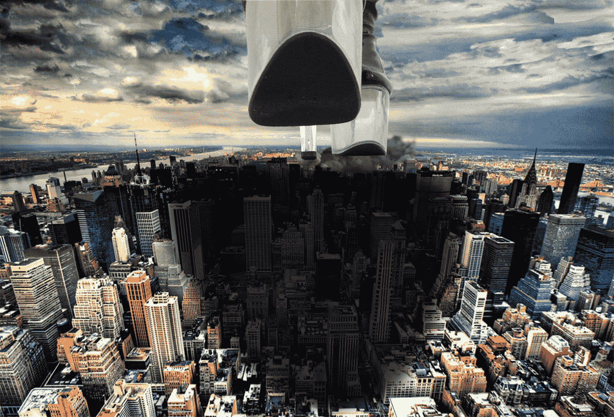

# 厚底高跟靴踩踏城市（第一次PS，瞎闹的！）再修！

作者：budebuai

TID：14623

<title>1</title> <link href="../Styles/Style.css" type="text/css" rel="stylesheet">

# 1

*本文章最後由 budebuai 於 2013-7-19 23:03 編輯*

真真真是第一次PS，好像还是第一次主动发帖。。。
看不过眼，自己都看不过眼，大侠们给出指导意见，最好帮忙修改，哈哈。。。

添加烟雾，修改一下，好像烟雾不是那么回事哈！

再修一次试试看哈！<title>2</title> <link href="../Styles/Style.css" type="text/css" rel="stylesheet">

# 2

 <ignore_js_op>[践踏黄昏的都市.jpg](forum.php?mod=attachment&aid=MzQ5MDJ8ZTJkZDRlN2N8MTYwMzg3MzY2OHwxODIzMHwxNDYyMw%3D%3D&nothumb=yes) *(914.72 KB, 下載次數: 13)*

[下載附件](forum.php?mod=attachment&aid=MzQ5MDJ8ZTJkZDRlN2N8MTYwMzg3MzY2OHwxODIzMHwxNDYyMw%3D%3D&nothumb=yes)

2013-6-26 14:00 上傳  

高跟靴践踏城市

</ignore_js_op>  <ignore_js_op>[践踏黄昏的都市·修改.jpg](forum.php?mod=attachment&aid=MzQ5Mjd8M2IyZmRjZGN8MTYwMzg3MzY2OHwxODIzMHwxNDYyMw%3D%3D&nothumb=yes) *(905.63 KB, 下載次數: 2)*

[下載附件](forum.php?mod=attachment&aid=MzQ5Mjd8M2IyZmRjZGN8MTYwMzg3MzY2OHwxODIzMHwxNDYyMw%3D%3D&nothumb=yes)

2013-6-28 09:44 上傳  

添加烟雾

</ignore_js_op>  <ignore_js_op>[践踏黄昏的都市·修改（已发表）.jpg](forum.php?mod=attachment&aid=MzUyMjh8MjY3NWFmMzl8MTYwMzg3MzY2OHwxODIzMHwxNDYyMw%3D%3D&nothumb=yes) *(911.78 KB, 下載次數: 4)*

[下載附件](forum.php?mod=attachment&aid=MzUyMjh8MjY3NWFmMzl8MTYwMzg3MzY2OHwxODIzMHwxNDYyMw%3D%3D&nothumb=yes)

2013-7-19 23:03 上傳  

烟雾修改

</ignore_js_op> <title>3</title> <link href="../Styles/Style.css" type="text/css" rel="stylesheet">

# 3

> Dante 發表於 2013-6-26 20:15 
> .
> 去背工作做得不錯，但是忽略了左腳鞋底與城市的接觸面的修飾工作。
> 導致圖片看上去只是兩張投影片上下疊 ...

对的对的！就是我的靴底不是那么回事！烟尘效果弄了半天也不会。。。这真的是第一次PS，看网易的教程东拉西扯的弄，填充不会就用修复画笔替代，图层不懂得新建就一遍又一遍用多边形抠图……唉。。。一天就这么过去了。
求教：烟尘效果以及此效果如何用在图片的选定范围内（比如用滤镜有全图都用了，想只用在选定的形状里）？<title>4</title> <link href="../Styles/Style.css" type="text/css" rel="stylesheet">

# 4

高楼建筑的碎裂，地面的破碎，踩扁小人后喷溅的血液液体……都是怎么做的呢？好奇中……