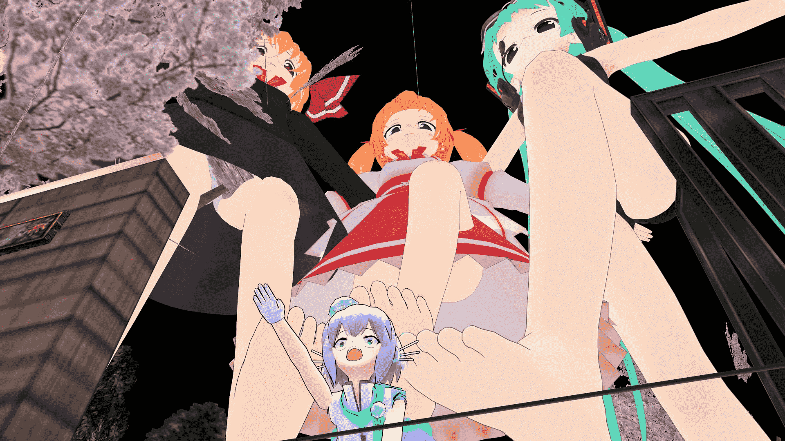
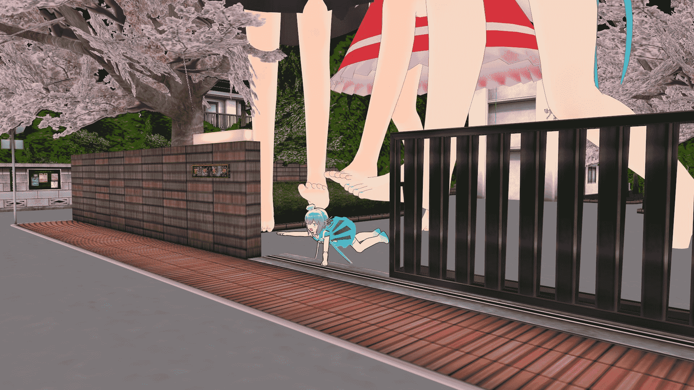
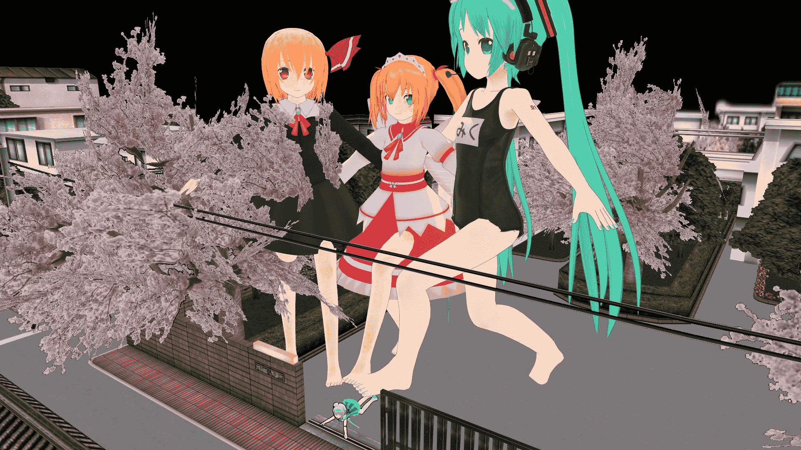
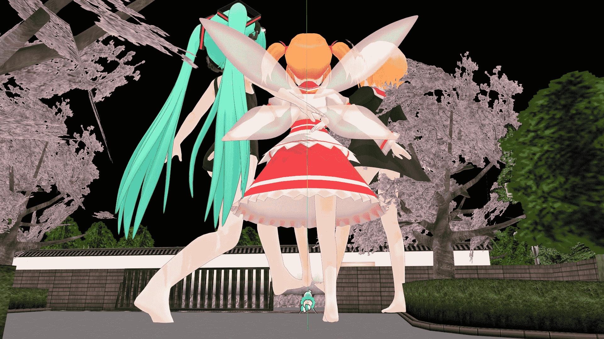
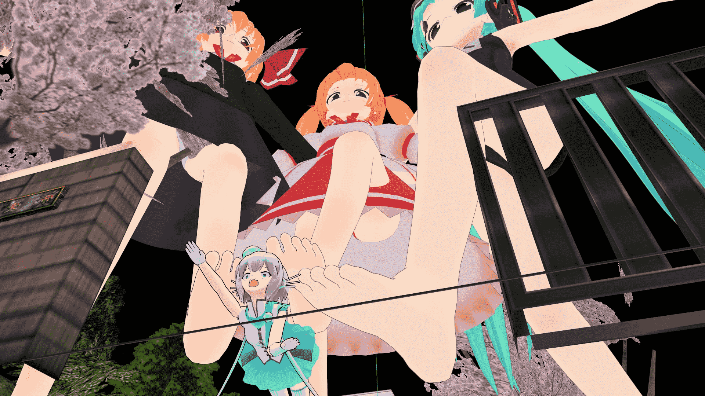
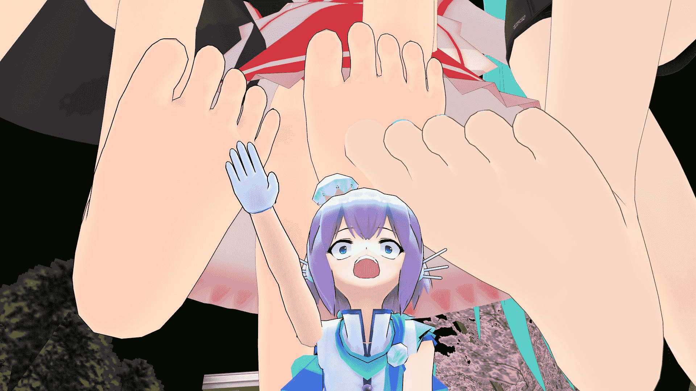

# 原创MMD：猜猜苍姬能否成功逃脱？

作者：西呱

TID：17228

 

# 1

下到了2个新的模型，立刻做了些静画。

这次下到的已经是萝莉都不算的幼女了。。不过也比没的用好得多。

猜猜苍姬能否成功逃脱。猜对有奖。

<ignore_js_op>

**1.JPG** *(223.35 KB, 下載次數: 0)*

[下載附件](forum.php?mod=attachment&aid=NDQyNDJ8ZjE4ODNlY2V8MTYwMzg2NjQ5MXwxODIzMHwxNzIyOA%3D%3D&nothumb=yes)

2014-7-8 22:29 上傳

<ignore_js_op>

**2.JPG** *(282.05 KB, 下載次數: 0)*

[下載附件](forum.php?mod=attachment&aid=NDQyNDN8OWE1ZDUzMTd8MTYwMzg2NjQ5MXwxODIzMHwxNzIyOA%3D%3D&nothumb=yes)

2014-7-8 22:30 上傳

<ignore_js_op>

**3.JPG** *(369.45 KB, 下載次數: 0)*

[下載附件](forum.php?mod=attachment&aid=NDQyNDR8ZWU5M2I5NmJ8MTYwMzg2NjQ5MXwxODIzMHwxNzIyOA%3D%3D&nothumb=yes)

2014-7-8 22:30 上傳

<ignore_js_op>

**4.JPG** *(331.19 KB, 下載次數: 0)*

[下載附件](forum.php?mod=attachment&aid=NDQyNDV8Y2FhYjEzNzR8MTYwMzg2NjQ5MXwxODIzMHwxNzIyOA%3D%3D&nothumb=yes)

2014-7-8 22:30 上傳

<ignore_js_op>

**6.JPG** *(246.08 KB, 下載次數: 0)*

[下載附件](forum.php?mod=attachment&aid=NDQyNDZ8ZmEzNTY2NTF8MTYwMzg2NjQ5MXwxODIzMHwxNzIyOA%3D%3D&nothumb=yes)

2014-7-8 22:30 上傳

<ignore_js_op>

**7.JPG** *(162.27 KB, 下載次數: 0)*

[下載附件](forum.php?mod=attachment&aid=NDQyNDd8N2U5ZmRiNDh8MTYwMzg2NjQ5MXwxODIzMHwxNzIyOA%3D%3D&nothumb=yes)

2014-7-8 22:30 上傳

 

# 2

> [shendanxiaogui 發表於 2014-7-8 22:35](https://giantessnight.com/gnforum2012/forum.php?mod=redirect&goto=findpost&pid=226594&ptid=17228)

> 不能(´・ω・｀)原因：看签名

> (〜￣△￣)〜冰西瓜你要再精细一点，你看双手的这个姿势，太直了... ...

谢谢建议，我下次会把巨大小女孩的胳膊放下去

 

# 3

> [ssn21 發表於 2014-7-8 22:47](https://giantessnight.com/gnforum2012/forum.php?mod=redirect&goto=findpost&pid=226597&ptid=17228)

> 冰瓜你这算是模型展示么...

> 虽然找到好模型就急于展示的心理我也有

> 但这个明显手臂都没有动啊!!!至 ...

我觉得我有大规模修改再重发一张的想发了

 

# 4

> [foxfun 發表於 2014-7-9 11:44](https://giantessnight.com/gnforum2012/forum.php?mod=redirect&goto=findpost&pid=226632&ptid=17228)

> 话说回来？模型是哪里下载的？还有动作是自己捏的对吧？

> 

> 最近计划钻研MCxMMD，但是发现自己完全不会做动作 ...

模型来自niconico

动作自己捏，可以去看教程</ignore_js_op></ignore_js_op></ignore_js_op></ignore_js_op></ignore_js_op></ignore_js_op>