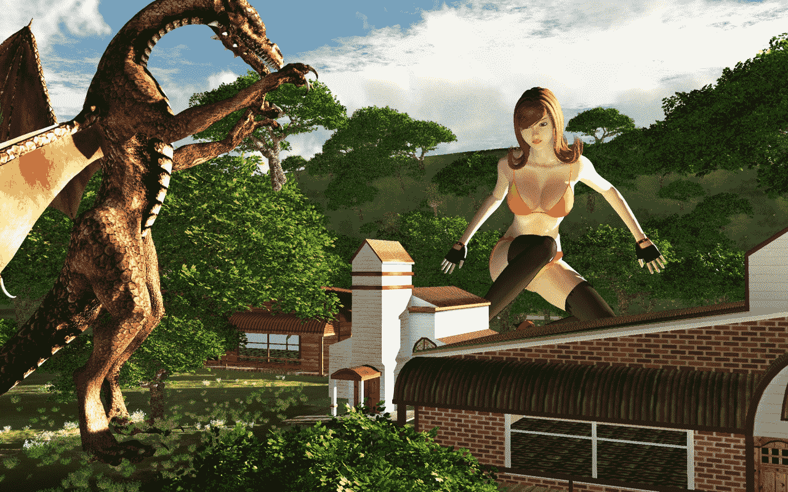
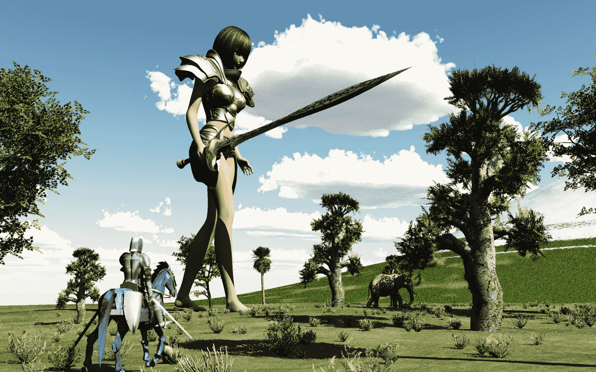
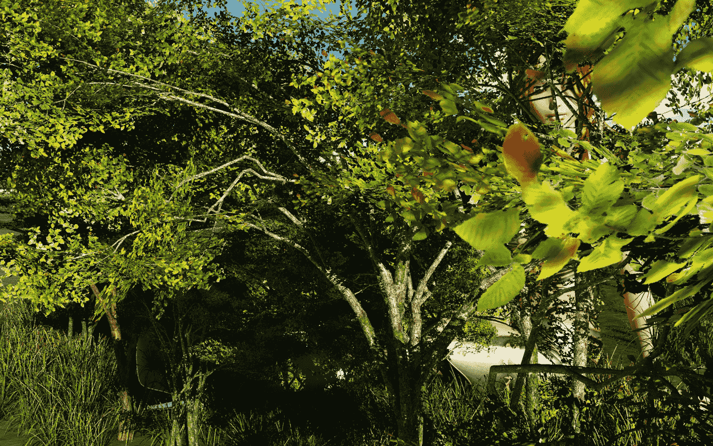

# 发两张 3D图

作者：qyj1213

TID：6717

 

# 1

<ignore_js_op>

**Untitled.jpg** *(994.15 KB, 下載次數: 2)*

[下載附件](forum.php?mod=attachment&aid=MTc0NTh8ZDBkMzA4Y2N8MTYwMzg4MDUyMnwxODIzMHw2NzE3&nothumb=yes)

2010-2-18 16:06 上傳

[ *本帖最後由 qyj1213 於 2010-2-18 16:06 編輯* ] 

# 2

[localimg=500,313]1[/localimg] 

# 3

竟然传不上去？ <ignore_js_op>

**3.jpg** *(544.31 KB, 下載次數: 1)*

[下載附件](forum.php?mod=attachment&aid=MTc0NDZ8MTMyODg1MGV8MTYwMzg4MDUyMnwxODIzMHw2NzE3&nothumb=yes)

2010-2-18 01:16 上傳

 

# 4

<ignore_js_op>

**4.jpg** *(862.53 KB, 下載次數: 1)*

[下載附件](forum.php?mod=attachment&aid=MTc0NDd8Y2I1YjdlNWV8MTYwMzg4MDUyMnwxODIzMHw2NzE3&nothumb=yes)

2010-2-18 01:17 上傳

 

# 5

一般渲染，15分钟就可以了，

再上一张

<ignore_js_op>

**Untitled.jpg** *(994.15 KB, 下載次數: 1)*

[下載附件](forum.php?mod=attachment&aid=MTc0NTd8YTc4NTQ5MjJ8MTYwMzg4MDUyMnwxODIzMHw2NzE3&nothumb=yes)

2010-2-18 16:02 上傳</ignore_js_op></ignore_js_op></ignore_js_op></ignore_js_op>