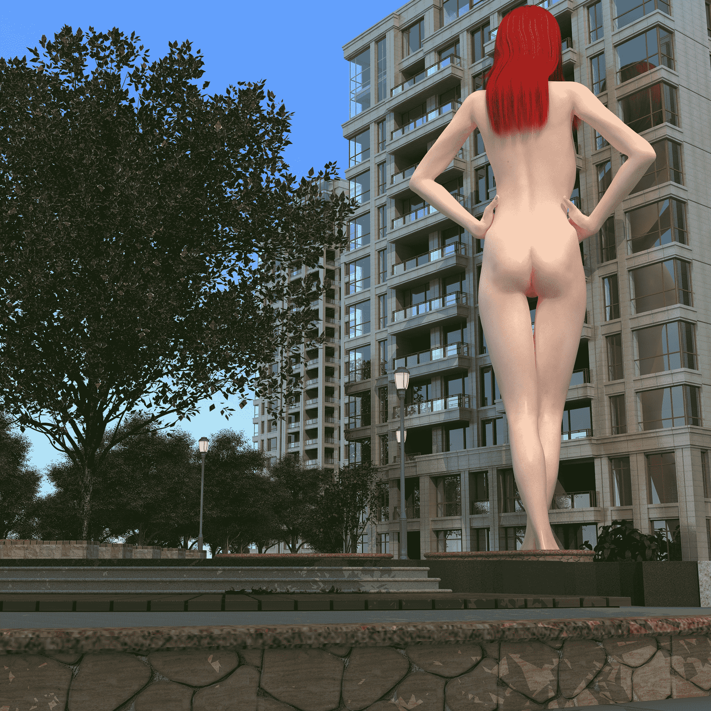

# 发图片

作者：qyj1213

TID：19020

 

# 1

好久没发图片了，怎么感觉预览图片小了。

<ignore_js_op>

**11.jpg** *(3.12 MB, 下載次數: 3)*

[下載附件](forum.php?mod=attachment&aid=NTIwNjl8YTE3YWI3MzN8MTYwMzg2Mzc5MnwxODIzMHwxOTAyMA%3D%3D&nothumb=yes)

2015-5-24 00:29 上傳

<ignore_js_op>

**10.jpg** *(2.25 MB, 下載次數: 4)*

[下載附件](forum.php?mod=attachment&aid=NTIwNjh8OWVjMmM0NjZ8MTYwMzg2Mzc5MnwxODIzMHwxOTAyMA%3D%3D&nothumb=yes)

2015-5-24 00:28 上傳

<ignore_js_op>

**06.jpg** *(498.71 KB, 下載次數: 2)*

[下載附件](forum.php?mod=attachment&aid=NTIwNjd8ZTZlZGNhNzl8MTYwMzg2Mzc5MnwxODIzMHwxOTAyMA%3D%3D&nothumb=yes)

2015-5-24 00:27 上傳

<ignore_js_op>

**05.png** *(946.68 KB, 下載次數: 2)*

[下載附件](forum.php?mod=attachment&aid=NTIwNjZ8ZjEyNjllNjh8MTYwMzg2Mzc5MnwxODIzMHwxOTAyMA%3D%3D&nothumb=yes)

2015-5-24 00:27 上傳

<ignore_js_op>

**01.png** *(749.85 KB, 下載次數: 4)*

[下載附件](forum.php?mod=attachment&aid=NTIwNjV8MDFiNmIyNzN8MTYwMzg2Mzc5MnwxODIzMHwxOTAyMA%3D%3D&nothumb=yes)

2015-5-24 00:27 上傳

<ignore_js_op>

**00.png** *(688.42 KB, 下載次數: 5)*

[下載附件](forum.php?mod=attachment&aid=NTIwNjR8YzkwYWRlNDN8MTYwMzg2Mzc5MnwxODIzMHwxOTAyMA%3D%3D&nothumb=yes)

2015-5-24 00:27 上傳

<ignore_js_op>

**12.png** *(692.73 KB, 下載次數: 3)*

[下載附件](forum.php?mod=attachment&aid=NTIwNzB8MWIxYTNjYjF8MTYwMzg2Mzc5MnwxODIzMHwxOTAyMA%3D%3D&nothumb=yes)

2015-5-24 00:30 上傳

 

# 2

> [mklbxpis 發表於 2015-5-24 00:47](https://giantessnight.com/gnforum2012/forum.php?mod=redirect&goto=findpost&pid=255528&ptid=19020)

> 先顶一下楼主，话说这种图片是用什么做出来的呢。

用的是poser导入3DMAX2012，vray渲染 

# 3

> [网络菜鸟 發表於 2015-5-25 23:17](https://giantessnight.com/gnforum2012/forum.php?mod=redirect&goto=findpost&pid=255726&ptid=19020)

> 问一下楼主做这些图片大概要多长时间

4核8线程，像这样2000x2000的图，渲染一张大约20分钟。</ignore_js_op></ignore_js_op></ignore_js_op></ignore_js_op></ignore_js_op></ignore_js_op></ignore_js_op>