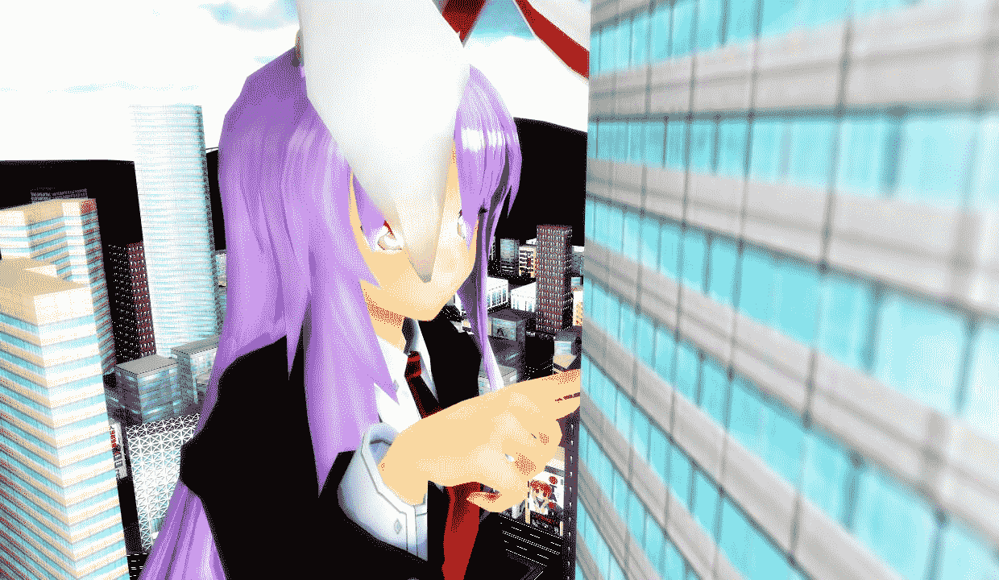
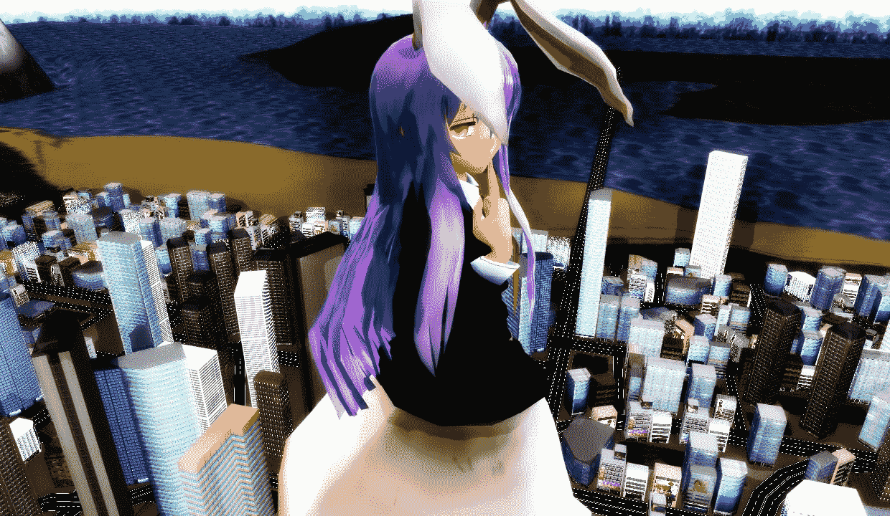
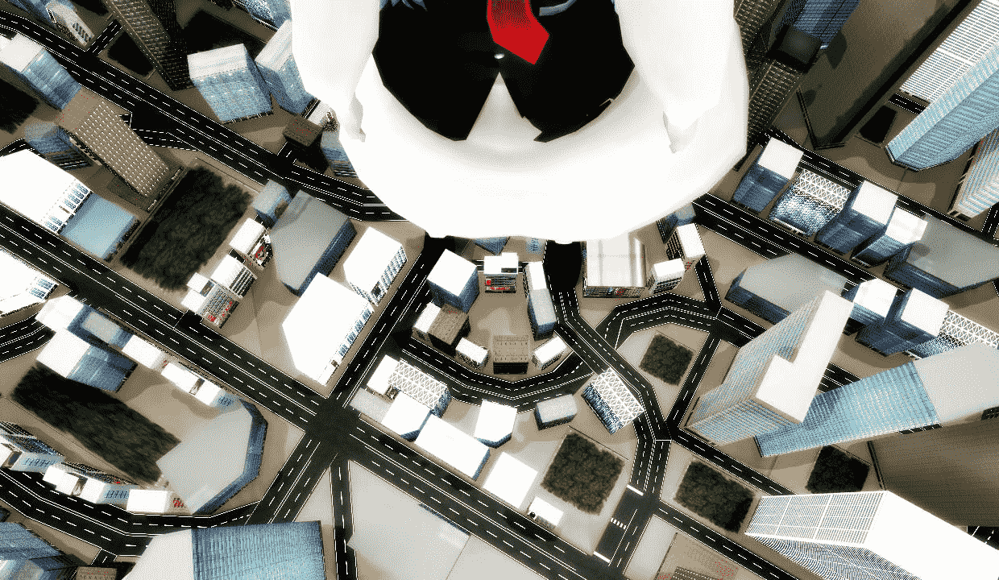

# 受兔其实很萌的- -＊

作者：水水水菌

TID：16894

 

# 1

昨天又被断网了 于是又去制作MMD了 设定什么的 脑细胞不够用 所以说嘛 就希望大伙不要吐槽[不现实&不符合常理&不符合设定]

咋已掌握图片上传顺序

顺便也测试了一下从某地学到的新渲染配方

嘛 果然还是我太年轻了 打了渲染赶脚还不如原版

把远景都打成炭黑色了

嘛 具体还是上图咯 1400x720的分辨率 赶脚还是不错的 至于互动性嘛 也没多大的互动性[虚弱]…… 

不过不管是什么情况 也要把产物给发上来让大伙指点一下 说不定还能开个脑洞就能更快的制作以后的视频作品了……

→迷之白字→话说咱是不是产物的质量越来越差了_(:з」∠)_

 

# 2

<ignore_js_op>[⑦.jpg](forum.php?mod=attachment&aid=NDMwNDJ8NjI1YzRkY2N8MTYwMzg2OTE1OHwxODIzMHwxNjg5NA%3D%3D&nothumb=yes) *(105.02 KB, 下載次數: 12)*

[下載附件](forum.php?mod=attachment&aid=NDMwNDJ8NjI1YzRkY2N8MTYwMzg2OTE1OHwxODIzMHwxNjg5NA%3D%3D&nothumb=yes)

2014-5-20 23:39 上傳  

</ignore_js_op> <ignore_js_op>[③.jpg](forum.php?mod=attachment&aid=NDMwMzh8NzcyZDVhYzh8MTYwMzg2OTE1OHwxODIzMHwxNjg5NA%3D%3D&nothumb=yes) *(188.83 KB, 下載次數: 9)*

[下載附件](forum.php?mod=attachment&aid=NDMwMzh8NzcyZDVhYzh8MTYwMzg2OTE1OHwxODIzMHwxNjg5NA%3D%3D&nothumb=yes)

2014-5-20 23:39 上傳  

</ignore_js_op> <ignore_js_op>[④.jpg](forum.php?mod=attachment&aid=NDMwMzl8OWM0MDFhODZ8MTYwMzg2OTE1OHwxODIzMHwxNjg5NA%3D%3D&nothumb=yes) *(92.21 KB, 下載次數: 7)*

[下載附件](forum.php?mod=attachment&aid=NDMwMzl8OWM0MDFhODZ8MTYwMzg2OTE1OHwxODIzMHwxNjg5NA%3D%3D&nothumb=yes)

2014-5-20 23:39 上傳  

</ignore_js_op> <ignore_js_op>[⑤.jpg](forum.php?mod=attachment&aid=NDMwNDB8NGM0NTEwYTN8MTYwMzg2OTE1OHwxODIzMHwxNjg5NA%3D%3D&nothumb=yes) *(211.82 KB, 下載次數: 5)*

[下載附件](forum.php?mod=attachment&aid=NDMwNDB8NGM0NTEwYTN8MTYwMzg2OTE1OHwxODIzMHwxNjg5NA%3D%3D&nothumb=yes)

2014-5-20 23:39 上傳  

</ignore_js_op> <ignore_js_op>[⑥.jpg](forum.php?mod=attachment&aid=NDMwNDF8MGI0N2E5ZjJ8MTYwMzg2OTE1OHwxODIzMHwxNjg5NA%3D%3D&nothumb=yes) *(83.01 KB, 下載次數: 5)*

[下載附件](forum.php?mod=attachment&aid=NDMwNDF8MGI0N2E5ZjJ8MTYwMzg2OTE1OHwxODIzMHwxNjg5NA%3D%3D&nothumb=yes)

2014-5-20 23:39 上傳  

</ignore_js_op> <ignore_js_op>[①.jpg](forum.php?mod=attachment&aid=NDMwMzZ8NzFiODY2ZGF8MTYwMzg2OTE1OHwxODIzMHwxNjg5NA%3D%3D&nothumb=yes) *(97.32 KB, 下載次數: 6)*

[下載附件](forum.php?mod=attachment&aid=NDMwMzZ8NzFiODY2ZGF8MTYwMzg2OTE1OHwxODIzMHwxNjg5NA%3D%3D&nothumb=yes)

2014-5-20 23:39 上傳  

</ignore_js_op> <ignore_js_op>[②.jpg](forum.php?mod=attachment&aid=NDMwMzd8NmNjYTdkNzV8MTYwMzg2OTE1OHwxODIzMHwxNjg5NA%3D%3D&nothumb=yes) *(51.39 KB, 下載次數: 6)*

[下載附件](forum.php?mod=attachment&aid=NDMwMzd8NmNjYTdkNzV8MTYwMzg2OTE1OHwxODIzMHwxNjg5NA%3D%3D&nothumb=yes)

2014-5-20 23:39 上傳  

</ignore_js_op>  

# 3

> [shendanxiaogui 發表於 2014-5-21 00:01](https://giantessnight.com/gnforum2012/forum.php?mod=redirect&goto=findpost&pid=222896&ptid=16894)

> 顺序呢（╯‵□′）╯ノ┻━┻☆

> 另外，没错(义正言辞脸

> (´・ω・｀)主要是这个渲染有点过亮了。。。都分 ...

_(:з」∠)_看来还是没摸清楚顺序 按照数字的倒序查看吧 表示这套渲染要是再加阴影 兔子脸就会一瞬间变得惨黄起来……所以……不过下次我可以尝试改进一下……