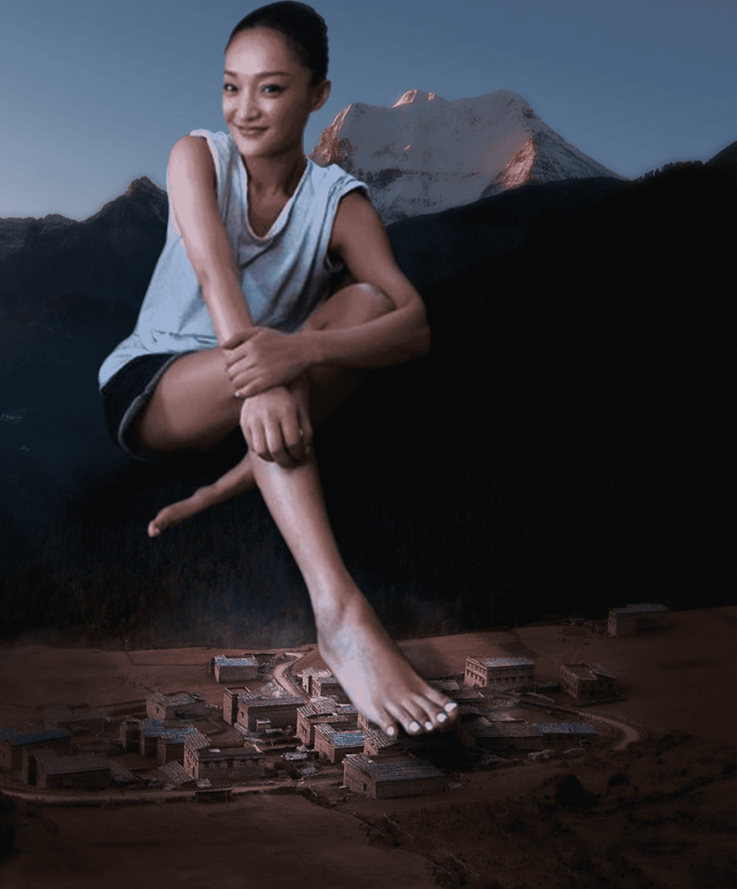
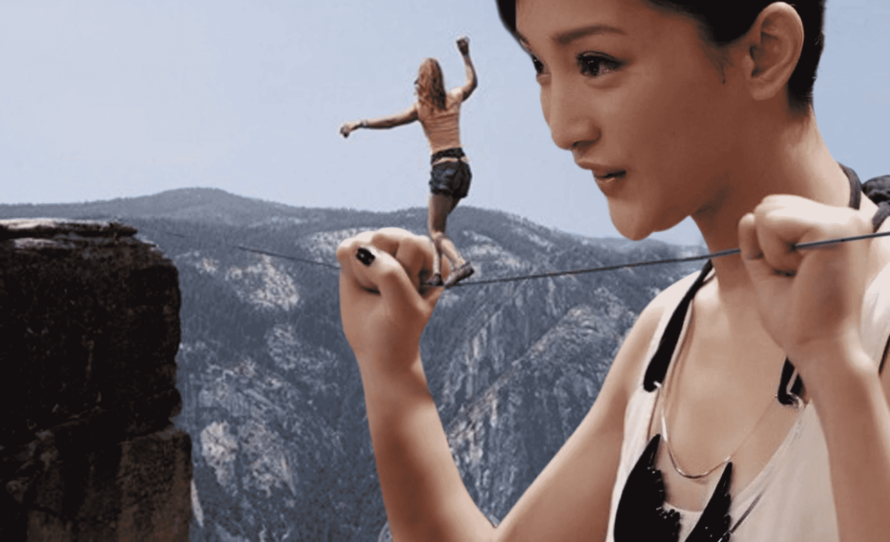
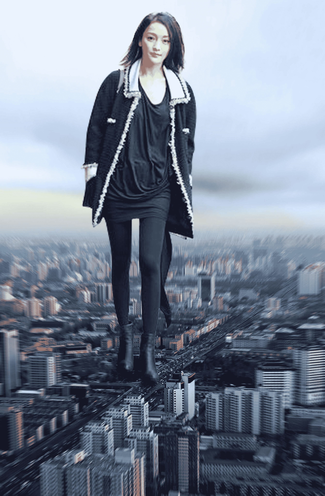
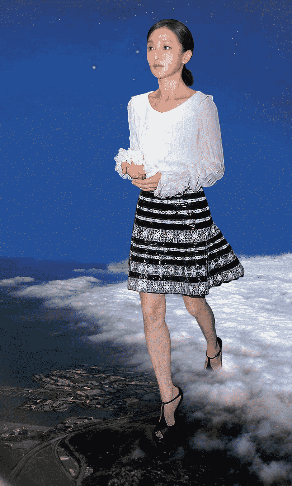
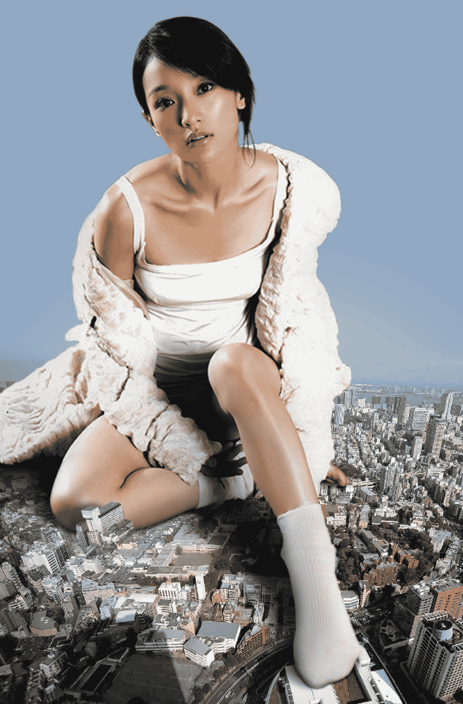
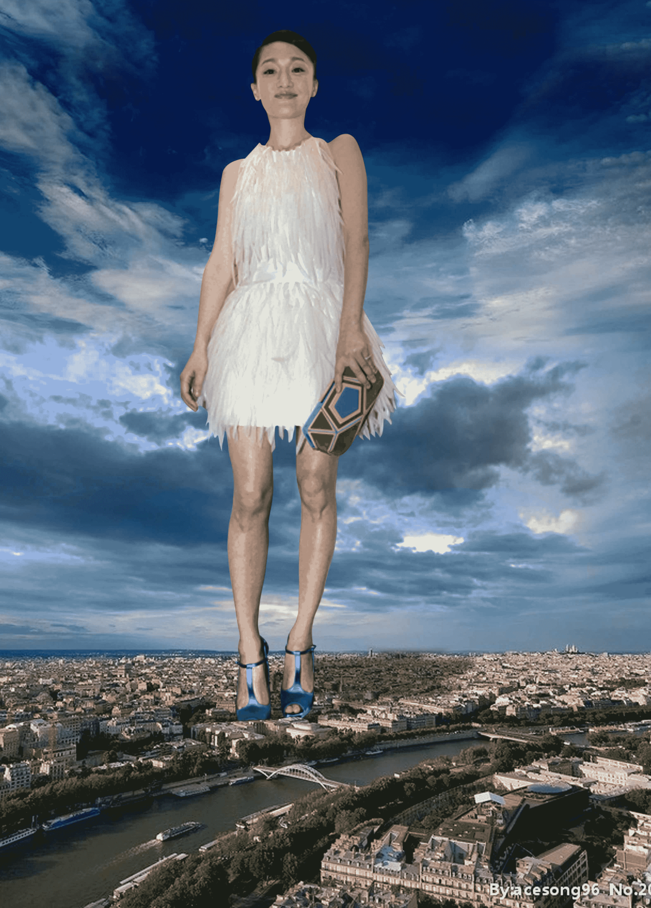
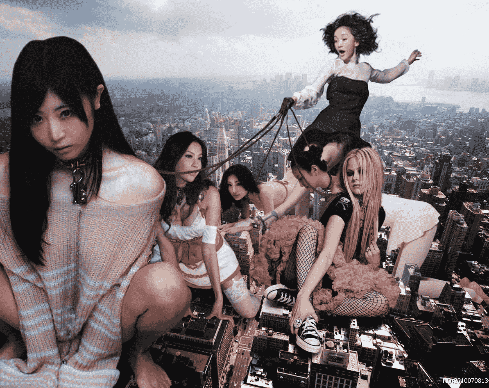

# 周公子的专题

作者：smsunhuawei

TID：19115

<title>1</title> <link href="../Styles/Style.css" type="text/css" rel="stylesheet">

# 1

*本帖最後由 smsunhuawei 於 2015-6-20 02:58 編輯*

01、一旦我的脚落下，这个村庄就要被碾进泥土里了，生活在里面的渺小人类也都会成为我脚底下的泥，究竟要不要踩下去呢？大家好，我是周迅，我是周公子！
<ignore_js_op>

**003.jpg** *(396.5 KB, 下載次數: 0)*

[下載附件](forum.php?mod=attachment&aid=NTI1NTV8YzJlOTc4Y2J8MTYwMzg2NTM4MXwxODIzMHwxOTExNQ%3D%3D&nothumb=yes)

2015-6-20 02:52 上傳

02、无聊的时候，偶尔也会弄几个小人儿来玩，将她们悬放在悬崖间，帮她们晃一晃绳索，或者吹口气给她们，每次看着她们腰肢乱扭的滑稽样子，我都忍不住想笑，至于笑过之后，我就要张开嘴靠近她们了，我很想知道，在这种情况下，是选择自己跳下去人多，还是选择被我吃下去的人多，就目前来讲，敢于跳下去的人还一个都没有呐，人们往往认为被我吃掉的话，会多出那么点生还的可能吧，哈哈哈……真是幼稚的可爱！
<ignore_js_op>

**006.jpg** *(244.06 KB, 下載次數: 0)*

[下載附件](forum.php?mod=attachment&aid=NTI1NTZ8MDk3ZmRhNzh8MTYwMzg2NTM4MXwxODIzMHwxOTExNQ%3D%3D&nothumb=yes)

2015-6-20 02:52 上傳

03、每当来到一座新的城市，我都喜欢先到处逛一逛，可能爱逛街是女人的天性吧，我承认，这座城市对你们来说已经很大了，但对我来说还是有些小，你看，最高的建筑物也刚刚高过我的靴子而已。每一步踏出，都会有一些生命消逝在我靴底，虽然我不是一个滥杀无辜的人，但你们在我眼里比爬虫还小欸，真的挺微不足道的。
<ignore_js_op>

**007-1.jpg** *(424.62 KB, 下載次數: 0)*

[下載附件](forum.php?mod=attachment&aid=NTI1NTd8ZDhkNTY1NDB8MTYwMzg2NTM4MXwxODIzMHwxOTExNQ%3D%3D&nothumb=yes)

2015-6-20 02:52 上傳

04、有一次，我想去个海边城市散心，但是很不巧，偏偏天要下雨，厚厚的云层已经没过了我的脚背，云层下面是个什么样子我根本都看不到，深一脚浅一脚的，也不知道都踩到些什么，还净是些水坑，讨厌，真真是一次很不好的外出经历。
<ignore_js_op>

**008-2.jpg** *(430.34 KB, 下載次數: 1)*

[下載附件](forum.php?mod=attachment&aid=NTI1NTh8ZWZjOWJjZGN8MTYwMzg2NTM4MXwxODIzMHwxOTExNQ%3D%3D&nothumb=yes)

2015-6-20 02:52 上傳

<ignore_js_op>

**008-3.jpg** *(388.13 KB, 下載次數: 2)*

[下載附件](forum.php?mod=attachment&aid=NTI1NTl8NDkzZDRmMTN8MTYwMzg2NTM4MXwxODIzMHwxOTExNQ%3D%3D&nothumb=yes)

2015-6-20 02:53 上傳

05、太剧烈的运动我不会去做，好累的，但是瑜伽我偶尔会尝试一下，说实话，这简单的运动做完之后，我浑身也都汗津津的，唉……身子骨还是有些弱啊！
<ignore_js_op>

**009.jpg** *(445.73 KB, 下載次數: 0)*

[下載附件](forum.php?mod=attachment&aid=NTI1NjB8YjNhZGI1YWZ8MTYwMzg2NTM4MXwxODIzMHwxOTExNQ%3D%3D&nothumb=yes)

2015-6-20 02:53 上傳

06、这是我去过的一个虽然不大，但很有味道的一座城市，整个城市就没有能高过我鞋跟的东西，不过从我的角度看，各式各样的屋顶真的很漂亮，而且踩下去的时候，成片的房屋被轻易碾平，脚一抬起来，地上就留下一个规整鞋印，很有意思，也很有成就感，不过那个城市现在已经不复存在了，还是有些怀念的。
<ignore_js_op>

**010.jpg** *(447.3 KB, 下載次數: 0)*

[下載附件](forum.php?mod=attachment&aid=NTI1NjF8Zjk2MDBhNTN8MTYwMzg2NTM4MXwxODIzMHwxOTExNQ%3D%3D&nothumb=yes)

2015-6-20 02:53 上傳

07、图书馆我去的次数有限，两只手都能数的过来，因为要进到图书馆里我要变小一些才行，主要是嫌麻烦，但有时候我也想重温一下学生的生活，就进去随便看看，其实读书我并不太喜欢，但我自有我的办法，我会挑个小不点，放进我的耳朵里念给我听，我就老老实实靠在墙上听着就行，往往读着读着我就睡着了，那些小东西不知道我的情况，也不敢停，在加上我比较贪睡，很多人都因此读哑了嗓子，真是没用的小东西！
<ignore_js_op>

**012.jpg** *(408.04 KB, 下載次數: 0)*

[下載附件](forum.php?mod=attachment&aid=NTI1NjN8ZWUzMGI5YWF8MTYwMzg2NTM4MXwxODIzMHwxOTExNQ%3D%3D&nothumb=yes)

2015-6-20 02:53 上傳

08、我的宠物们一点都不听话，关在笼子里的时候就吵吵闹闹着要出去，带她们出去溜溜吧，就到处疯跑，我也只能用绳子拴着她们才行，要说起我的这几个宠物，真都挺棒的，最左边那个，她老爸是目前为止的全球首富，家里教育的特别好，绝对算是大家闺秀中的典范了，她后面那个，人家可是亚洲小姐冠军，不过是那一届的我给忘了，再她后面的是一个从模特出道，近几年红到发紫的演员，颜值爆表，身材超赞，再看右边第一个，她是个唱歌的，我特别喜欢她的声音，所以就让她过来做我的宠物了，她身后的是我上学时的老师，哈哈，看不出来把，她也只比我大5岁，保养的可好了，上学的时候就特别照顾我，算是为了感谢她吧，我也把她留在身边了。这五个小宠物看着挺乖，其实一天都不让我省心，特能捣乱，只有时常牵出来溜溜她们，才能安静一阵儿，真不知道是该爱还是该恨。
“好啦，该上厕所上厕所，该找东西吃找东西吃，去吧！”
<ignore_js_op>

**013.jpg** *(455.2 KB, 下載次數: 0)*

[下載附件](forum.php?mod=attachment&aid=NTI1NjR8ZDdkNWIxZDR8MTYwMzg2NTM4MXwxODIzMHwxOTExNQ%3D%3D&nothumb=yes)

2015-6-20 02:53 上傳</ignore_js_op></ignore_js_op></ignore_js_op></ignore_js_op></ignore_js_op></ignore_js_op></ignore_js_op></ignore_js_op></ignore_js_op>