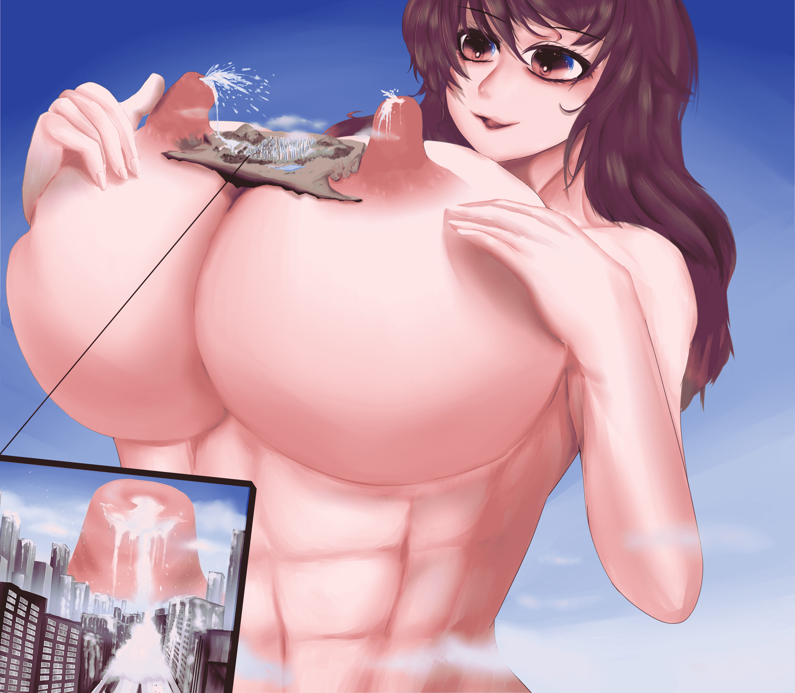

# 圣白莲的普渡众生计划

作者：噶比

TID：23967

<title>1</title> <link href="../Styles/Style.css" type="text/css" rel="stylesheet">

# 1

*本帖最後由 gabbit 於 2017-12-16 20:58 編輯*

感谢各位的点评，希望今后能更加努力吧，技术很烂的自己不想让自己太天真，太傻逼。<title>2</title> <link href="../Styles/Style.css" type="text/css" rel="stylesheet">

# 2

 <ignore_js_op>[332.jpg](forum.php?mod=attachment&aid=Njk2OTN8ODg4ODZiMGN8MTYwMzg1Mzk5OXwxODIzMHwyMzk2Nw%3D%3D&nothumb=yes) *(1.32 MB, 下載次數: 38)*

[下載附件](forum.php?mod=attachment&aid=Njk2OTN8ODg4ODZiMGN8MTYwMzg1Mzk5OXwxODIzMHwyMzk2Nw%3D%3D&nothumb=yes)

2017-10-27 23:47 上傳  

</ignore_js_op> <title>3</title> <link href="../Styles/Style.css" type="text/css" rel="stylesheet">

# 3

> [魔法少女小静流 發表於 2017-10-28 16:27](https://giantessnight.com/gnforum2012/forum.php?mod=redirect&goto=findpost&pid=349377&ptid=23967)
> 感觉看起来...有点奇怪？

如果觉得怪的地方可以指出来的，——。。。—（其实全部都很怪。。，自己衔着空余时间画了差不多俩礼拜，感觉会比上次好点的，但越画越渣的。。）自己的画技拙劣，
小的会再去练习，先练个一两年再出水吧）

<title>4</title> <link href="../Styles/Style.css" type="text/css" rel="stylesheet">

# 4

> [葬儀社 發表於 2017-10-28 18:11](https://giantessnight.com/gnforum2012/forum.php?mod=redirect&goto=findpost&pid=349383&ptid=23967)
> 支持先.五大老最喜歡的就是白蓮BB(消音
> 
> 本身沒畫圖的經驗跟能力.所以沒辦法提供啥意見

謝謝大佬的建議，以後抽閑時去研究小的接觸板繪時間太短，是我太心急了
我一定多去練習，以後（退坑前）畫出大家能看上眼的畫

<title>5</title> <link href="../Styles/Style.css" type="text/css" rel="stylesheet">

# 5

*本帖最後由 gabbit 於 2017-11-11 08:50 編輯*

> [land 發表於 2017-11-2 21:39](https://giantessnight.com/gnforum2012/forum.php?mod=redirect&goto=findpost&pid=349557&ptid=23967)
> Pixiv登入 相关hosts修改
> 210.129.120.41 [www.pixiv.net](http://www.pixiv.net)
> 210.140.131.144 source.pixiv.net

谢谢大佬，能够喜欢我的垃圾作品是对我的最大鼓励谢谢

<title>6</title> <link href="../Styles/Style.css" type="text/css" rel="stylesheet">

# 6

> [laohantuibaoma 發表於 2017-11-9 23:17](https://giantessnight.com/gnforum2012/forum.php?mod=redirect&goto=findpost&pid=349875&ptid=23967)
> 硬要说的话，就是楼主在画正面还是侧面之间的角度区分不开，，导致了肚子的与胸部以上的角度透视出现了问题 ...

嗯，谢谢大佬的指点，我以后会注意这些的，自己是个初学者，很多基础还没打扎实，自己去慢慢补，至少在退坑前吧，
谢谢大佬