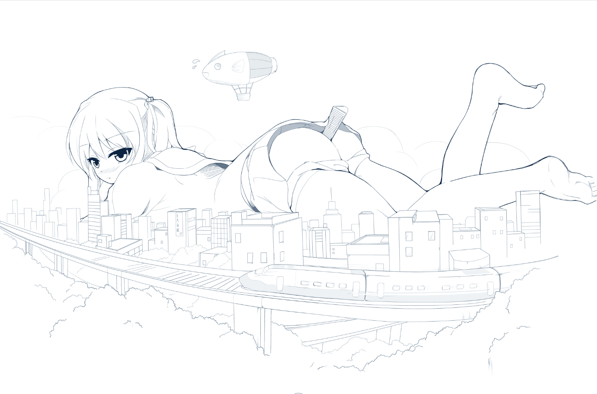
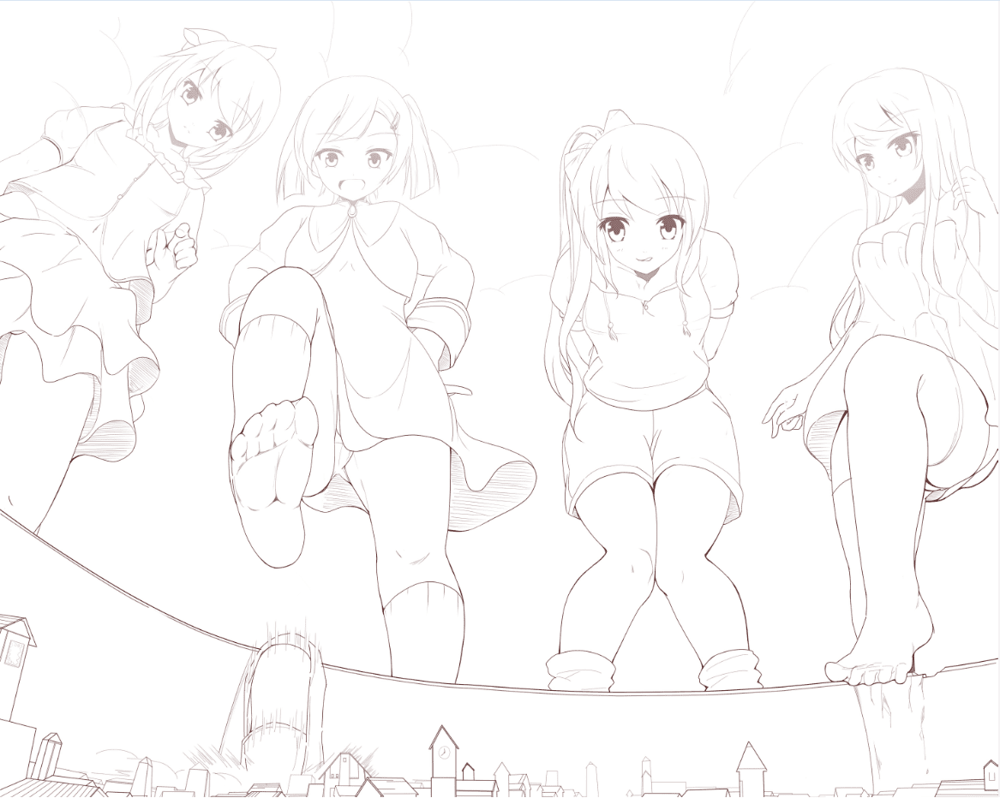
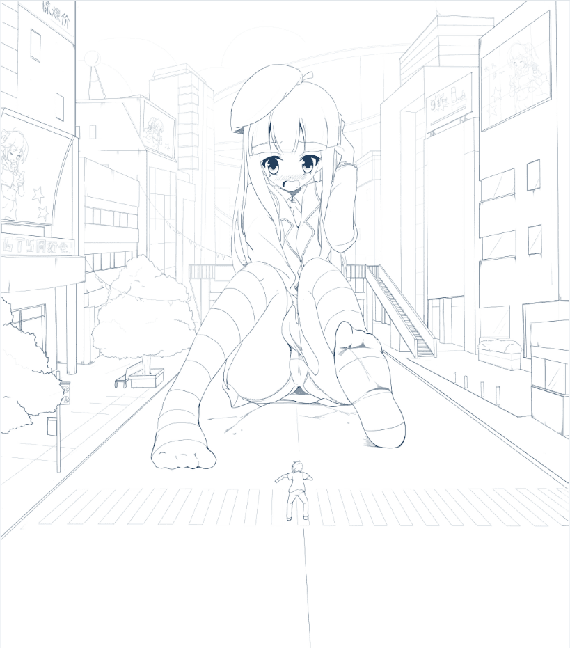

# 在线稿中美化人物与背景的一些方法

作者：laohantuibaoma

TID：29224

 

# 1

*本帖最後由 laohantuibaoma 於 2020-8-6 19:33 編輯*

大家好，这里是zy，一名喜欢暗中观察的画师，还没有P站（蓄爆中），重度vore控，擅长风格：抖M系，只要是巨大娘会做的都能画( •̀ ω •́ )y，全职约稿（近期接了漫画，暂不接单，感谢鸣群各位小伙伴的赞助！），偶尔会进行无偿创作，请各位多关照~

嗯...之所以会想到这点，也是因为在逛论坛时偶然想到的，正好这里有三张以前不用的线稿，所以想来做下小示范，不用上色，不用后期也一样能画出好看的效果，当然也只是针对板绘时仅对线稿钟爱的老铁们。（仅对线稿！仅对线稿！仅对线稿！）

有时候画面中的物体太多，很容易让画面看起来很脏乱，会找不到视觉上的落脚点，那么这时候体现出虚实效果就很重要了。画好线稿后，可以降低不透明度至75%和50%进行吸色，备份三种颜色，然后锁定线稿图层虚化处理。

图1.加深主体，减淡背景。这种方法很简单也很实用，就是用笔重新在人物周围勾一遍，简单粗暴，一目了然。<ignore_js_op>

**巨大娘1.png** *(451.88 KB, 下載次數: 3)*

[下載附件](forum.php?mod=attachment&aid=ODQzOTZ8ZDhmOWQ0Zjh8MTYwMzgyNzE3MHwxODIzMHwyOTIyNA%3D%3D&nothumb=yes)

图1

2020-8-6 16:50 上傳

图2.表现高耸入云的效果，减淡上半身以上的颜色，很好的体现出层次感，给人一种上半身被云遮住的感觉，可以很好的体现出巨大娘的魄力。<ignore_js_op>

**巨大娘2.png** *(507.47 KB, 下載次數: 2)*

[下載附件](forum.php?mod=attachment&aid=ODQzOTd8NGM1N2QyMzR8MTYwMzgyNzE3MHwxODIzMHwyOTIyNA%3D%3D&nothumb=yes)

图2

2020-8-6 16:51 上傳

图3.由近到远，由深到浅的虚实渐变效果，这种方法有点类似第一种，很好的把人与景区分开来的同时，渐变也能带来很好的视觉观，如果懒得画这么多房子，锁定图层用不同颜色进行模糊即可。<ignore_js_op>

**巨大娘3.png** *(385.74 KB, 下載次數: 2)*

[下載附件](forum.php?mod=attachment&aid=ODQzOTh8ZjI2ZDQ5YjB8MTYwMzgyNzE3MHwxODIzMHwyOTIyNA%3D%3D&nothumb=yes)

图3

2020-8-6 16:51 上傳

最后再说明几点。

1.虚实效果有啥用？—— 突出层次感，明确主体。

2.只有一个巨大娘，为了让她看起来更高大，我想虚化上半身是否可以？——不可以，巨大娘本身就是一个整体，虚化后不好看，虚化局部等只能上色完成。

3.如果只有巨大娘和一栋房子，可不可以做虚实效果？——看情况，如果身为主体的巨大娘和房子进行了互动（两者都成为了主体），就不行。

以上就是关于处理线稿上处理人和景的方法，虽然对上色没什么帮助，不过如果你喜欢这种效果，可以去尝试一下。那么这种处理方法，各位觉得怎样呢=.=？？？

PS:我自己常用软件是sai2（绘画），photoshop（后期）等，如果有技术方面的问题不懂，也可以问我~</ignore_js_op>  

# 2

> [琉璃 發表於 2020-8-6 17:19](https://giantessnight.com/gnforum2012/forum.php?mod=redirect&goto=findpost&pid=444062&ptid=29224)

> 非常受益啊，那么顺道问下，上哪去做能被包养的富婆呢

你这是要找富婆呢还是做富婆？？？

 

# 3

> [琉璃 發表於 2020-8-6 17:32](https://giantessnight.com/gnforum2012/forum.php?mod=redirect&goto=findpost&pid=444064&ptid=29224)

> 当然是找富婆咯，找富婆 打错了

咳咳，包养其实是别人众筹帮忙去画漫画的意思。

 

# 4

> [nhbnfn 發表於 2020-8-6 17:55](https://giantessnight.com/gnforum2012/forum.php?mod=redirect&goto=findpost&pid=444068&ptid=29224)

> 噢噢是会画画的巨佬 膜拜一下 如果有p站账号一定会关注!

谢谢，其实已经有账号了，只是现在啥都还没有，等我弄好时会告诉你的（可能会很久，一大堆半成品要补全...）

 

# 5

> [dfggggx 發表於 2020-8-6 18:29](https://giantessnight.com/gnforum2012/forum.php?mod=redirect&goto=findpost&pid=444069&ptid=29224)

> 画得很好，丝毫没有国漫那种违和感，相当纯净的日式画风，不知道如何约稿 ...

谢谢支持，我这边估计会等到11月12月才能抽出时间，老铁你可以私信留个联系方式，存个好友=。=

 

# 6

> [琉璃 發表於 2020-8-6 18:43](https://giantessnight.com/gnforum2012/forum.php?mod=redirect&goto=findpost&pid=444071&ptid=29224)

> 那也是大佬啊，膜拜膜拜

看了老铁你过去的帖子，应该刚开始学画不久吧，画画最需要的两点就是时间和毅力，坚持下去就好。平日里可以多留意一些周围环境，提升空间感以及布局。还有时不时可以看看别人的作品来提高审美，审美能力上来了自己哪里画得不够好一看便知，对提升的帮助相当大。

 

# 7

*本帖最後由 laohantuibaoma 於 2020-8-7 11:02 編輯*

> [dfggggx 發表於 2020-8-6 19:26](https://giantessnight.com/gnforum2012/forum.php?mod=redirect&goto=findpost&pid=444078&ptid=29224)

> 不知道画一张简单的线稿大概需要多久？我看uru大佬甚至可以一天一更一张彩图，可惜总是get不到点

> ...

我现在画的线稿都是精稿，如果只画一个人物，会用上三个小时吧。uru画的是简稿，上色用的是厚涂，所以画的快（uru大佬的效率真的很高）。至于get不到点，不知是xp方面还是风格方面。

 

# 8

> [西呱 發表於 2020-8-6 21:31](https://giantessnight.com/gnforum2012/forum.php?mod=redirect&goto=findpost&pid=444090&ptid=29224)

> 这真是太厉害了，我十分欣赏你的画风且佩服你的技术

感谢西呱，今后还会在此基础上精益求精。

 

# 9

> [dfggggx 發表於 2020-8-7 13:14](https://giantessnight.com/gnforum2012/forum.php?mod=redirect&goto=findpost&pid=444146&ptid=29224)

> uru那个女仆系列，花了二十几张，都没进入正题，多浪费啊

咦？是这方面啊，或许他这篇漫画想以叙述剧情为主吧。</ignore_js_op></ignore_js_op>