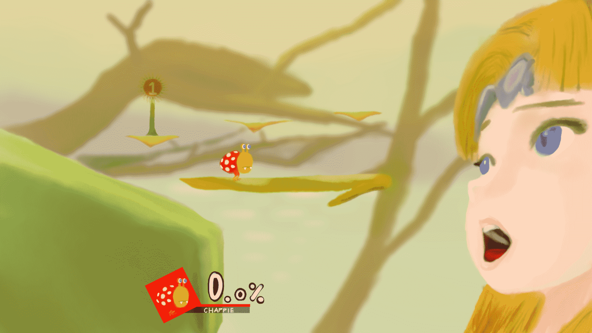

# 大亂鬥SP：立場調換

作者：3213213210

TID：26169

<title>1</title> <link href="../Styles/Style.css" type="text/css" rel="stylesheet">

# 1

半夜睡不著作了這個鬼東西
<ignore_js_op>

**lol.jpg** *(682.98 KB, 下載次數: 1)*

[下載附件](forum.php?mod=attachment&aid=NzU3OTd8ODk4OGU5YzR8MTYwMzg0ODUxNnwxODIzMHwyNjE2OQ%3D%3D&nothumb=yes)

2018-12-16 04:56 上傳

薩爾達是直接開遊戲用截圖功能傳上來再描的
怎麼說 遊戲發售第一天後這個畫面就一直卡在我腦裡
現在 雖然成品沒多好看 已經足夠表達我在想的東西了
同步發推特 祈禱著有那麼點機率變成小圈子的meme
[https://twitter.com/s3213213210/status/1074048518224994304](https://twitter.com/s3213213210/status/1074048518224994304)
好啦 該去檢討一下自己的人生了

<title>2</title> <link href="../Styles/Style.css" type="text/css" rel="stylesheet">

# 2

> [琉璃 發表於 2018-12-16 19:30](https://giantessnight.com/gnforum2012/forum.php?mod=redirect&goto=findpost&pid=392423&ptid=26169)
> 哦！你也玩大乱斗啊= =加个好友啊

燈火之星角色才開一半 也還沒決定自己要Main哪隻= =

然後我沒買NSO 這個月又在破產邊緣 所以我可以私訊FC碼 但要打的話不用等我了

<title>3</title> <link href="../Styles/Style.css" type="text/css" rel="stylesheet">

# 3

> [MicWhyss 發表於 2018-12-16 20:11](https://giantessnight.com/gnforum2012/forum.php?mod=redirect&goto=findpost&pid=392427&ptid=26169)
> 畫得很好呀，皮克敏這個系列本來就很細小的，和巨大娘的題材很配 :)

我還有個梗叫「符合原作比例的大亂鬥」 不過就要從零開始構圖了
<title>4</title> <link href="../Styles/Style.css" type="text/css" rel="stylesheet">

# 4

> [archer 發表於 2018-12-16 22:35](https://giantessnight.com/gnforum2012/forum.php?mod=redirect&goto=findpost&pid=392443&ptid=26169)
> 说起来这张图右边原来是只特别巨大的蜗牛来着。。这么想的话塞尔达还要巨大的多 ...

這張圖的梗就是把鬥士跟那隻蝸牛(恰比)調換
不過就算薩爾達臉拉到快極限大了嘴還是沒辦法張的比蝸牛大

<title>5</title> <link href="../Styles/Style.css" type="text/css" rel="stylesheet">

# 5

> [archer 發表於 2018-12-17 18:40](https://giantessnight.com/gnforum2012/forum.php?mod=redirect&goto=findpost&pid=392502&ptid=26169)
> 话说要怎么才能像网络上有人可以暂停游戏查看模型什么的

打到一半按暫停 找到調攝影機的選項 接下來照操作說明弄就好 好了按截圖<title>6</title> <link href="../Styles/Style.css" type="text/css" rel="stylesheet">

# 6

> [TANGLUNG 發表於 2018-12-18 09:23](https://giantessnight.com/gnforum2012/forum.php?mod=redirect&goto=findpost&pid=392536&ptid=26169)
> 前两天刚买了这游戏，感觉解锁人物好麻烦啊……

如果只是要解鎖的話有很快的方法
在普通亂鬥裡設定HP制、頭上開花，然後把別人的HP調成最低，這樣一開場就會馬上結束
接下來就把出現的角色幹掉就好，幹不掉就再一次，慢慢練
缺點是玩燈火的時候全部都要重解……</ignore_js_op>