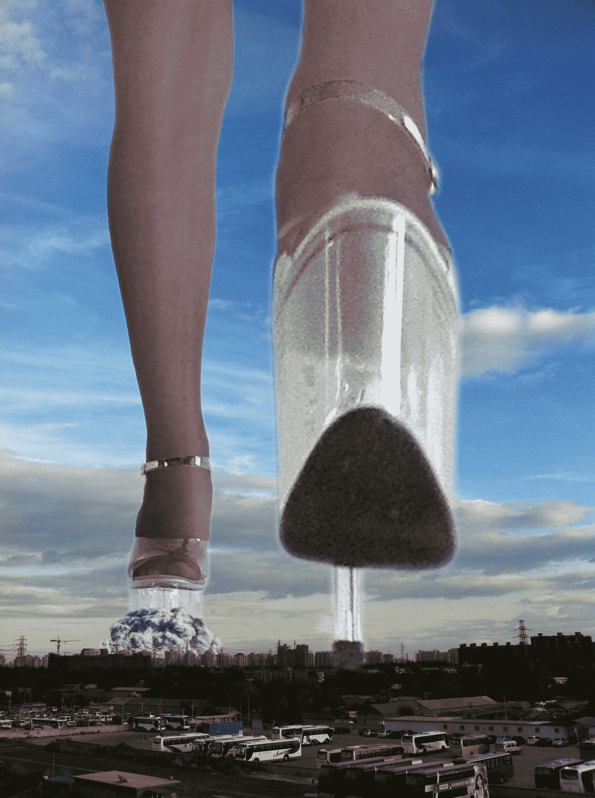

# 女神一步——厚底凉高漫步城区

作者：budebuai

TID：15172

<title>1</title> <link href="../Styles/Style.css" type="text/css" rel="stylesheet">

# 1

照片老了。。。角度弄了半天，就这样吧。。。<title>2</title> <link href="../Styles/Style.css" type="text/css" rel="stylesheet">

# 2

 <ignore_js_op>[女神一步.jpg](forum.php?mod=attachment&aid=MzYzNzd8YzI3ZjI1YjN8MTYwMzg3Mjc5MnwxODIzMHwxNTE3Mg%3D%3D&nothumb=yes) *(2.49 MB, 下載次數: 41)*

[下載附件](forum.php?mod=attachment&aid=MzYzNzd8YzI3ZjI1YjN8MTYwMzg3Mjc5MnwxODIzMHwxNTE3Mg%3D%3D&nothumb=yes)

2013-8-30 20:36 上傳  

女神一步踩踏城市

</ignore_js_op> <title>3</title> <link href="../Styles/Style.css" type="text/css" rel="stylesheet">

# 3

> ADSL 發表於 2013-8-30 20:50 
> 确实老。
> 像素略低。
> 那个烟雾的效果是用滤镜做的吗？

的确像素低。。。
烟雾找素材变形的，果然变形了，而且边缘还没处理。。。<title>4</title> <link href="../Styles/Style.css" type="text/css" rel="stylesheet">

# 4

> a5436060 發表於 2013-8-30 23:41 
> 全部都是高跟啊，以后可不可以尝试着换一下风格比如裸足或布鞋什么的 ...

呵呵，我是。。。高跟控，嗯嗯。。。