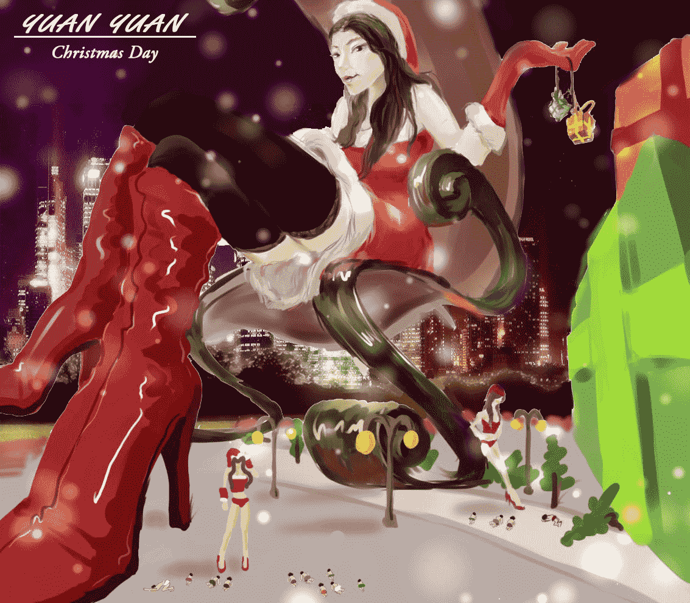
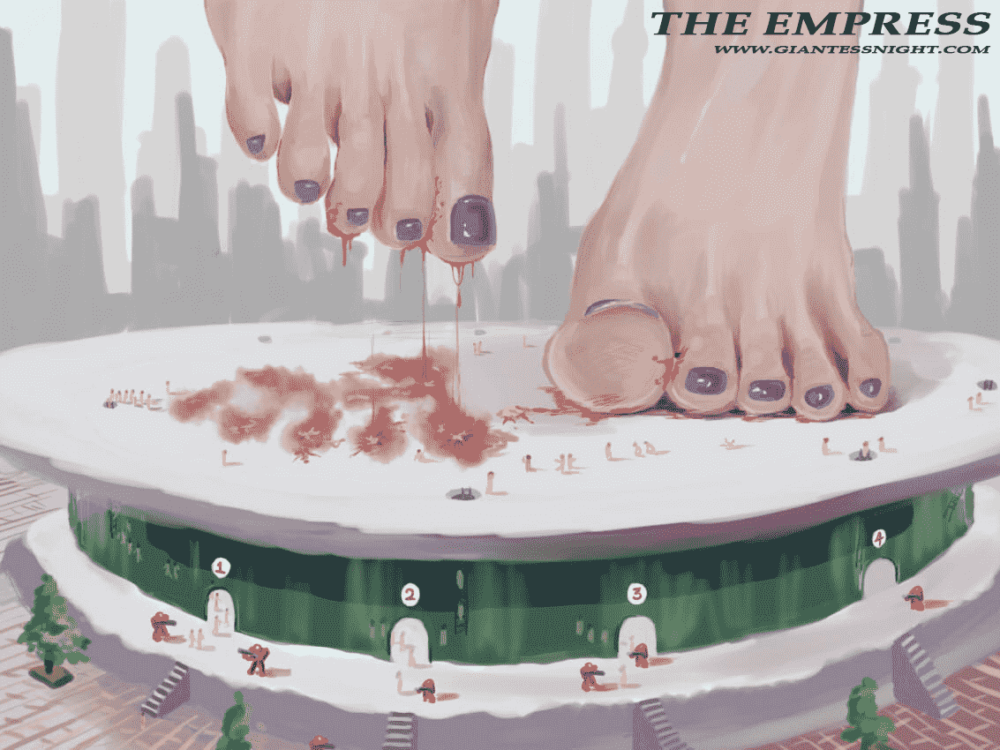
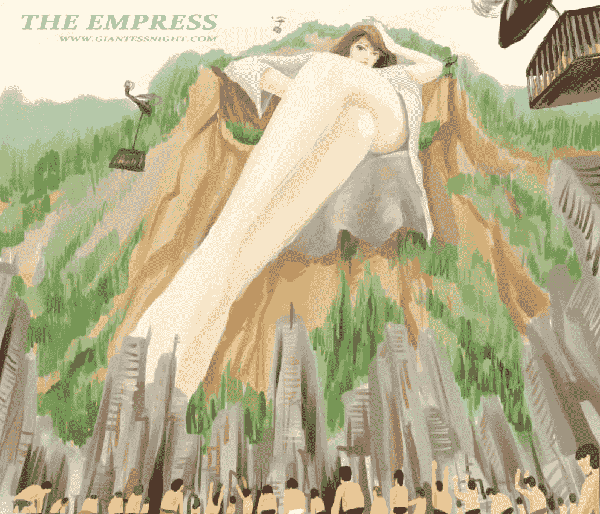

# 媛 媛 圣 足（更新）

作者：1291626994

TID：18105

<title>1</title> <link href="../Styles/Style.css" type="text/css" rel="stylesheet">

# 1

*本帖最後由 1291626994 於 2014-12-28 23:26 編輯*

媛媛新图片~~~~~~~~~~~~~~~~~~~~~~~~~~~~~~~~~~~~~~~~~~~<title>2</title> <link href="../Styles/Style.css" type="text/css" rel="stylesheet">

# 2

 <ignore_js_op>[媛媛圣足(4).jpg](forum.php?mod=attachment&aid=NDkwNDd8NTYxYWVkNmF8MTYwMzg2NjUyOHwxODIzMHwxODEwNQ%3D%3D&nothumb=yes) *(56.06 KB, 下載次數: 71)*

[下載附件](forum.php?mod=attachment&aid=NDkwNDd8NTYxYWVkNmF8MTYwMzg2NjUyOHwxODIzMHwxODEwNQ%3D%3D&nothumb=yes)

2014-12-28 23:26 上傳  

[.jpg")](javascript:;)</ignore_js_op> <ignore_js_op>[媛媛的圣诞节.JPG](forum.php?mod=attachment&aid=NDkwMjh8MmI5MGZlZGN8MTYwMzg2NjUyOHwxODIzMHwxODEwNQ%3D%3D&nothumb=yes) *(514.1 KB, 下載次數: 87)*

[下載附件](forum.php?mod=attachment&aid=NDkwMjh8MmI5MGZlZGN8MTYwMzg2NjUyOHwxODIzMHwxODEwNQ%3D%3D&nothumb=yes)

2014-12-25 23:48 上傳  

</ignore_js_op> <ignore_js_op>[IMG_6979.JPG](forum.php?mod=attachment&aid=NDg1ODZ8Mjk0MjQ0MWN8MTYwMzg2NjUyOHwxODIzMHwxODEwNQ%3D%3D&nothumb=yes) *(274.14 KB, 下載次數: 46)*

[下載附件](forum.php?mod=attachment&aid=NDg1ODZ8Mjk0MjQ0MWN8MTYwMzg2NjUyOHwxODIzMHwxODEwNQ%3D%3D&nothumb=yes)

2014-11-23 01:53 上傳  

</ignore_js_op> <ignore_js_op>[媛媛的成长日志（第二十二章 女皇）.jpg](forum.php?mod=attachment&aid=NDg1MjF8MzhiM2Q1NmN8MTYwMzg2NjUyOHwxODIzMHwxODEwNQ%3D%3D&nothumb=yes) *(326.04 KB, 下載次數: 277)*

[下載附件](forum.php?mod=attachment&aid=NDg1MjF8MzhiM2Q1NmN8MTYwMzg2NjUyOHwxODIzMHwxODEwNQ%3D%3D&nothumb=yes)

2014-11-15 20:17 上傳  

</ignore_js_op> <title>3</title> <link href="../Styles/Style.css" type="text/css" rel="stylesheet">

# 3

> [awkeygen 發表於 2014-11-15 22:06](https://giantessnight.com/gnforum2012/forum.php?mod=redirect&goto=findpost&pid=238786&ptid=18105)
> 怒赞！不知楼主是画的还是渲染的？楼主可以试试finalrender。。。
> 感觉绘画还是做巨大化的正途，3d做巨大化 ...

画的，是啊，3D实在有点麻烦~~~~~~~~
<title>4</title> <link href="../Styles/Style.css" type="text/css" rel="stylesheet">

# 4

> [因为你新鞋 發表於 2014-11-29 00:11](https://giantessnight.com/gnforum2012/forum.php?mod=redirect&goto=findpost&pid=240131&ptid=18105)
> 好喜欢楼主的画风！第二张仰视大长腿的感觉简直赞

谢谢支持~~~~~~~~~~~~~~~~~~~<title>5</title> <link href="../Styles/Style.css" type="text/css" rel="stylesheet">

# 5

> [282795532 發表於 2014-12-6 15:28](https://giantessnight.com/gnforum2012/forum.php?mod=redirect&goto=findpost&pid=240968&ptid=18105)
> LZ画风点赞，期待新作。

谢谢支持～～～～～～<title>6</title> <link href="../Styles/Style.css" type="text/css" rel="stylesheet">

# 6

> [嘟囔u影 發表於 2014-12-7 21:28](https://giantessnight.com/gnforum2012/forum.php?mod=redirect&goto=findpost&pid=241202&ptid=18105)
> LZ画的很像那种油画，不过色调上有些地方模糊，但是不影响整体的画面！
> 总之是很好的了 ...

谢谢支持~~~~~~~~~~~~~~~~~~~~~~~~~~~~~~~~~~<title>7</title> <link href="../Styles/Style.css" type="text/css" rel="stylesheet">

# 7

> [fox2 發表於 2014-12-26 21:23](https://giantessnight.com/gnforum2012/forum.php?mod=redirect&goto=findpost&pid=242677&ptid=18105)
> 很喜歡這畫風
> 樓主繼續加油!!

谢谢支持～～～～～～<title>8</title> <link href="../Styles/Style.css" type="text/css" rel="stylesheet">

# 8

> [半肉ADC 發表於 2014-12-28 15:46](https://giantessnight.com/gnforum2012/forum.php?mod=redirect&goto=findpost&pid=242857&ptid=18105)
> 画的不错，顶起！！！！！！

谢谢支持～～～～～～～<title>9</title> <link href="../Styles/Style.css" type="text/css" rel="stylesheet">

# 9

> [xnr 發表於 2015-1-3 02:54](https://giantessnight.com/gnforum2012/forum.php?mod=redirect&goto=findpost&pid=243302&ptid=18105)
> 感觉透视有问题，其他还好，请继续创作

是啊，仰视的身体正视的脚～的确有些问题～感谢支持～<title>10</title> <link href="../Styles/Style.css" type="text/css" rel="stylesheet">

# 10

> [yuliner 發表於 2015-2-7 15:16](https://giantessnight.com/gnforum2012/forum.php?mod=redirect&goto=findpost&pid=245890&ptid=18105)
> 楼主这个用手绘板画的吗

是的啊~~~~~~~~~~~~~~~~~~~~~~~~~~~~~~~~~~~~~~~~·