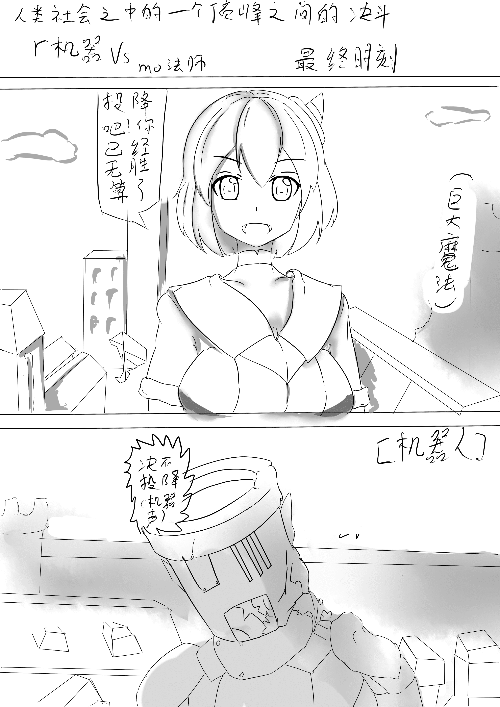
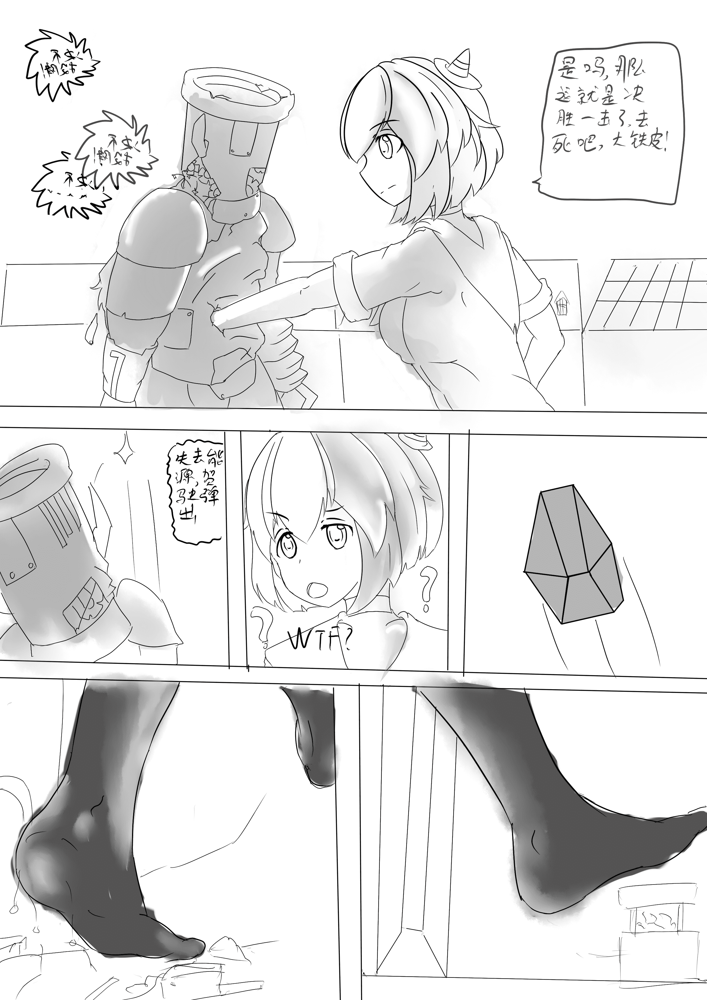
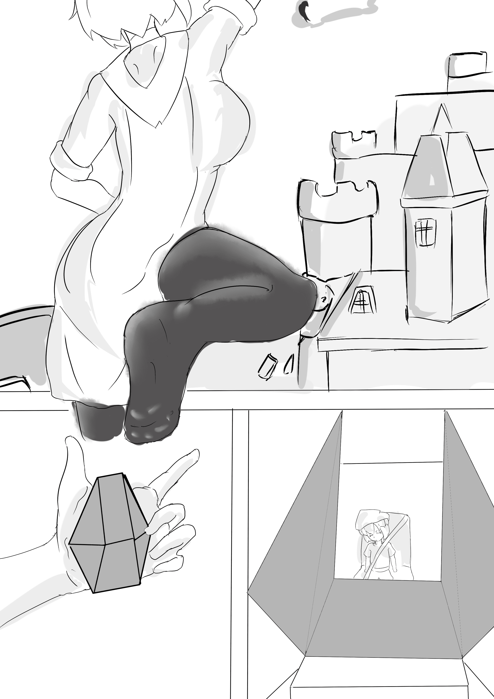

# 小长篇长期骗分计划（1）

作者：maker13

TID：21205

 

# 1

由于个人原因，自己是第一次尝试画漫画，所以画的很烂。。加上我自己没什么时间，，所以最后决定分多次画了，一可以分次骗分，二画画技巧有提高的话也可以变现出来，其实画这个的目的主要还是为了练习吧233

 

# 2

<ignore_js_op>[1.jpg](forum.php?mod=attachment&aid=NjE3MTB8OTE1ZTBhYWF8MTYwMzg2MTgzNnwxODIzMHwyMTIwNQ%3D%3D&nothumb=yes) *(1.8 MB, 下載次數: 15)*

[下載附件](forum.php?mod=attachment&aid=NjE3MTB8OTE1ZTBhYWF8MTYwMzg2MTgzNnwxODIzMHwyMTIwNQ%3D%3D&nothumb=yes)

2016-6-11 11:46 上傳  

</ignore_js_op> <ignore_js_op>[2.jpg](forum.php?mod=attachment&aid=NjE3MTF8MGNlMjU3ZmR8MTYwMzg2MTgzNnwxODIzMHwyMTIwNQ%3D%3D&nothumb=yes) *(2 MB, 下載次數: 4)*

[下載附件](forum.php?mod=attachment&aid=NjE3MTF8MGNlMjU3ZmR8MTYwMzg2MTgzNnwxODIzMHwyMTIwNQ%3D%3D&nothumb=yes)

2016-6-11 11:46 上傳  

</ignore_js_op> <ignore_js_op>[3.jpg](forum.php?mod=attachment&aid=NjE3MTJ8ZTY0MWFkNDN8MTYwMzg2MTgzNnwxODIzMHwyMTIwNQ%3D%3D&nothumb=yes) *(1.22 MB, 下載次數: 6)*

[下載附件](forum.php?mod=attachment&aid=NjE3MTJ8ZTY0MWFkNDN8MTYwMzg2MTgzNnwxODIzMHwyMTIwNQ%3D%3D&nothumb=yes)

2016-6-11 11:46 上傳  

</ignore_js_op> <ignore_js_op>[5.0.jpg](forum.php?mod=attachment&aid=NjE3MTN8M2I0ZTQ1ODd8MTYwMzg2MTgzNnwxODIzMHwyMTIwNQ%3D%3D&nothumb=yes) *(1.43 MB, 下載次數: 4)*

[下載附件](forum.php?mod=attachment&aid=NjE3MTN8M2I0ZTQ1ODd8MTYwMzg2MTgzNnwxODIzMHwyMTIwNQ%3D%3D&nothumb=yes)

2016-6-11 11:46 上傳  

</ignore_js_op>  

# 3

> 包子巴掌 發表於 2016-6-11 12:49

> 这是楼主自己画的吗？ 确实画的不错呢

是自己画的，谢谢啦～ 

# 4

> [jiachufan1 發表於 2016-6-11 15:45](https://giantessnight.com/gnforum2012/forum.php?mod=redirect&goto=findpost&pid=296048&ptid=21205)

> 看到了（1）

> 说明就有 2 3 4 5 6咯？（淫笑）

被你发现了，其实还会继续画下去的，只要有足够的时间和空间的话

 

# 5

> [1826631475 發表於 2016-6-11 15:10](https://giantessnight.com/gnforum2012/forum.php?mod=redirect&goto=findpost&pid=296046&ptid=21205)

> 很赞的说～（啊啊我的流量啊...

233，建议用电脑看比较好

 

# 6

> [gw1990zzz 發表於 2016-6-11 20:33](https://giantessnight.com/gnforum2012/forum.php?mod=redirect&goto=findpost&pid=296075&ptid=21205)

> 建议下次在ps里码字吧，sai里写字简直不堪。。。

然而我并不会用ps。。

 

# 7

> [447825856 發表於 2016-6-12 00:30](https://giantessnight.com/gnforum2012/forum.php?mod=redirect&goto=findpost&pid=296105&ptid=21205)

> 河童：我可不会轻易地狗带！欧拉欧拉欧拉欧拉欧拉！！！！

> GTS：木大木大木大木大木大！！！！

> 画的很棒啊 ...

因为种种原因这并不是我最满意的，个人感觉如果条件允许的话能画的更好。。 

# 8

> [aszccdd 發表於 2016-6-12 03:30](https://giantessnight.com/gnforum2012/forum.php?mod=redirect&goto=findpost&pid=296120&ptid=21205)

> Well done dude! Your comics seem like the one come out from masters, looking forward your more artwo ...

似乎是来自国际的友人，先谢谢赏光，然后谁帮我翻译一下。。。