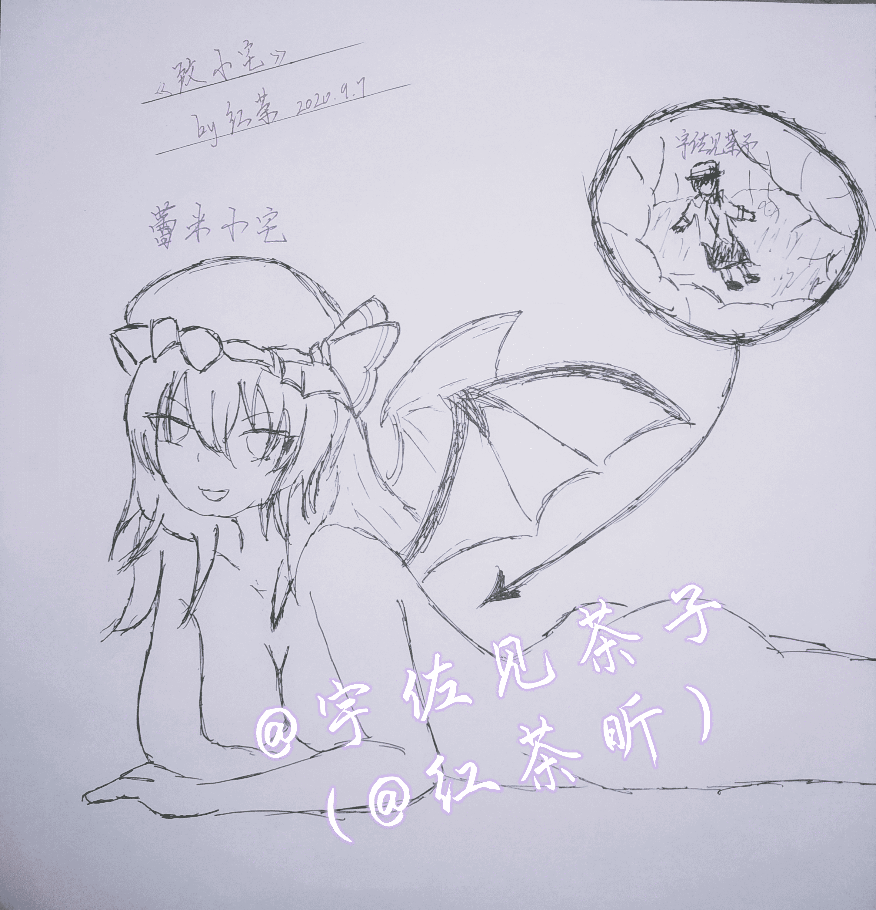

# 尝试一下手绘，零基础的试水作

作者：红茶

TID：29435

 

# 1

<ignore_js_op>

**作品1水印.jpg** *(3.2 MB, 下載次數: 0)*

[下載附件](forum.php?mod=attachment&aid=ODQ5ODB8Yzk5NTE1Nzl8MTYwMzgyNjEzMXwxODIzMHwyOTQzNQ%3D%3D&nothumb=yes)

2020-9-7 21:19 上傳

这次不搞写作和自拍，尝试一次手绘

从来没有学过绘画，也没有经验，构图缺陷请见谅）

角色则是蕾米和莲子啦，自己和cp的圈内人设））

 

# 2

> [libido 發表於 2020-9-7 21:45](https://giantessnight.com/gnforum2012/forum.php?mod=redirect&goto=findpost&pid=447136&ptid=29435)

> 感觉把翅膀去掉的话，还可以再摸一张蜜蜂组的(厨力放出)

在别的群晒的时候，也被人第一眼看成了梅莉……

 

# 3

> [St2019 發表於 2020-9-7 23:01](https://giantessnight.com/gnforum2012/forum.php?mod=redirect&goto=findpost&pid=447146&ptid=29435)

> 很不错啊，看上去看不出来什么很大缺陷。

> 话说茶姐不是有数位板吗，咋就吃灰啦。要是有兴趣练的多了可以转 ...

只是一时兴起搞得，平时练的最多的还是书法……

数位板的话，手感实在有点适应不过来，加上SAI好多东西我根本看不懂……

 

# 4

> [焦冥小虫xxx 發表於 2020-9-8 00:34](https://giantessnight.com/gnforum2012/forum.php?mod=redirect&goto=findpost&pid=447156&ptid=29435)

> 还不错呢。感觉多多练习肯定画的更好呢，既然茶姐书法不错对于绘画应该也是需要练习些就很好哦。有时候适当 ...

嗯，还是会尽可能去尝试的x

 

# 5

> [cuitianhaocy 發表於 2020-9-8 13:39](https://giantessnight.com/gnforum2012/forum.php?mod=redirect&goto=findpost&pid=447190&ptid=29435)

> 为啥红茶不是吞食的角色呢

往小了讲，算是宠cp

往大了讲，蕾米人设更加色气一点吧</ignore_js_op>