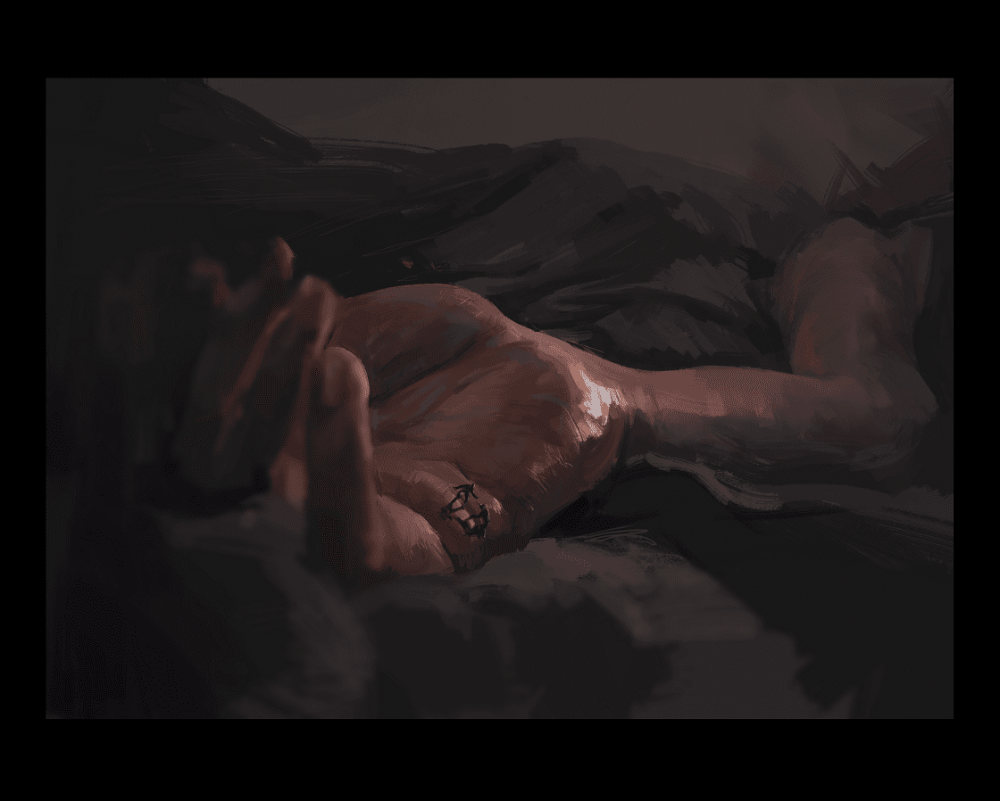

# 希望坚持把这个系列画出来

作者：1291626994

TID：27305

<title>1</title> <link href="../Styles/Style.css" type="text/css" rel="stylesheet">

# 1

希望坚持把这个系列画出来

<title>2</title> <link href="../Styles/Style.css" type="text/css" rel="stylesheet">

# 2

 <ignore_js_op>[微信截图_20190827162547.png](forum.php?mod=attachment&aid=Nzk0OTV8OGMxOTE1OTd8MTYwMzgzOTQxNHwxODIzMHwyNzMwNQ%3D%3D&nothumb=yes) *(783.45 KB, 下載次數: 48)*

[下載附件](forum.php?mod=attachment&aid=Nzk0OTV8OGMxOTE1OTd8MTYwMzgzOTQxNHwxODIzMHwyNzMwNQ%3D%3D&nothumb=yes)

2019-8-27 16:26 上傳  

</ignore_js_op> <title>3</title> <link href="../Styles/Style.css" type="text/css" rel="stylesheet">

# 3

> [dfk345 發表於 2019-8-27 17:05](https://giantessnight.com/gnforum2012/forum.php?mod=redirect&goto=findpost&pid=413568&ptid=27305)
> 哇大佬你这是WLOP的画风吗，我超喜欢的，经常那他的图做壁纸

是的，棒哦
但我也想稍微跟他做出些区别