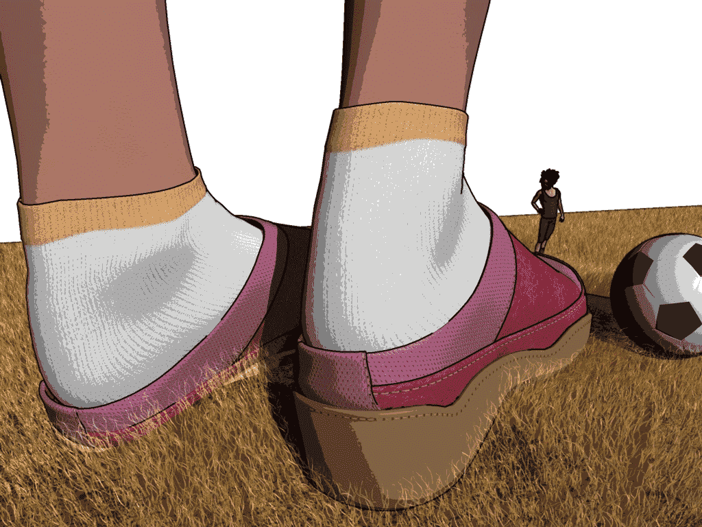
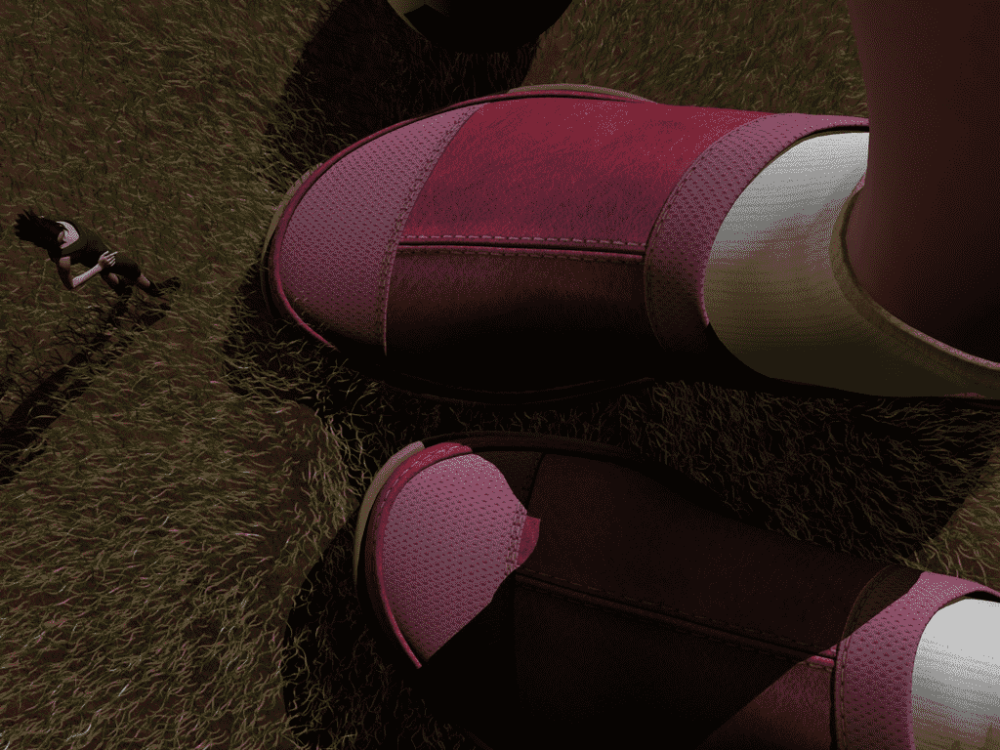
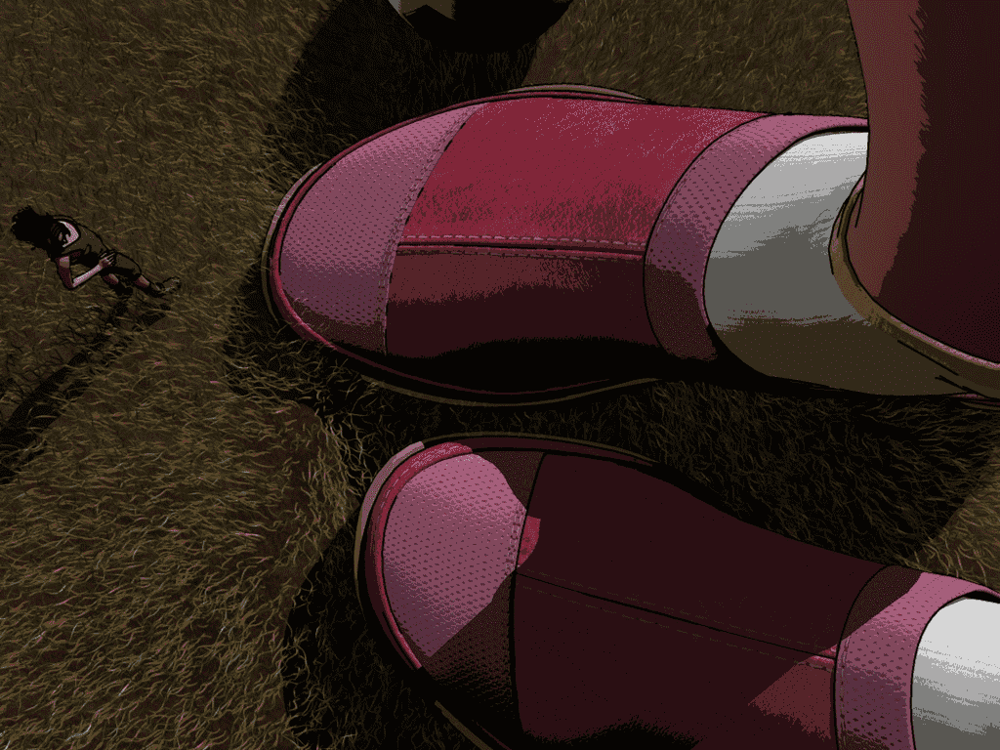

# 恩恩 让大家比较一下3d效果和漫画效果（6张）

作者：awkeygen

TID：6460

 

# 1

一直都很忙，再加上没什么剧情，一直没开工，最近学了一些Cinema4D（就是mk_cuf用的那个软件），话说这个软件在国外已经很流行了，号称“小maya”，为了弥补这段时间的空缺，发了6张图图，分别用3D和漫画两种方式渲染，自己都不知道那种效果好了，看看大家的反应，呵呵，好了，不说了，上图

**别忘了点击后再看哦！！**

01（3d效果）

<ignore_js_op>

**01.jpg** *(168.24 KB, 下載次數: 8)*

[下載附件](forum.php?mod=attachment&aid=MTY3OTR8NmFkZDhiNTF8MTYwMzg3OTg5OXwxODIzMHw2NDYw&nothumb=yes)

2010-1-28 14:53 上傳

01（漫画效果）

<ignore_js_op>

**01_1.jpg** *(169.12 KB, 下載次數: 1)*

[下載附件](forum.php?mod=attachment&aid=MTY3OTV8NTdkYjNhYWN8MTYwMzg3OTg5OXwxODIzMHw2NDYw&nothumb=yes)

2010-1-28 14:54 上傳

02（3d效果）

<ignore_js_op>

**02.jpg** *(252.63 KB, 下載次數: 1)*

[下載附件](forum.php?mod=attachment&aid=MTY3OTZ8NzE4MWIzNzZ8MTYwMzg3OTg5OXwxODIzMHw2NDYw&nothumb=yes)

2010-1-28 14:55 上傳

02（漫画效果）

<ignore_js_op>

**02_1.jpg** *(281.18 KB, 下載次數: 1)*

[下載附件](forum.php?mod=attachment&aid=MTY4MDV8OGUzZjRkYzl8MTYwMzg3OTg5OXwxODIzMHw2NDYw&nothumb=yes)

2010-1-28 14:56 上傳

03（3d效果）

<ignore_js_op>

**03.jpg** *(277.39 KB, 下載次數: 1)*

[下載附件](forum.php?mod=attachment&aid=MTY4MDZ8YjljYjk2NWN8MTYwMzg3OTg5OXwxODIzMHw2NDYw&nothumb=yes)

2010-1-28 14:57 上傳

03（漫画效果）

<ignore_js_op>

**03_1.jpg** *(294.96 KB, 下載次數: 1)*

[下載附件](forum.php?mod=attachment&aid=MTY4MDd8ZDQ5OWU2NDZ8MTYwMzg3OTg5OXwxODIzMHw2NDYw&nothumb=yes)

2010-1-28 14:57 上傳

[ *本帖最後由 awkeygen 於 2010-1-28 14:58 編輯* ] 

# 2

其实质感还是取决于贴图本身，我一直用那个比较光滑的皮肤，我喜欢这种无暇的感觉，质感的皮肤看着真实，可是我一看就有一种粗糙脏兮兮的感觉，可能是我做东西太理想化了

总之呢就是调整贴图的凹凸和高光就能出现皮肤质感，但是一个人物从头到脚30多张材质调一遍的话我估计会疯的。。。。哭。。。。

话说你3d最近又进展没？ 

# 3

是啊 我个人还是比较喜欢3d真实感再略加一些绚丽浪漫的感觉，但是3d不容易出效果，漫画感觉容易出效果（其实漫画渲染实质是一种偷工减料）。

话说最近各种自动化考试艰难通过，可是一到实际项目中那一堆矩阵（好像叫什么现代控制啥的）根本没用上，真是崩溃

[ *本帖最後由 awkeygen 於 2010-1-29 10:02 編輯* ]</ignore_js_op></ignore_js_op></ignore_js_op></ignore_js_op></ignore_js_op></ignore_js_op>