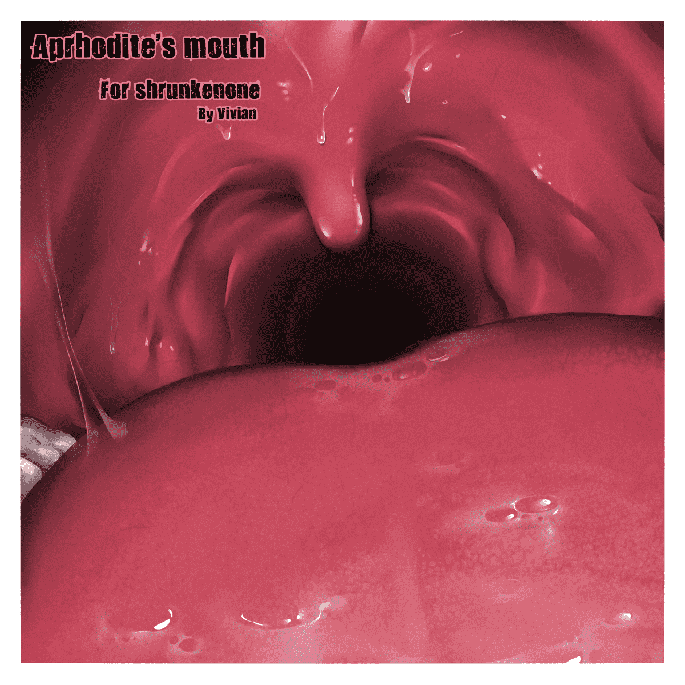

# 我也来个口腔系

作者：vivian

TID：12148

<title>1</title> <link href="../Styles/Style.css" type="text/css" rel="stylesheet">

# 1

 同时发两个表情符号也可以啊。<title>2</title> <link href="../Styles/Style.css" type="text/css" rel="stylesheet">

# 2

 <ignore_js_op>[Aprhodite's mouth.jpg](forum.php?mod=attachment&aid=MjgxOTR8ODBlM2M4ZTF8MTYwMzg3NDg3N3wxODIzMHwxMjE0OA%3D%3D&nothumb=yes) *(359.48 KB, 下載次數: 68)*

[下載附件](forum.php?mod=attachment&aid=MjgxOTR8ODBlM2M4ZTF8MTYwMzg3NDg3N3wxODIzMHwxMjE0OA%3D%3D&nothumb=yes)

2012-4-15 12:21 上傳  

</ignore_js_op> <title>3</title> <link href="../Styles/Style.css" type="text/css" rel="stylesheet">

# 3

> 原帖由 *Dante* 於 2012-4-16 14:35 發表 
> .
> 真的可以感受到VV這幾年來的不斷進步。
> 
> 基本上打從comm3的時候，就發現妳對寫實的人體特寫掌握得很好。
> 或者以前就有這種感覺，但comm3的幾段描寫讓我肯定了這一點。
> 想必是經過一番苦練才培育出來的技法，十 ...

久违的被认同的感受真的好棒！55555