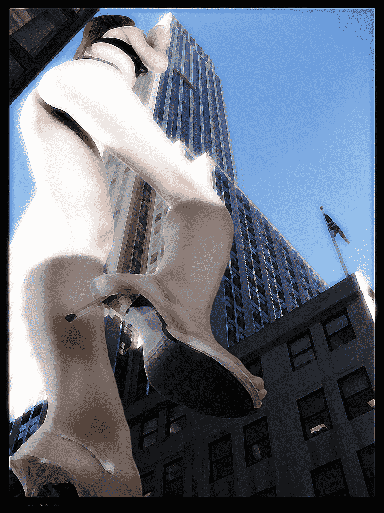
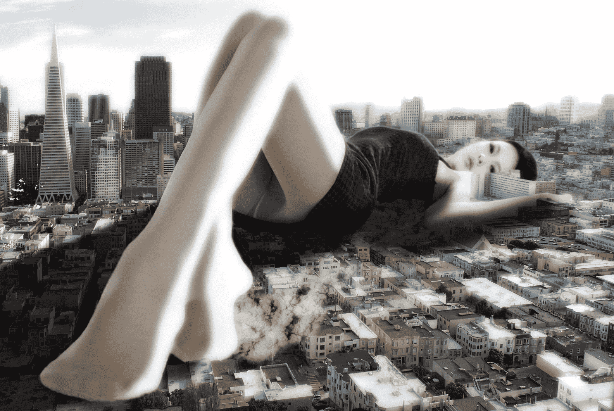

# 我又来啦,哈哈!

作者：AKM41803

TID：10876

 

# 1

大家对我的支持是我作图的动力 <ignore_js_op> </ignore_js_op> **C.jpg** *(2.05 MB, 下載次數: 0)*

[下載附件](forum.php?mod=attachment&aid=MjYwMDJ8MWFjNzM5NjV8MTYwMzg3NjIyOXwxODIzMHwxMDg3Ng%3D%3D&nothumb=yes)

2011-8-26 16:57 上傳

[localimg=500,335]2[/localimg],这次来两张艺术风格的: <ignore_js_op>

**D.jpg** *(1.53 MB, 下載次數: 4)*

[下載附件](forum.php?mod=attachment&aid=MjYwMDN8ZGRkYzlmYTl8MTYwMzg3NjIyOXwxODIzMHwxMDg3Ng%3D%3D&nothumb=yes)

2011-8-26 17:00 上傳

[ *本帖最後由 AKM41803 於 2011-8-26 17:00 編輯* ] 

# 2

今天突然心血来潮,所以...

 这两张都用了PHOTOSHOP中"成角的线条"效果...</ignore_js_op>