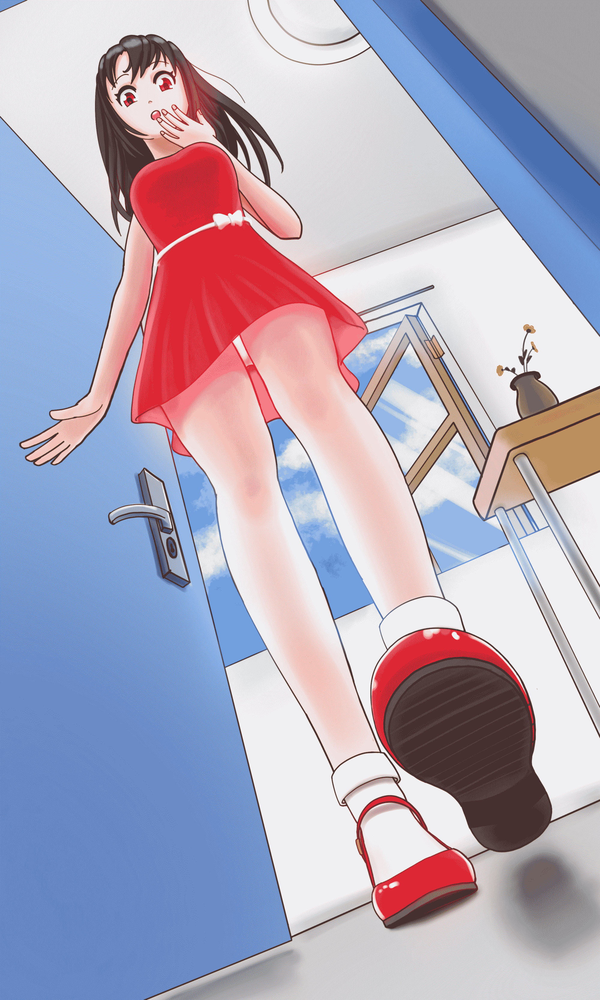

# 我开始学画画了

作者：marycat

TID：26879

<title>1</title> <link href="../Styles/Style.css" type="text/css" rel="stylesheet">

# 1

<ignore_js_op>

**0519_2.jpg** *(1.1 MB, 下載次數: 36)*

[下載附件](forum.php?mod=attachment&aid=Nzg0OTZ8ZDUwNTlmYzV8MTYwMzgzOTQ1MXwxODIzMHwyNjg3OQ%3D%3D&nothumb=yes)

2019-5-19 19:23 上傳

图片尺寸太大发不上来，缩小了一点才可以，反正没多少细节，不影响观看_(:з)∠)_

第一幅作品，水平极其有限，就这么个简单的场景花了一星期_(:з)∠)_

刚刚才发现忘了画窗帘，但我已经不想再返工了

画画真的好难
<title>2</title> <link href="../Styles/Style.css" type="text/css" rel="stylesheet">

# 2

> [andywong29 發表於 2019-5-19 20:16](https://giantessnight.com/gnforum2012/forum.php?mod=redirect&goto=findpost&pid=405563&ptid=26879)
> 真的是第一次?晝得很棒呀

若干年前在学校有一点点静物的素描水粉基础，之后画画基本处于荒废状态。两个月前下定决心开始学人体解剖结构，尝试开始画人，然后又把N年前买的一页没看的SAI上色书翻出来看了几页学会了基本上色方法。。于是……就有了这张图
<title>3</title> <link href="../Styles/Style.css" type="text/css" rel="stylesheet">

# 3

> [迷途小喵 發表於 2019-5-20 10:39](https://giantessnight.com/gnforum2012/forum.php?mod=redirect&goto=findpost&pid=405600&ptid=26879)
> 雖然不知道是不是有參考的場景，但初學者就有話的如此好的比例骨架背景架構，實在是不得不佩服，隨然在細節 ...

确实是用了之前做的角色模型摆姿势角度做参考的（小声<title>4</title> <link href="../Styles/Style.css" type="text/css" rel="stylesheet">

# 4

> [MiaoKong 發表於 2019-5-19 21:45](https://giantessnight.com/gnforum2012/forum.php?mod=redirect&goto=findpost&pid=405570&ptid=26879)
> 又是一位板绘大佬的诞生！我也是学画画的，不如咱们pixiv互关一波吧～我p站ID是MiaoKong ...

大佬，我不混P站哒，N年前注册过现在别说密码了用户名都忘得一干二净了2333
<title>5</title> <link href="../Styles/Style.css" type="text/css" rel="stylesheet">

# 5

> [無邊落木 發表於 2019-5-20 00:03](https://giantessnight.com/gnforum2012/forum.php?mod=redirect&goto=findpost&pid=405585&ptid=26879)
> 兩個月從零畫到有透視有互動有顏色，前途不可限量!!

借大佬吉言ヽ(✿ﾟ▽ﾟ)ノ
话说我学人体结构本来是为了做更写实的模型，后来发现画画也挺有意思的哈哈
<title>6</title> <link href="../Styles/Style.css" type="text/css" rel="stylesheet">

# 6

> [ww69 發表於 2019-5-21 00:35](https://giantessnight.com/gnforum2012/forum.php?mod=redirect&goto=findpost&pid=405640&ptid=26879)
> 感觉你不只忘了窗帘 还忘了加小人  不过这鞋子超级对胃口

第一人称视角，所以没有画小人=￣ω￣=
<title>7</title> <link href="../Styles/Style.css" type="text/css" rel="stylesheet">

# 7

> [回梦游仙 發表於 2019-5-20 21:14](https://giantessnight.com/gnforum2012/forum.php?mod=redirect&goto=findpost&pid=405628&ptid=26879)
> 祝贺祝贺画的真心不错以后可以尝试图文了

其实我早在十年前上高中的时候拿着诺基亚键盘机码过一篇上万字的文23333 但是没有在任何地方发过，现在看来也算黑历史了_(:з)∠)_
<title>8</title> <link href="../Styles/Style.css" type="text/css" rel="stylesheet">

# 8

> [3213213210 發表於 2019-5-21 23:11](https://giantessnight.com/gnforum2012/forum.php?mod=redirect&goto=findpost&pid=405690&ptid=26879)
> 門把跟門本體的透視沒有統一，腰帶沒有立體感
> 除此之外，太棒啦，太有毅力了，剛開始學畫畫就衝含腳的仰角 ...

其实是用了之前做的模型摆pose参考的hhhhh 不然肯定画崩
<title>9</title> <link href="../Styles/Style.css" type="text/css" rel="stylesheet">

# 9

> [3213213210 發表於 2019-5-25 12:28](https://giantessnight.com/gnforum2012/forum.php?mod=redirect&goto=findpost&pid=405935&ptid=26879)
> 看得出來有用3D做參考 不然人有點圓滑過頭
> 那不算問題啦 但是我感覺有些物件是在不同的空間擺出來再描上去 ...

我也知道透视很重要，不过感觉对我现在的水平来说还有点早。。以前看过一个四个小时的透视教学视频，真的太复杂了。。那时才知道透视根本不是一句近大远小能概括的
<ignore_js_op>

**微信图片_20190525165540.jpg** *(26.18 KB, 下載次數: 0)*

[下載附件](forum.php?mod=attachment&aid=Nzg2MjV8M2Y3ZmM3NWV8MTYwMzgzOTQ1MXwxODIzMHwyNjg3OQ%3D%3D&nothumb=yes)

2019-5-25 16:57 上傳</ignore_js_op></ignore_js_op>