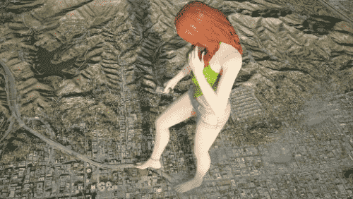
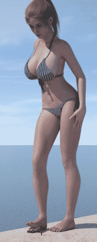

# 我想试着学一下图片的制作，求问这种图一般是什么软件做出来的

作者：roundrage

TID：25801

<title>1</title> <link href="../Styles/Style.css" type="text/css" rel="stylesheet">

# 1

我是在giantessbooru看到的，还有很多类似的，感觉画质很好，看起来比较真实。很想去学，然后做出很多自己喜欢的体位什么的。我大学新生，军训后会有充足时间，有计算机基础。<title>2</title> <link href="../Styles/Style.css" type="text/css" rel="stylesheet">

# 2

 <ignore_js_op>[233859.jpg](forum.php?mod=attachment&aid=NzQwNzN8YjU3MGNiYWZ8MTYwMzg0OTIwNXwxODIzMHwyNTgwMQ%3D%3D&nothumb=yes) *(64.87 KB, 下載次數: 1)*

[下載附件](forum.php?mod=attachment&aid=NzQwNzN8YjU3MGNiYWZ8MTYwMzg0OTIwNXwxODIzMHwyNTgwMQ%3D%3D&nothumb=yes)

2018-9-9 17:07 上傳  

</ignore_js_op> <ignore_js_op>[237266.jpg](forum.php?mod=attachment&aid=NzQwNzR8NjUxYWYyMmR8MTYwMzg0OTIwNXwxODIzMHwyNTgwMQ%3D%3D&nothumb=yes) *(20.46 KB, 下載次數: 0)*

[下載附件](forum.php?mod=attachment&aid=NzQwNzR8NjUxYWYyMmR8MTYwMzg0OTIwNXwxODIzMHwyNTgwMQ%3D%3D&nothumb=yes)

2018-9-9 17:08 上傳  

</ignore_js_op> <title>3</title> <link href="../Styles/Style.css" type="text/css" rel="stylesheet">

# 3

上传之后清晰度比较低，但原图还是比较清晰的。<title>4</title> <link href="../Styles/Style.css" type="text/css" rel="stylesheet">

# 4

> 3213213210 發表於 2018-9-9 21:13
> 要做3D的話 最推薦的是Blender當入門
> 為甚麼呢 兩個字 免費
> 而且Blender是開源的 所以雖然更新比較慢 但是 ...

进了重点班据说每个人都配电脑，等分班考试成绩出来我再看看，不过我估计就算能进也没有那么好的......