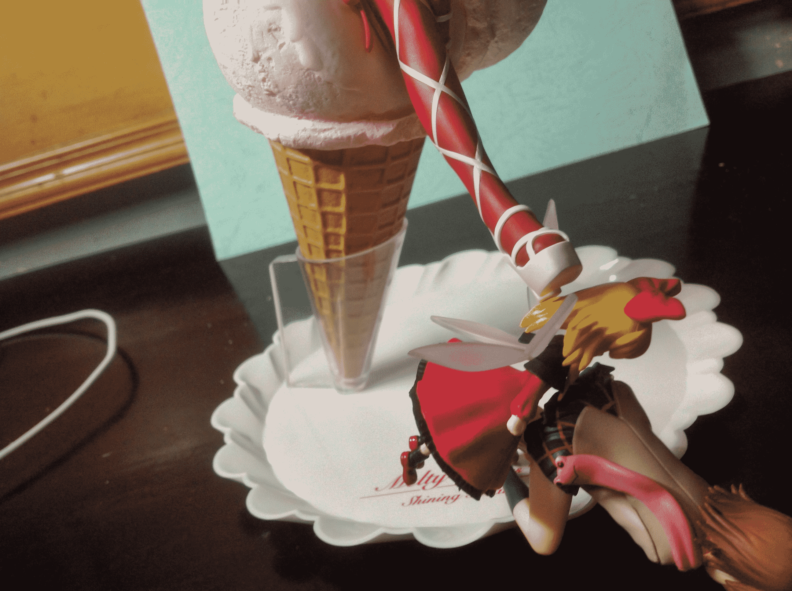
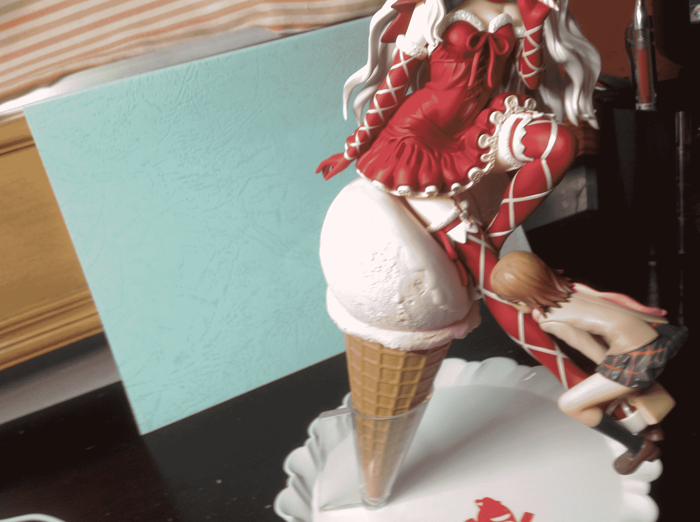
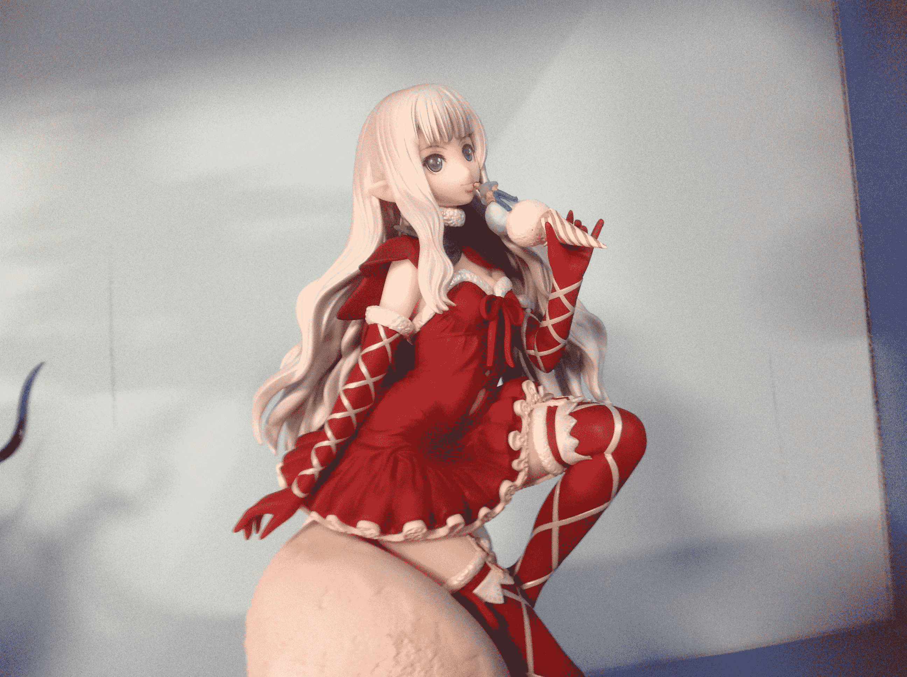
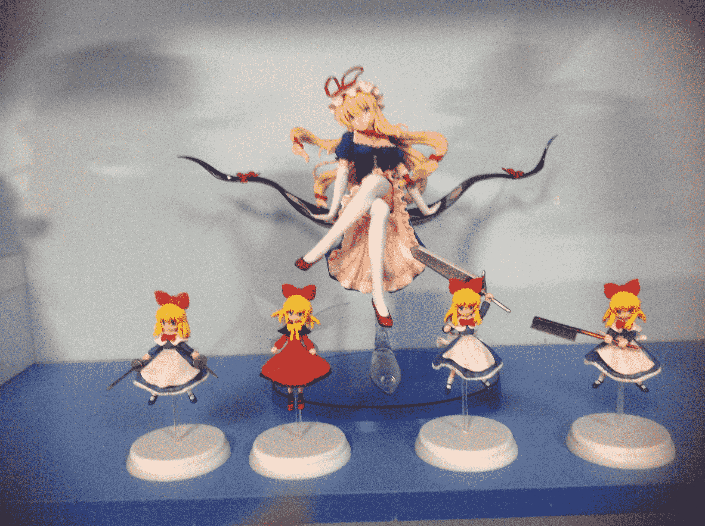
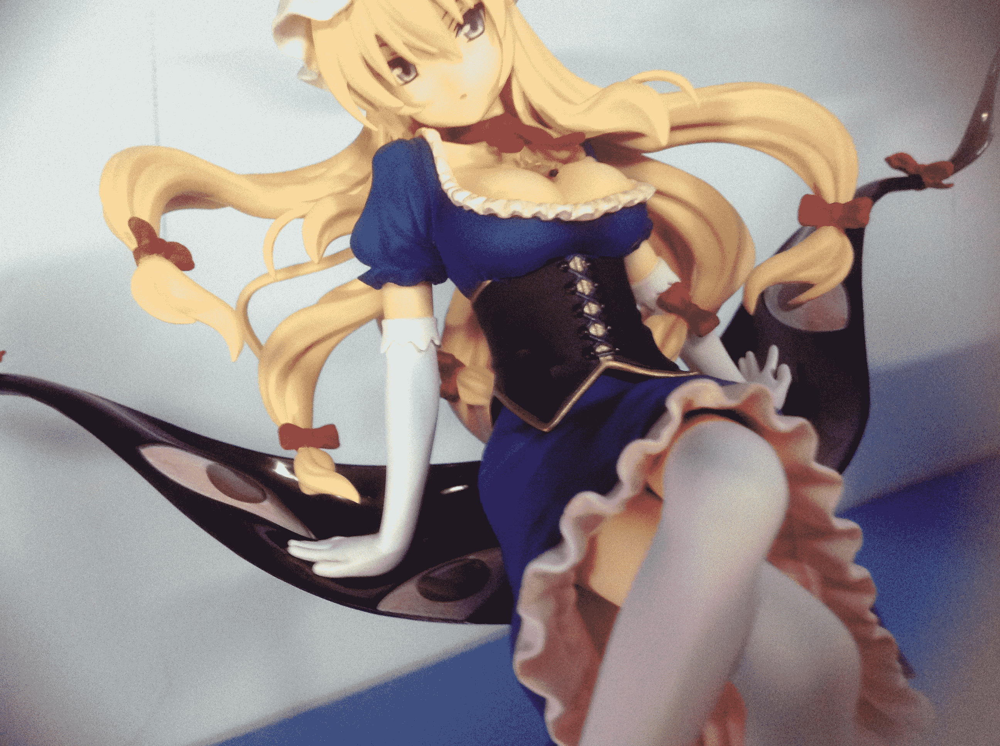
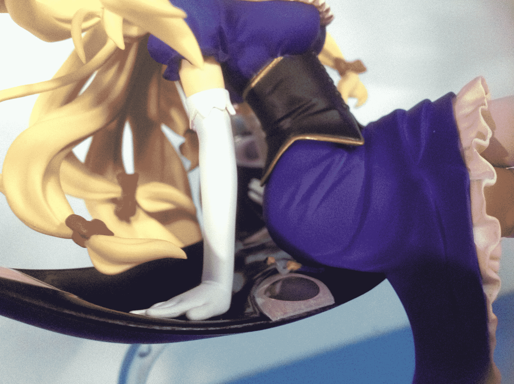
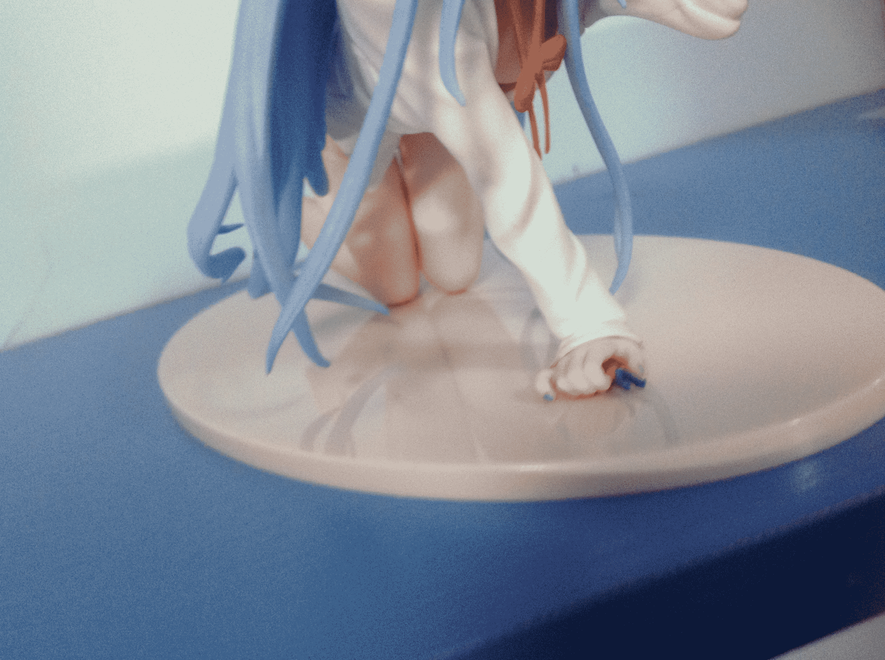
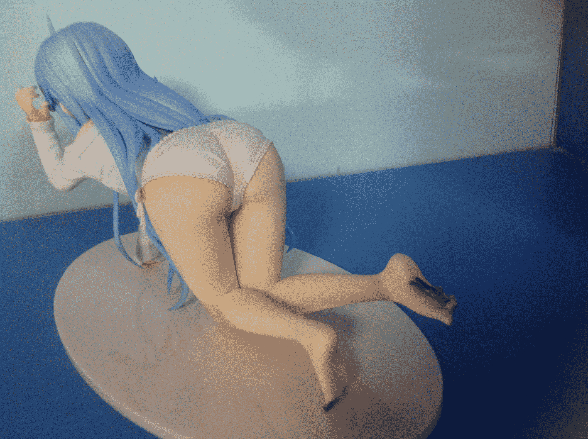
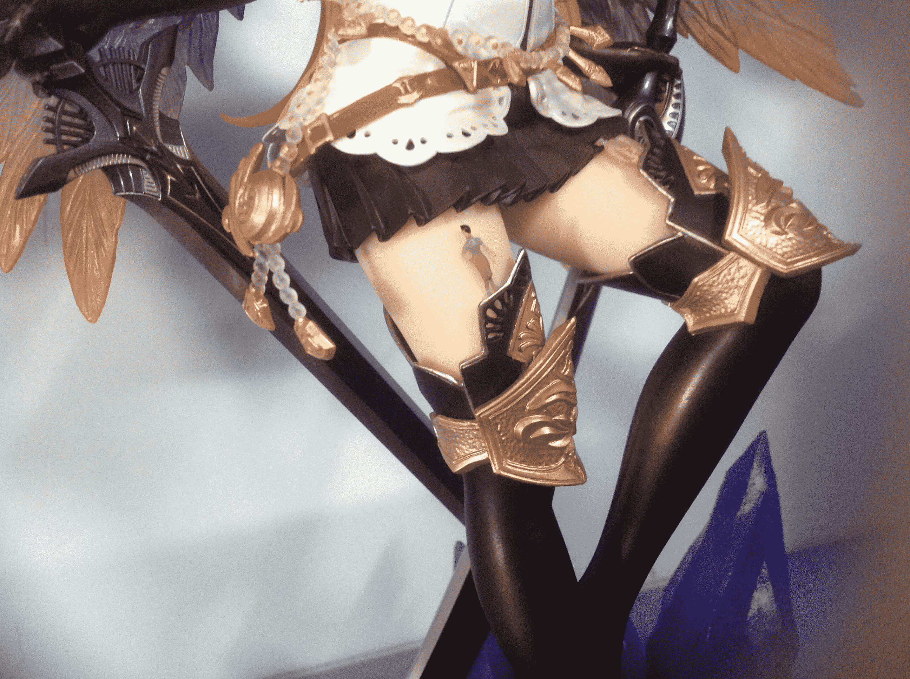

# 我有特别的动漫手办玩法

作者：a49666

TID：17570

<title>1</title> <link href="../Styles/Style.css" type="text/css" rel="stylesheet">

# 1

<ignore_js_op>

**IMG_1020.JPG** *(1.26 MB, 下載次數: 1)*

[下載附件](forum.php?mod=attachment&aid=NDU3MjZ8ZDNkNGE3YTF8MTYwMzg2ODA2NHwxODIzMHwxNzU3MA%3D%3D&nothumb=yes)

2014-8-16 22:44 上傳

<ignore_js_op>

**IMG_1026.JPG** *(1.28 MB, 下載次數: 1)*

[下載附件](forum.php?mod=attachment&aid=NDU3Mjd8M2JmZGQ1MWJ8MTYwMzg2ODA2NHwxODIzMHwxNzU3MA%3D%3D&nothumb=yes)

2014-8-16 22:44 上傳

<ignore_js_op>

**IMG_1041 - 副本.JPG** *(2.02 MB, 下載次數: 1)*

[下載附件](forum.php?mod=attachment&aid=NDU3MzB8YjQ4MDNmOTR8MTYwMzg2ODA2NHwxODIzMHwxNzU3MA%3D%3D&nothumb=yes)

2014-8-16 22:45 上傳

<ignore_js_op>

**IMG_1042 - 副本.JPG** *(1.88 MB, 下載次數: 1)*

[下載附件](forum.php?mod=attachment&aid=NDU3MzF8MzBkZmNlYjB8MTYwMzg2ODA2NHwxODIzMHwxNzU3MA%3D%3D&nothumb=yes)

2014-8-16 22:45 上傳

<ignore_js_op>

**IMG_1039 - 副本.JPG** *(1.9 MB, 下載次數: 1)*

[下載附件](forum.php?mod=attachment&aid=NDU3Mjh8M2Q0ZDUxOTJ8MTYwMzg2ODA2NHwxODIzMHwxNzU3MA%3D%3D&nothumb=yes)

2014-8-16 22:44 上傳

<ignore_js_op>

**IMG_1037 - 副本.JPG** *(1.83 MB, 下載次數: 1)*

[下載附件](forum.php?mod=attachment&aid=NDU3Mjl8YTM3NWRlN2V8MTYwMzg2ODA2NHwxODIzMHwxNzU3MA%3D%3D&nothumb=yes)

2014-8-16 22:45 上傳

<ignore_js_op>

**IMG_1038.JPG** *(1.91 MB, 下載次數: 1)*

[下載附件](forum.php?mod=attachment&aid=NDU3MzZ8MTZlYWFiMDV8MTYwMzg2ODA2NHwxODIzMHwxNzU3MA%3D%3D&nothumb=yes)

2014-8-16 22:47 上傳

<ignore_js_op>

**IMG_1043 - 副本.JPG** *(1.76 MB, 下載次數: 1)*

[下載附件](forum.php?mod=attachment&aid=NDU3MzJ8OGRjODRlZTl8MTYwMzg2ODA2NHwxODIzMHwxNzU3MA%3D%3D&nothumb=yes)

2014-8-16 22:45 上傳

<ignore_js_op>

**IMG_1044 - 副本.JPG** *(1.56 MB, 下載次數: 1)*

[下載附件](forum.php?mod=attachment&aid=NDU3MzN8ZThlNGQ5NjV8MTYwMzg2ODA2NHwxODIzMHwxNzU3MA%3D%3D&nothumb=yes)

2014-8-16 22:45 上傳

<ignore_js_op>

**IMG_1046 - 副本.JPG** *(1.93 MB, 下載次數: 1)*

[下載附件](forum.php?mod=attachment&aid=NDU3MzR8NmJjZTNjMDd8MTYwMzg2ODA2NHwxODIzMHwxNzU3MA%3D%3D&nothumb=yes)

2014-8-16 22:46 上傳

<ignore_js_op>

**IMG_1047 - 副本.JPG** *(2.08 MB, 下載次數: 1)*

[下載附件](forum.php?mod=attachment&aid=NDU3MzV8ZmRjNWFhZTN8MTYwMzg2ODA2NHwxODIzMHwxNzU3MA%3D%3D&nothumb=yes)

2014-8-16 22:46 上傳

<title>2</title> <link href="../Styles/Style.css" type="text/css" rel="stylesheet">

# 2

> [ssn21 發表於 2014-8-16 23:27](https://giantessnight.com/gnforum2012/forum.php?mod=redirect&goto=findpost&pid=231934&ptid=17570)
> 模型摆拍也是创作的手法之一呢
> 
> 记得之前也有大（tu）神（hao）拍摄同一模型场景的两张光影角度一模一样的 ...

饿，那可以给我看下那位大神拍摄的图吗？</ignore_js_op></ignore_js_op></ignore_js_op></ignore_js_op></ignore_js_op></ignore_js_op></ignore_js_op></ignore_js_op></ignore_js_op></ignore_js_op></ignore_js_op>