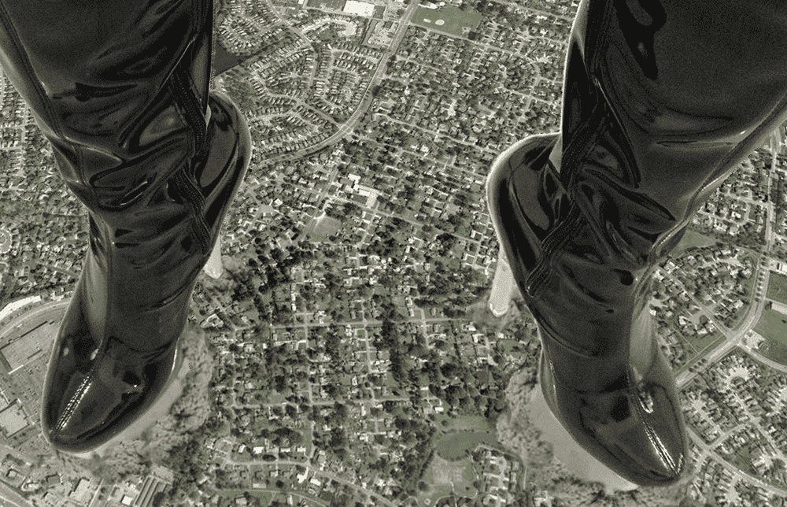

# 我的第二张践踏图·厚底高跟靴踩踏城区

作者：budebuai

TID：14653

<title>1</title> <link href="../Styles/Style.css" type="text/css" rel="stylesheet">

# 1

我第二张ps图。上一张图（[http://giantessnight.com/gnforum2012/forum.php?mod=viewthread&tid=14623&extra=page%3D1](http://giantessnight.com/gnforum2012/forum.php?mod=viewthread&tid=14623&extra=page%3D1)）得到但大和很多人的鼓励，技术继续学习中。。。
<title>2</title> <link href="../Styles/Style.css" type="text/css" rel="stylesheet">

# 2

 <ignore_js_op>[高跟靴踩踏城区.jpg](forum.php?mod=attachment&aid=MzQ5Njd8NmIyMTkwN2Z8MTYwMzg3MzU3MXwxODIzMHwxNDY1Mw%3D%3D&nothumb=yes) *(650.67 KB, 下載次數: 31)*

[下載附件](forum.php?mod=attachment&aid=MzQ5Njd8NmIyMTkwN2Z8MTYwMzg3MzU3MXwxODIzMHwxNDY1Mw%3D%3D&nothumb=yes)

2013-6-30 13:59 上傳  

踩踏居民区

</ignore_js_op> <title>3</title> <link href="../Styles/Style.css" type="text/css" rel="stylesheet">

# 3

> shendanxiaogui 發表於 2013-6-30 14:11 
> 。。。我个人感觉质量有所下降。。。1是阴影没有，2是放光有点奇怪。。。UP还需要更注重细节。。。。 ...

这次抠图有点问题，高跟靴发光的像素被忽略掉了。。。。阴影就是很遗憾的，因为高跟靴扣下来的图层和图片都找不到了（已经和背景合并了）。想应该画个阴影什么的，嘿嘿。。。<title>4</title> <link href="../Styles/Style.css" type="text/css" rel="stylesheet">

# 4

> NEYO 發表於 2013-6-30 19:38 
> 角度不大好... 要是正视图会更好

背景就是谷歌地图啦，调整过，因为不调整就更加奇怪了。调整了之后就合并了图层，原始文件又不见了。。。下次不这么奇怪了。<title>5</title> <link href="../Styles/Style.css" type="text/css" rel="stylesheet">

# 5

> haobinghehe 發表於 2013-7-1 12:29 
> 烟雾比第一张好，第一张后面就像悬空的似的。但是为什么没做阴影呢？

嗯嗯，第一张后面的高跟靴下应该有烟雾，就不会显得悬空了。这次阴影是个问题。。。