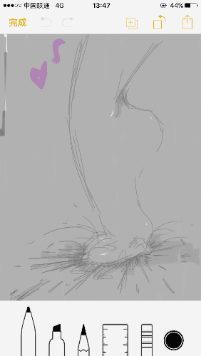

# 手机备忘录简简简画

作者：monkey

TID：23624

 

# 1

往后应该很少机会画长篇漫画了...

只能偷偷在手机备忘录画一下... 

# 2

<ignore_js_op>[IMG_2389.PNG](forum.php?mod=attachment&aid=NjkwODd8OGU0NGQxZWR8MTYwMzg1NDg4M3wxODIzMHwyMzYyNA%3D%3D&nothumb=yes) *(86 KB, 下載次數: 9)*

[下載附件](forum.php?mod=attachment&aid=NjkwODd8OGU0NGQxZWR8MTYwMzg1NDg4M3wxODIzMHwyMzYyNA%3D%3D&nothumb=yes)

2017-8-6 01:19 上傳  

</ignore_js_op>  

# 3

> [qreeper 發表於 2017-8-6 11:04](https://giantessnight.com/gnforum2012/forum.php?mod=redirect&goto=findpost&pid=343062&ptid=23624)

> 好厉害，楼主学画画的吗

是啊～ 就是没机会在电脑上画了

 

# 4

> [mjw315 發表於 2017-8-6 17:59](https://giantessnight.com/gnforum2012/forum.php?mod=redirect&goto=findpost&pid=343129&ptid=23624)

> 手机画的?厉害了...不知道lz用的是什么软件

iphon自带的备忘录 哈哈哈

 

# 5

> [das 發表於 2017-8-6 14:12](https://giantessnight.com/gnforum2012/forum.php?mod=redirect&goto=findpost&pid=343083&ptid=23624)

> 感谢lz作图，手机作图做的很好了，单图还是很有看点的

谢谢～ 但真的无法满足啊 真的很想画长篇...

 

# 6

> [斯佳摩妮 發表於 2017-8-6 22:07](https://giantessnight.com/gnforum2012/forum.php?mod=redirect&goto=findpost&pid=343158&ptid=23624)

> 画的不错，该叫你蒙奇还是猴子呢？

应该...都可以吧……(._.)