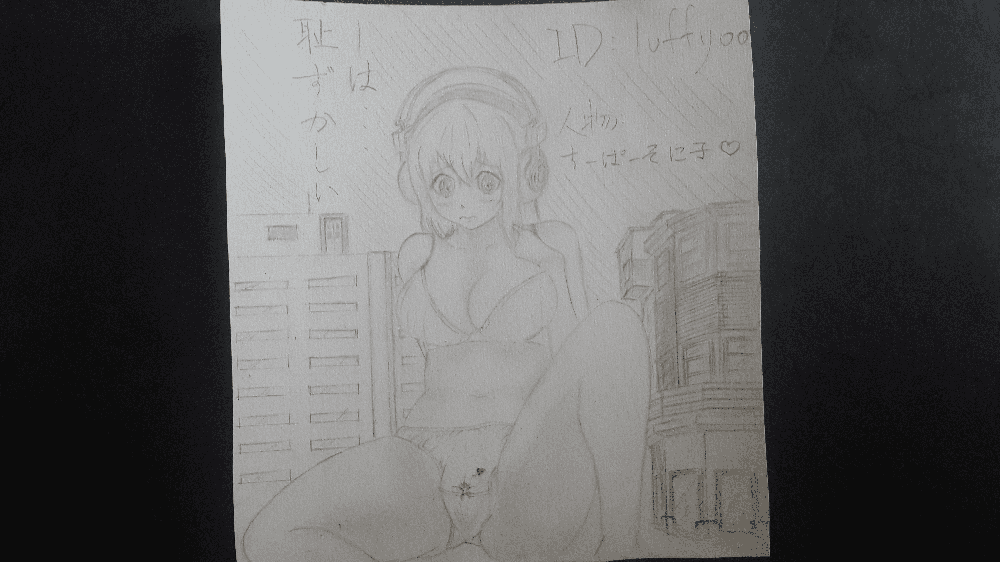

# 手绘

作者：luffyoo

TID：19368

 

# 1

第一次画，手生，不会画背景，Q Q但是尽力了，以后再接再厉v 

# 2

<ignore_js_op>[20150709_183405.jpg](forum.php?mod=attachment&aid=NTMwMjJ8Mzk0YjM0Njl8MTYwMzg2NDkyMHwxODIzMHwxOTM2OA%3D%3D&nothumb=yes) *(2.65 MB, 下載次數: 15)*

[下載附件](forum.php?mod=attachment&aid=NTMwMjJ8Mzk0YjM0Njl8MTYwMzg2NDkyMHwxODIzMHwxOTM2OA%3D%3D&nothumb=yes)

2015-7-9 18:38 上傳  

</ignore_js_op>  

# 3

> [archer 發表於 2015-7-9 18:56](https://giantessnight.com/gnforum2012/forum.php?mod=redirect&goto=findpost&pid=260946&ptid=19368)

> 是索尼子呢  胸部很还原啊   

> 楼主你这怎么都不像第一次画啊。。。

多谢鼓励多谢鼓励！

 

# 4

> [dijkstra 發表於 2015-7-10 09:50](https://giantessnight.com/gnforum2012/forum.php?mod=redirect&goto=findpost&pid=261013&ptid=19368)

> 这么细致的线条阴影和透视，楼主你告诉我你不会画背景！？？(ノಠ益ಠ)ノ彡┻━┻

> 

> 默默滚回去练习线条了。 ...

多谢鼓励！多谢鼓励QvQ