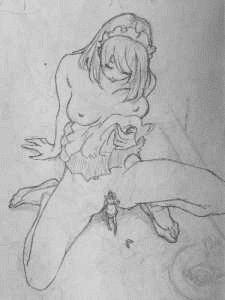
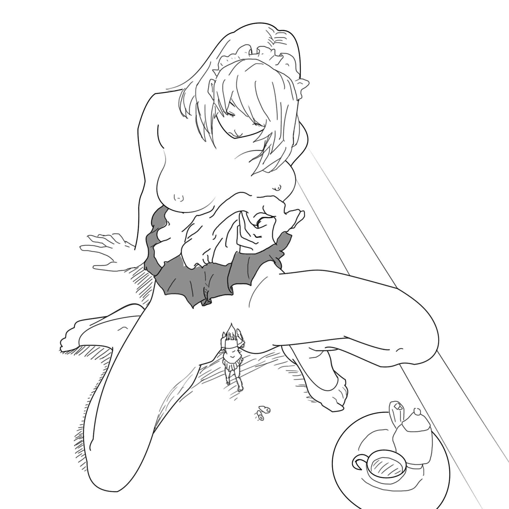

# 把414215152的圖用PS描了一遍

作者：3213213210

TID：22247

<title>1</title> <link href="../Styles/Style.css" type="text/css" rel="stylesheet">

# 1

*本帖最後由 3213213210 於 2016-12-4 16:49 編輯*

原帖：
[http://giantessnight.com/gnforum ... iewthread&tid=22214](http://giantessnight.com/gnforum2012/forum.php?mod=viewthread&tid=22214)
原圖：
<ignore_js_op>

**145900ndsqd0n7sd71il17.jpg.thumb.jpg** *(6.69 KB, 下載次數: 0)*

[下載附件](forum.php?mod=attachment&aid=NjU4NTV8NzFiOGQzZDV8MTYwMzg1OTYxOXwxODIzMHwyMjI0Nw%3D%3D&nothumb=yes)

2016-12-4 16:25 上傳

一個周末的摸索成果：
<ignore_js_op>

**1.jpg** *(407.17 KB, 下載次數: 0)*

[下載附件](forum.php?mod=attachment&aid=NjU4NTR8MGU2Y2I1ZTB8MTYwMzg1OTYxOXwxODIzMHwyMjI0Nw%3D%3D&nothumb=yes)

2016-12-4 16:24 上傳

PSD(PS用的檔)
<ignore_js_op> [仿河下水希作品 .psd](forum.php?mod=attachment&aid=NjU4NTZ8NmZlYzlkZDF8MTYwMzg1OTYxOXwxODIzMHwyMjI0Nw%3D%3D) *(2.5 MB, 下載次數: 19)* 2016-12-4 16:28 上傳點擊文件名下載附件

如果把這個檔打開會發現很多地方很偷懶......
歡迎任何人把圖修改以後重新上傳

<title>2</title> <link href="../Styles/Style.css" type="text/css" rel="stylesheet">

# 2

> [414215152 發表於 2016-12-6 13:22](https://giantessnight.com/gnforum2012/forum.php?mod=redirect&goto=findpost&pid=316677&ptid=22247)
> 哇哇
> 棒啊
> 难以用语言形容

放心，頭髮和指甲不是你太挑
一般這種直髮也是要拉貝茲曲線再用筆劃路徑畫的，不過我還不懂怎麼畫頭髮，所以直接用筆刷亂掃再擦
指甲……忘了 只是忘了

原圖這種東西還是早點放比較好
第一次花很多時間的是為了找方法，之後會越來越有效率
再說真的沒空我就不作就好……我們又沒簽契約，作這個也算是為了自己的成就感
總之，不用顧慮我，想怎麼作就怎麼作吧</ignore_js_op></ignore_js_op></ignore_js_op>