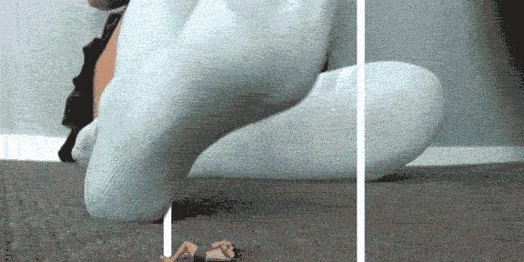
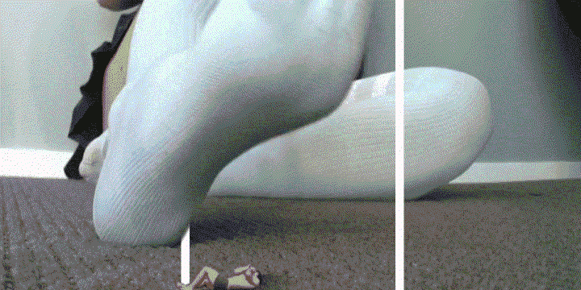
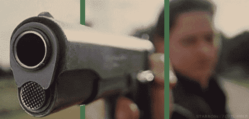

# 搞了个简单的裸眼3D效果

作者：wxy112300

TID：16196

 

# 1

3D的原理就是那两条线了，和那些抖动3D不太一样...用AE制作，非常麻烦的地方是roto-masking，需要逐帧处理，改起来也较麻烦...

实在没找到什么合适的素材，所以就用了186G种子里的一个视频片段来合成一个测试了，效果么，还说的过去了..

最理想的素材应该是POV视频，而且3D主体在中间，比较靠前没有干扰。没有找到好的素材，所以先凑合弄一个了。

这个可以骗点**奖励点**吧...

小水管专用尺寸（3.91MB）：

<ignore_js_op>

**motion3d_small.gif** *(3.91 MB, 下載次數: 69)*

[下載附件](forum.php?mod=attachment&aid=NDA3NTF8NjJkYzRlNzB8MTYwMzg3MTc0N3wxODIzMHwxNjE5Ng%3D%3D&nothumb=yes)

2014-2-9 01:17 上傳

大水管看这里（原图，720*360，11.85MB）：

<ignore_js_op>

**motion3d_big.gif** *(11.85 MB, 下載次數: 59)*

[下載附件](forum.php?mod=attachment&aid=NDA3NTB8MTgxNjUzNzZ8MTYwMzg3MTc0N3wxODIzMHwxNjE5Ng%3D%3D&nothumb=yes)

2014-2-9 01:16 上傳

其实我想要的理想效果是这样的..

<ignore_js_op>

**6b0143b5c9ea15ceaf4d958db6003af33b87b249.jpg** *(974.06 KB, 下載次數: 3)*

[下載附件](forum.php?mod=attachment&aid=NDA3NTJ8ZDE1NjZlNmV8MTYwMzg3MTc0N3wxODIzMHwxNjE5Ng%3D%3D&nothumb=yes)

2014-2-9 01:26 上傳</ignore_js_op></ignore_js_op></ignore_js_op>