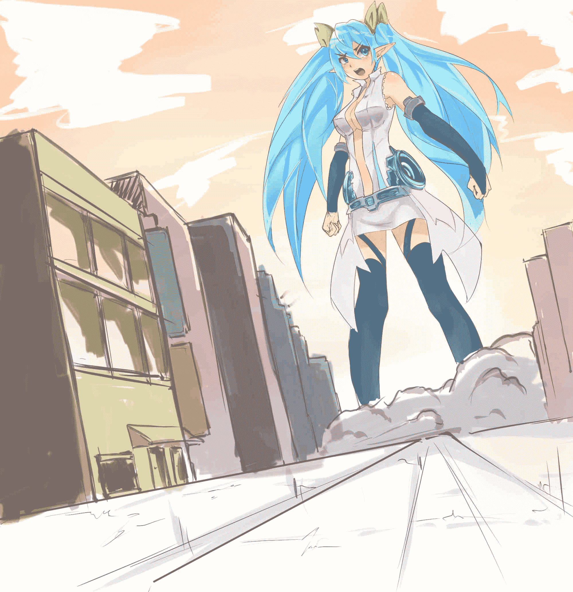

# 撸一张巨大miku酱

作者：wwj9520

TID：19000

<title>1</title> <link href="../Styles/Style.css" type="text/css" rel="stylesheet">

# 1

最近转原创区发现没什么新东西，所以索性撸一张拿来让大家水2333，不说废话了，上图

<title>2</title> <link href="../Styles/Style.css" type="text/css" rel="stylesheet">

# 2

<ignore_js_op>

**miku.jpg** *(193.92 KB, 下載次數: 7)*

[下載附件](forum.php?mod=attachment&aid=NTE5NDZ8MjM5NmFlNmR8MTYwMzg2NTY4OHwxODIzMHwxOTAwMA%3D%3D&nothumb=yes)

2015-5-19 10:46 上傳

画了一晚上，比较潦草，大家凑活看，由于miku和场景是分开画的，画完miku酱以后突然就不太想画场景了，就随意画了下，结果发现人物背景很不搭啊233，感觉miku像贴上的有木有= =

<title>3</title> <link href="../Styles/Style.css" type="text/css" rel="stylesheet">

# 3

如果有人想看过程的话，我就把过程发一下，大家都喜欢画画，我也希望能够帮到大家~<title>4</title> <link href="../Styles/Style.css" type="text/css" rel="stylesheet">

# 4

> [huang123ja 發表於 2015-5-19 11:07](https://giantessnight.com/gnforum2012/forum.php?mod=redirect&goto=findpost&pid=255096&ptid=19000)
> 楼主大触手啊.
> 感谢分享

不敢不敢，我还在学习中，大家互相交流互相学习~
<title>5</title> <link href="../Styles/Style.css" type="text/css" rel="stylesheet">

# 5

> [foronly 發表於 2015-5-19 11:00](https://giantessnight.com/gnforum2012/forum.php?mod=redirect&goto=findpost&pid=255095&ptid=19000)
> 她看起来好像不太开心XD
> 画得很好啦~感谢楼主分享~

哈哈，可能和我昨晚事太多有关

<title>6</title> <link href="../Styles/Style.css" type="text/css" rel="stylesheet">

# 6

> [dijkstra 發表於 2015-5-19 14:52](https://giantessnight.com/gnforum2012/forum.php?mod=redirect&goto=findpost&pid=255121&ptid=19000)
> 嗯，因为背景的光是从miku背后，而且是底照光，楼主的miku感觉是常见的顶照光，所以觉得不对。
> 两种简单 ...

恩，画画有什么问题都可以问我，咱们一起交流，一起进步
<title>7</title> <link href="../Styles/Style.css" type="text/css" rel="stylesheet">

# 7

> [ambulance 發表於 2015-5-19 20:45](https://giantessnight.com/gnforum2012/forum.php?mod=redirect&goto=findpost&pid=255168&ptid=19000)
> 构图实在太像这张入野井的...当然没有恶意只是脑海里立刻浮现出这张来

就是这张构图，我直接拿来用了
<title>8</title> <link href="../Styles/Style.css" type="text/css" rel="stylesheet">

# 8

> [dijkstra 發表於 2015-5-19 22:29](https://giantessnight.com/gnforum2012/forum.php?mod=redirect&goto=findpost&pid=255176&ptid=19000)
> 嗯嗯，如果有过程，请务必发出来！想了解一下楼主的上色流程，尤其是渐变色，想学~
> 另外就是场景的流程， ...

明天吧，明天我发一个新帖子</ignore_js_op>