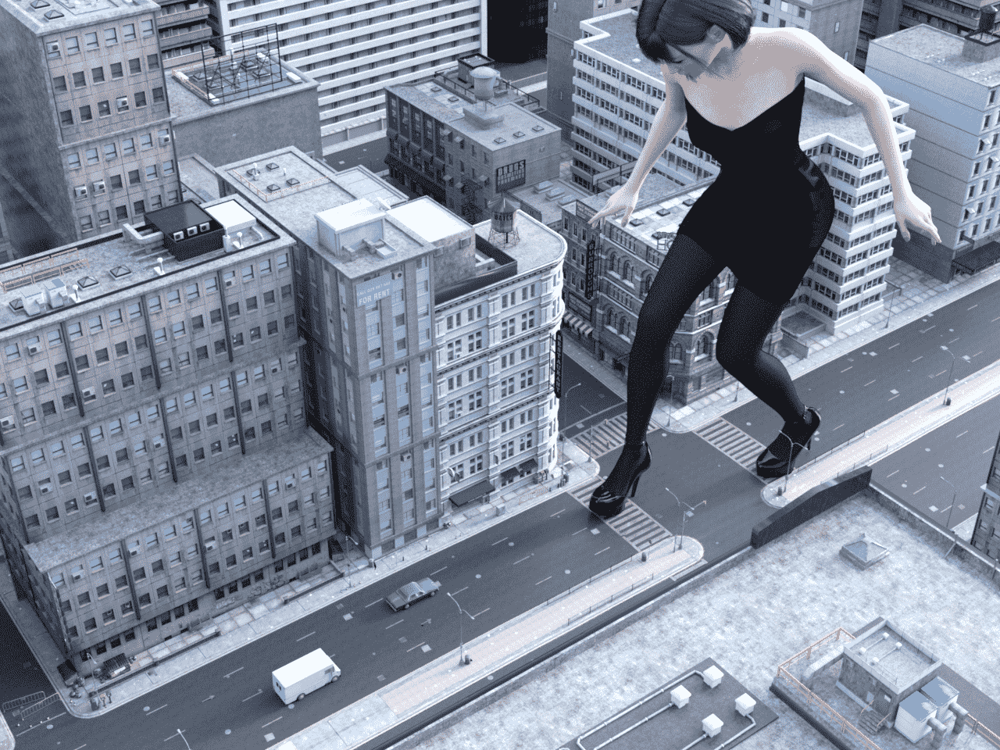

# 新人首个3D作品

作者：nhbnfn

TID：29104

<title>1</title> <link href="../Styles/Style.css" type="text/css" rel="stylesheet">

# 1

给各位看个乐呵 最近一直再找素材 找到一些还不错的 这个属于测试图 街道上什么也没有 比奥尔加要坐车之前还安静 一个人都没有 以后会考虑增加细节。
另外有个问题请教大佬们 怎样才能添加天空呢  skydome一加再渲染就黑了 删了吧又没天空了 就很纠结 渲染里面的dome又太模糊了 我还不知道怎么调(基本功都不扎实)所以我还是老老实实滚去学习了
<title>2</title> <link href="../Styles/Style.css" type="text/css" rel="stylesheet">

# 2

 <ignore_js_op>[giantess2.png](forum.php?mod=attachment&aid=ODQwMDd8YWQ5MWE3ZjV8MTYwMzgyODIyMnwxODIzMHwyOTEwNA%3D%3D&nothumb=yes) *(2.41 MB, 下載次數: 10)*

[下載附件](forum.php?mod=attachment&aid=ODQwMDd8YWQ5MWE3ZjV8MTYwMzgyODIyMnwxODIzMHwyOTEwNA%3D%3D&nothumb=yes)

2020-7-19 23:11 上傳  

</ignore_js_op> <title>3</title> <link href="../Styles/Style.css" type="text/css" rel="stylesheet">

# 3

> [xuecha 發表於 2020-7-19 23:58](https://giantessnight.com/gnforum2012/forum.php?mod=redirect&goto=findpost&pid=442295&ptid=29104)
> 这也能迫害团长是我没想到的只要我们不停下脚步，道路就会不断延伸！ ...

所以说 不要停下来啊(指做图)
<title>4</title> <link href="../Styles/Style.css" type="text/css" rel="stylesheet">

# 4

> [jy24310350 發表於 2020-7-20 06:29](https://giantessnight.com/gnforum2012/forum.php?mod=redirect&goto=findpost&pid=442308&ptid=29104)
> 楼主是新人吗，图片水平很高啊！

感谢回复 真的是新人 这个水平我相信特别了解的大佬一看就知道问题很多 属于半成品。。。一个是灯光问题 根本就不是真实的太阳光 第二个是天空背景 因为不会调所以就没敢在渲染的时候放入天空 于是换了个视角。。还有人物动作啊 地图细节啊 等等之类的 一边学习一边做吧(QAQ) 希望您能喜欢
<title>5</title> <link href="../Styles/Style.css" type="text/css" rel="stylesheet">

# 5

> [kevinsky05 發表於 2020-7-20 18:56](https://giantessnight.com/gnforum2012/forum.php?mod=redirect&goto=findpost&pid=442373&ptid=29104)
> 先說我所知的幾種:
> 1\. 首先一進程式預設的渲染燈光是可以直接用 (只是不像陽光和像你所說硬將dome 材質改掉 ...

我的天啊 K大回复我了 受宠若惊 感谢K大的指导 今天刚刚下了一些HDR的资源 一开始还没搞懂怎么回事 后来发现是改变了渲染里面环境的背景 这样确实可以做到渲染的时候也有天空了 不过不添加天空 渲染导出png之后再ps上去也是一种办法 非常感谢k大回复!!