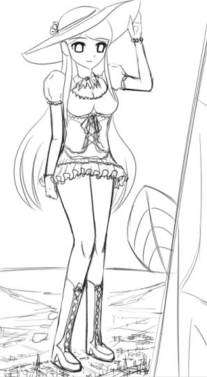

# 新作预告第一弹

作者：xnr

TID：9191

<title>1</title> <link href="../Styles/Style.css" type="text/css" rel="stylesheet">

# 1

以下是本人的新作截图。
我之所以敢放出一个完整的GTS，是因为这只是最终原图的三分之一，此外还有分镜、POV、互动特写等等，内容绝对充实饱满。

<ignore_js_op>

**Snap7.jpg** *(30.35 KB, 下載次數: 2)*

[下載附件](forum.php?mod=attachment&aid=MjI5NTV8NjZmMmNkYmJ8MTYwMzg3NzcyOHwxODIzMHw5MTkx&nothumb=yes)

2011-1-23 18:59 上傳

关键字：Mega，巨人国少女来到小人国，欧洲古典服饰，英伦风格，靴子。

因为现在还是草稿阶段，欢迎评价，欢迎吐槽，欢迎提出各种意见和建议。
（尤其是服饰搭配方面有待考究。。。）

本来预计和另外一张新春贺图在春节前一同放出，但是看进度估计来不及了。。。总得先保证质量吧。。。
——————————————————————————————————————————

我的几个求灵感的老帖子都沉了很久了：
新作漫画截图一：
[http://giantessnight.com/gnforum ... &extra=page%3D1](http://giantessnight.com/gnforum/viewthread.php?tid=8781&page=1&extra=page%3D1)
新作漫画截图二：
[http://giantessnight.com/gnforum ... &extra=page%3D1](http://giantessnight.com/gnforum/viewthread.php?tid=8830&page=1&extra=page%3D1)
讨论串：
[http://giantessnight.com/gnforum ... &extra=page%3D1](http://giantessnight.com/gnforum/viewthread.php?tid=8515&extra=page%3D1)
欢迎大家多多留言，每一个帖子我都会认真去看并且回复的，请不要灌水哦！

[ *本帖最後由 xnr 於 2011-2-19 20:47 編輯* ]<title>2</title> <link href="../Styles/Style.css" type="text/css" rel="stylesheet">

# 2

图片修改了下，更新完毕。<title>3</title> <link href="../Styles/Style.css" type="text/css" rel="stylesheet">

# 3

> 原帖由 *ladeng* 於 2011-1-24 02:03 發表 
> 太大了，40-50米高最合适

不好意思，40-50米高的GTS我兴趣不大。。。够大才够给力。

我是Mega级GTS的忠实簇拥。<title>4</title> <link href="../Styles/Style.css" type="text/css" rel="stylesheet">

# 4

> 原帖由 *larry444444* 於 2011-2-19 22:38 發表 
> 畫得很好阿LZ
> 不過裙子緣的角度好像稍微有點怪
> 靴子好像應該要突出一點 跟小腿線條連在一起會感覺還是有點小
> 恩...
> (講那麼多自己也畫不出來哈...||| )

早就放出预告截图第二弹了。。。你们都没去看么。。。要顶帖子也要顶这个呀：
[http://giantessnight.com/gnforum ... 9239&highlight=](http://giantessnight.com/gnforum/viewthread.php?tid=9239&highlight=)</ignore_js_op>