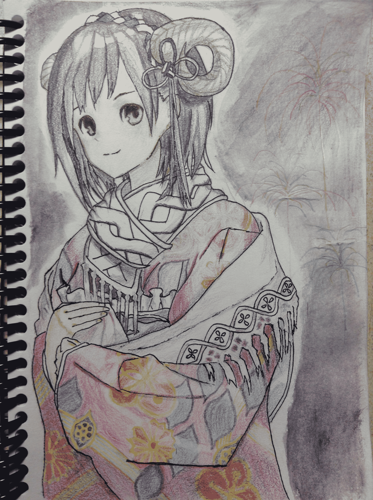
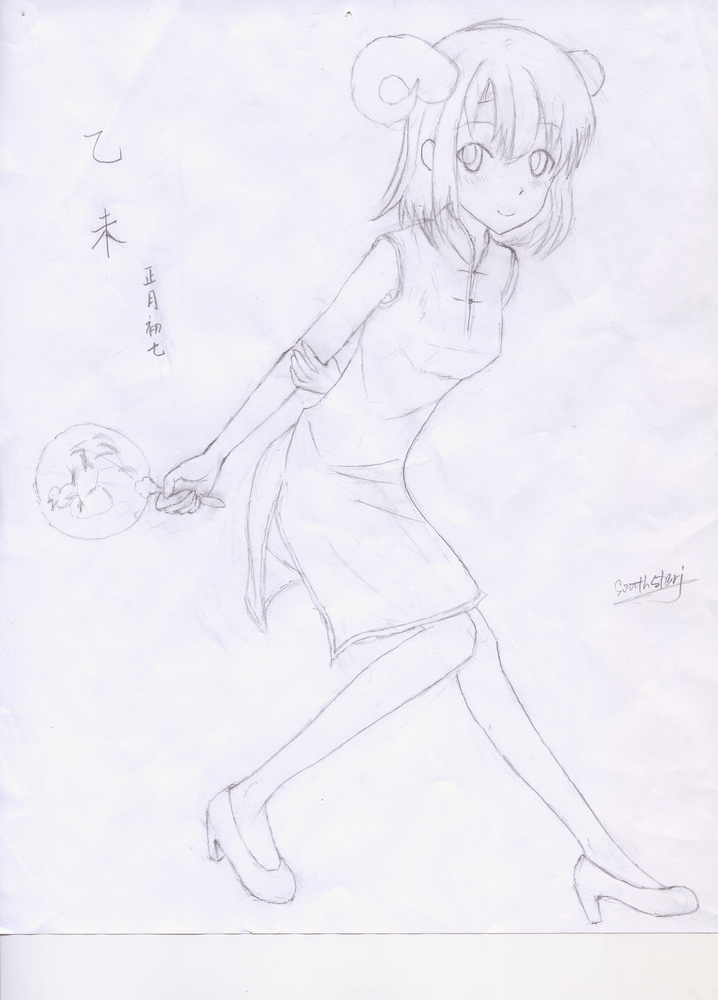

# 新年贺图，虽然似乎有点晚了。。。

作者：dijkstra

TID：18663

<title>1</title> <link href="../Styles/Style.css" type="text/css" rel="stylesheet">

# 1

*本帖最後由 dijkstra 於 2015-3-15 00:46 編輯*

而且好像不太符合主题。。。主要是构图出差错了，画一半发现纸下面不够画城镇，只好改正常向了。。。T_T下次吧，下次作品画GTS向

总之祝大家羊年快乐~
<ignore_js_op>

**IMG_0538.JPG** *(1.73 MB, 下載次數: 0)*

[下載附件](forum.php?mod=attachment&aid=NTEwNjd8MDQyNWQxZWN8MTYwMzg2NjA4NXwxODIzMHwxODY2Mw%3D%3D&nothumb=yes)

2015-3-15 00:42 上傳

意思是告诉大家我会上色<(￣︶￣)>
<ignore_js_op>

**drawing.png** *(14.42 MB, 下載次數: 0)*

[下載附件](forum.php?mod=attachment&aid=NTEwNjh8YTc2YWMxY2V8MTYwMzg2NjA4NXwxODIzMHwxODY2Mw%3D%3D&nothumb=yes)

2015-3-15 00:42 上傳

下面纸不够大了啊。。。

<title>2</title> <link href="../Styles/Style.css" type="text/css" rel="stylesheet">

# 2

> [aa3756619 發表於 2015-3-15 01:35](https://giantessnight.com/gnforum2012/forum.php?mod=redirect&goto=findpost&pid=248978&ptid=18663)
> 图太小了  看不大清楚

大图可以点开看，点两次就可以了</ignore_js_op></ignore_js_op>