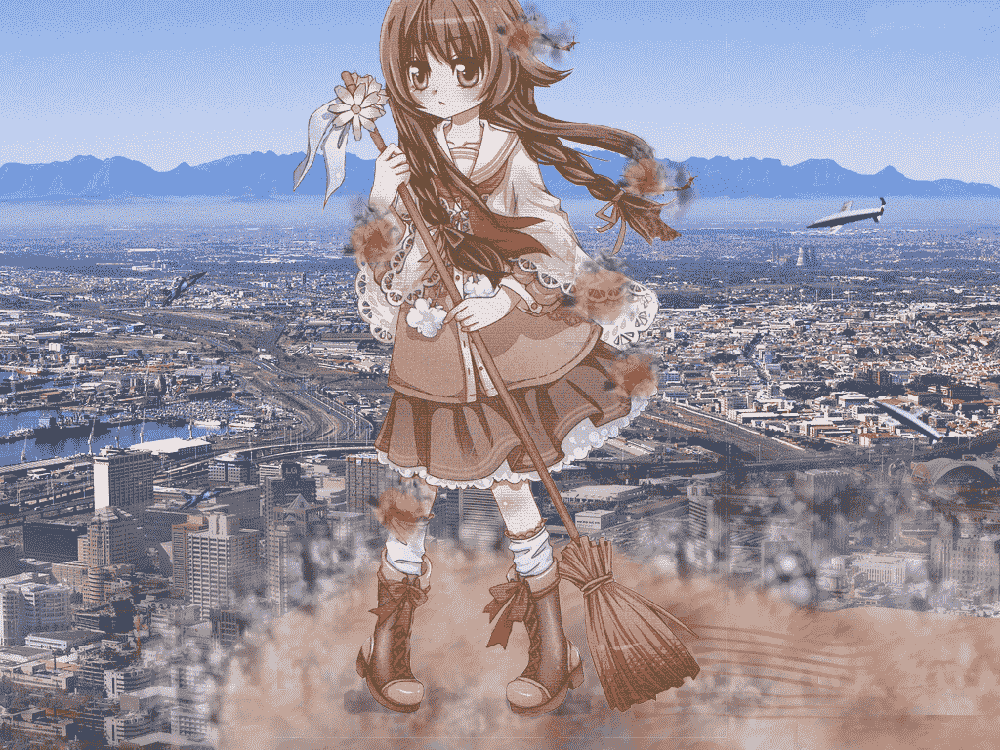

# 新手P图，做得不太好的请见谅

作者：cat

TID：11471

<title>1</title> <link href="../Styles/Style.css" type="text/css" rel="stylesheet">

# 1

第一次P图上来，那里不好请各位指出，下次会注意。
<ignore_js_op>

**great.jpg** *(750.52 KB, 下載次數: 0)*

[下載附件](forum.php?mod=attachment&aid=MjY5Njd8YzU4NTk5Njd8MTYwMzg3NTI1NHwxODIzMHwxMTQ3MQ%3D%3D&nothumb=yes)

2011-12-28 21:38 上傳

<title>2</title> <link href="../Styles/Style.css" type="text/css" rel="stylesheet">

# 2

四楼，这张图是一本漫画上印的，我把它扫描进电脑了。
六楼，透视的问题，我不太会弄，可否详细说明一下？</ignore_js_op>