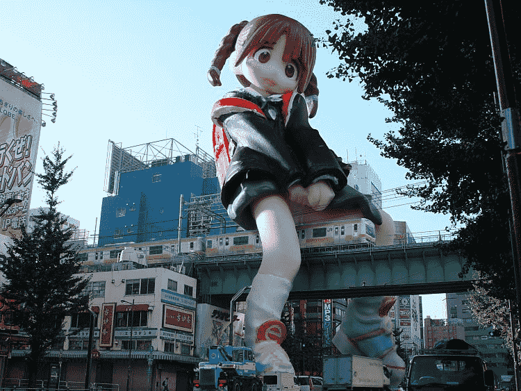
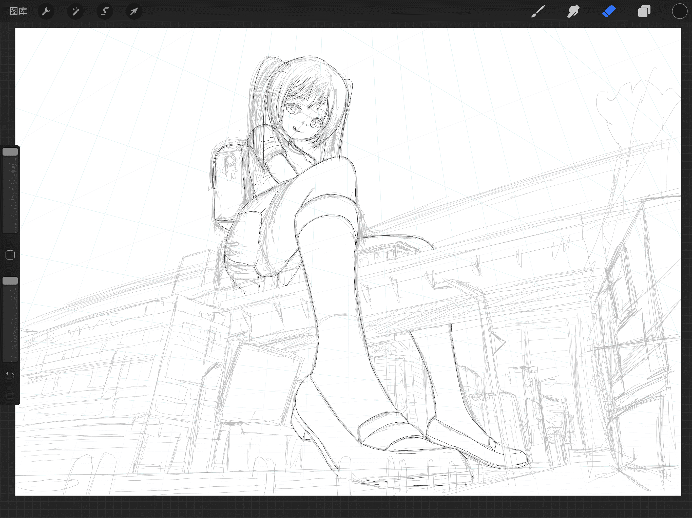
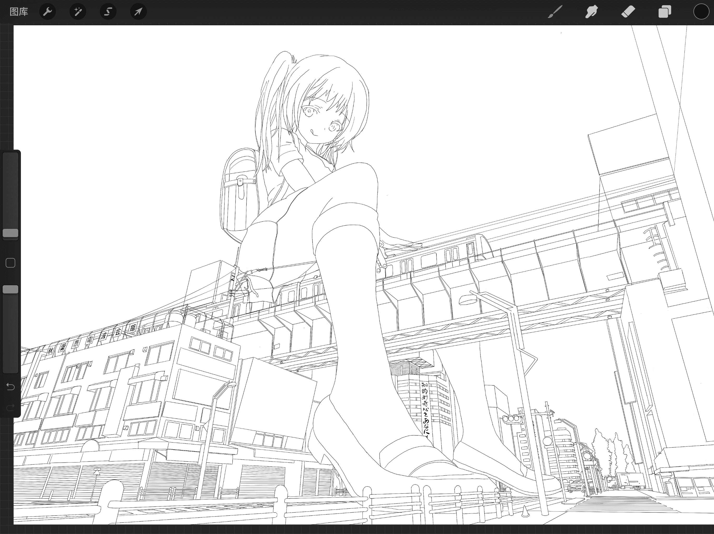
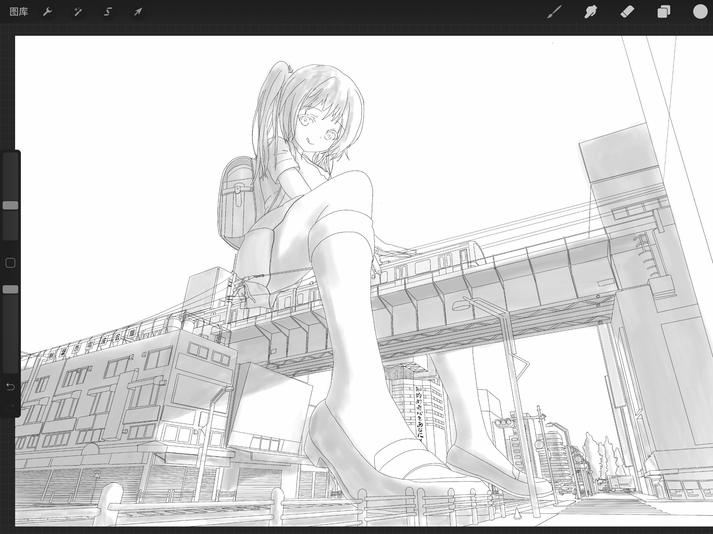
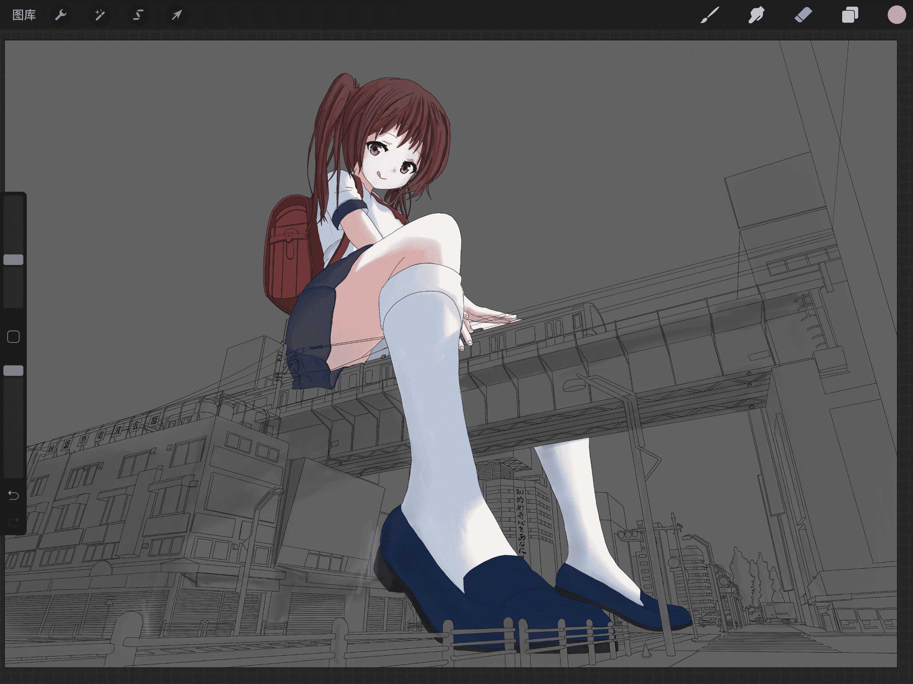
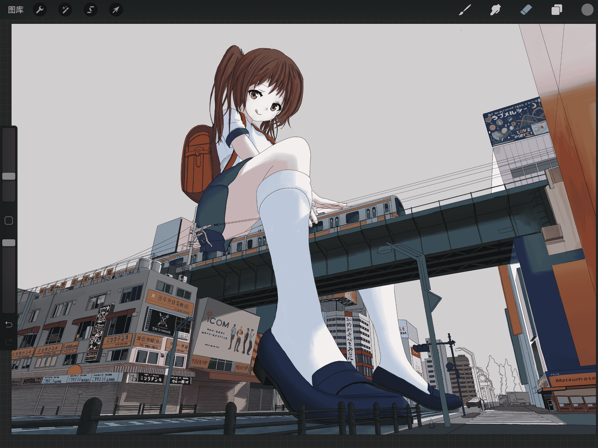

# 新横浜ありなinアキハバラ

作者：wxy112300

TID：29151

 

# 1

<ignore_js_op></ignore_js_op> **83276579_p0.jpg** *(5.03 MB, 下載次數: 7)*

[下載附件](forum.php?mod=attachment&aid=ODQxNzR8NGY1YzhmMDF8MTYwMzgyODExNHwxODIzMHwyOTE1MQ%3D%3D&nothumb=yes)

2020-7-28 12:36 上傳 P站直达：[https://www.pixiv.net/artworks/83276579](https://www.pixiv.net/artworks/83276579)

又有几年时间没有创作什么GTS方面的作品了，成为社畜之后自己的时间真是少的可怜，这张图硬是用了两个月才完成（中途还因为TLOU2咕了）。

入圈有年头的人应该都能认出来原型吧：

<ignore_js_op></ignore_js_op> **Topb30c05.jpg** *(111.3 KB, 下載次數: 0)*

[下載附件](forum.php?mod=attachment&aid=ODQxNzV8YzgwYjQ0NGV8MTYwMzgyODExNHwxODIzMHwyOTE1MQ%3D%3D&nothumb=yes)

2020-7-28 12:46 上傳

<ignore_js_op></ignore_js_op> **images.jpg** *(9.09 KB, 下載次數: 0)*

[下載附件](forum.php?mod=attachment&aid=ODQxNzZ8NGQ1MWNjNzR8MTYwMzgyODExNHwxODIzMHwyOTE1MQ%3D%3D&nothumb=yes)

2020-7-28 12:48 上傳 

其实是根据一个手办PS的同人作品，原作名字就叫『新横浜ありなinアキハバラ』，2004年的，相信也是很多人的入坑图之一了，甚至有老外特意跑来秋叶原来找（笑）。

去年去秋叶原的时候特意来这里取了素材，拖了很久终于把图画完了。

顺便记录下过程图：

<ignore_js_op>

**01.png** *(3.35 MB, 下載次數: 0)*

[下載附件](forum.php?mod=attachment&aid=ODQxNzd8NzQ1MTMxMjB8MTYwMzgyODExNHwxODIzMHwyOTE1MQ%3D%3D&nothumb=yes)

2020-7-28 12:50 上傳

<ignore_js_op>

**02.png** *(2.12 MB, 下載次數: 0)*

[下載附件](forum.php?mod=attachment&aid=ODQxNzh8YjI2ZDYxYTd8MTYwMzgyODExNHwxODIzMHwyOTE1MQ%3D%3D&nothumb=yes)

2020-7-28 12:50 上傳

<ignore_js_op>

**03.png** *(4.1 MB, 下載次數: 0)*

[下載附件](forum.php?mod=attachment&aid=ODQxNzl8NDcyNTY4YTl8MTYwMzgyODExNHwxODIzMHwyOTE1MQ%3D%3D&nothumb=yes)

2020-7-28 12:50 上傳

<ignore_js_op>

**04.png** *(4.48 MB, 下載次數: 0)*

[下載附件](forum.php?mod=attachment&aid=ODQxODB8ZjYwNzc5NWJ8MTYwMzgyODExNHwxODIzMHwyOTE1MQ%3D%3D&nothumb=yes)

2020-7-28 12:51 上傳

<ignore_js_op>

**05.png** *(7.2 MB, 下載次數: 0)*

[下載附件](forum.php?mod=attachment&aid=ODQxODF8MDA0ZmM4OTh8MTYwMzgyODExNHwxODIzMHwyOTE1MQ%3D%3D&nothumb=yes)

2020-7-28 12:51 上傳

就酱

 

# 2

> [吸水恶魔 發表於 2020-7-28 22:25](https://giantessnight.com/gnforum2012/forum.php?mod=redirect&goto=findpost&pid=443090&ptid=29151)

> 因为TLOU2咕了.......被气的吗

边气边玩，剧情真的无语，但是除了剧情外也确实好玩...

一周目硬是36个小时才通关，无心画画了（逃

 

# 3

> [nhbnfn 發表於 2020-7-28 13:22](https://giantessnight.com/gnforum2012/forum.php?mod=redirect&goto=findpost&pid=443058&ptid=29151)

> 我的天啊 光是这个图都有好长时间的年头了 这个图好像我还是第一次在贴吧看到的 楼主画技精湛 在完美还原的 ...

过奖了...对这张图感情比较深刻而已

我上初中时候就见到了，甚至一度以为日本真的有这个玩意...</ignore_js_op></ignore_js_op></ignore_js_op></ignore_js_op></ignore_js_op>