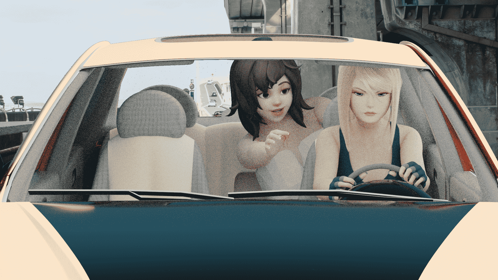

# 更多Blender2.8測試作圖

作者：3213213210

TID：27287

<title>1</title> <link href="../Styles/Style.css" type="text/css" rel="stylesheet">

# 1

*本帖最後由 3213213210 於 2019-8-23 08:50 編輯*

先上成品
<ignore_js_op>

**3200.jpg** *(1.28 MB, 下載次數: 1)*

[下載附件](forum.php?mod=attachment&aid=Nzk0NjR8NTAyNGEyNDV8MTYwMzg0MDM0M3wxODIzMHwyNzI4Nw%3D%3D&nothumb=yes)

2019-8-23 08:40 上傳

「真的啦！含著看看！不然放進褲子裡也不錯！」
「拜託你安靜坐好，我在開車。」

……比一開始預想的無聊超多的這還是1066跑了8個小時(Sample數3200)的成品，品質也沒想像的高
不過作為對照組，這是Optix降躁前的圖( [https://remington.pro/software/blender/d-noise/](https://remington.pro/software/blender/d-noise/) )
<ignore_js_op>

**3200D.jpg** *(1.2 MB, 下載次數: 0)*

[下載附件](forum.php?mod=attachment&aid=Nzk0NjV8MmI3OWRjNDB8MTYwMzg0MDM0M3wxODIzMHwyNzI4Nw%3D%3D&nothumb=yes)

2019-8-23 08:46 上傳

這是算4小時的成品(Sample數256)
<ignore_js_op>

**256.jpg** *(2.27 MB, 下載次數: 0)*

[下載附件](forum.php?mod=attachment&aid=Nzk0NjJ8NzAxM2UwMmZ8MTYwMzg0MDM0M3wxODIzMHwyNzI4Nw%3D%3D&nothumb=yes)

2019-8-22 22:20 上傳

(顏色有變是因為我有調World的顏色)

屁話等等聊，先講重點

車子的模型是這個
[https://www.turbosquid.com/3d-models/free-obj-mode-elantra-2008/703706](https://www.turbosquid.com/3d-models/free-obj-mode-elantra-2008/703706)
舊的blend檔案有很多相容性問題，所以幾乎整台車的材質都得重弄
(其實也只是把Node tree砍掉改接Principle BSDF)
在終於要弄完時發現，媽的這台車沒安全帶啊......

然後大家真的在乎的，人物模型，是這個
[https://www.patreon.com/Arhoangel/](https://www.patreon.com/Arhoangel/posts)
這個傢伙的5鎂資助者可以下載的
坐前坐的是Samus，後座的是OW的小美
(這傢伙被任天堂的律師寄信，所以以後不會有任天堂角色了QQ)
因為也是2.7x的blend專案檔，在2.8裡使用的毛病很多，
我昨天耗好幾個小時才終於讓角色能正常活動骨架
詳細情況和應對方法呢，有人問我再講

總之最重要的是想辦法把模型需要的部分複製起來，貼上到新創的預設專案檔，
就不用微調一堆東西了，從右邊清單複製、在別的專案檔可以直接貼上

至於後面的馬路其實只是一張網路上抓來的圖，
Google「cc0 Freeway」找到的，用Gimp合成上去

======================閒聊分隔線=========================

一開始想做的是套圖，大概是「前坐的人很冷靜地在開車，後座在瘋狂翻雲覆雨」，
然後收尾是「車子急轉彎，後座的人跌得狗吃屎」
結果光是把車和人處理到能用就快崩潰了，決定把本來就少得可憐的劇情砍到剩一張單圖
背景也是大問題，免費的景色專案檔沒有想像中好找......
去下載各種東西拼裝起來呢? 不預先構圖就不知道該找什麼，想要的東西也不見得找得到
於是對作品的期望不停地下滑，到最後連這種圖都Po得出來了
總之就是一個累，我連這個是弄了兩天還三天都想不起來了
現在打字也相當語無倫次，大腦真的已經超載過熱啦

等等，我好像漏了什麼很重要的事

哦對

**Blender免費開源喔喔喔喔喔喔喔喔喔喔**

<title>2</title> <link href="../Styles/Style.css" type="text/css" rel="stylesheet">

# 2

> [weiwenjiao 發表於 2019-8-23 20:49](https://giantessnight.com/gnforum2012/forum.php?mod=redirect&goto=findpost&pid=413302&ptid=27287)
> 好棒啊 不过也好难啊

我打算之後直接賣課程了 形式上會確保再沒經驗的人都可以對軟體操作有基本認識
現在已經找到可商用的模型跟場景 但教學影片和場景搭架要到真的能擺上架賣還需要好一段時間
等我覺得賣夠久了應該就會開放免費下載吧 不過那也會是一兩年後的事了
總之 時間多的是 先下載來玩玩看吧
<title>3</title> <link href="../Styles/Style.css" type="text/css" rel="stylesheet">

# 3

> [awkeygen 發表於 2019-8-24 20:30](https://giantessnight.com/gnforum2012/forum.php?mod=redirect&goto=findpost&pid=413372&ptid=27287)
> 首先向作者建议一个插件，http://www.3dtoall.com/里面的http://www.3dtoall.com/products/maxtoblender/， ...

Max轉Blender我應該會滿需要的，2.8的免費場景現在還不怎麼充分角色我都直接找現成的，雖然Blender 2.81會大幅升級雕刻功能，但沒有人體結構知識就不是工具的問題了

然後雖然你看不出來，但玻璃的IOR不是1、車子的Principle BSDF參數我亂拉、抓的角色皮膚也有SSS......所以三個都有
打光也不是HDRI，因為那時候Blender Cloud不知為何拒絕運作，我就直接用背景的照射角度打了陽光
(Filmic讓顏色捕捉的動態範圍很廣，可以打強光再靠反射光把畫面填滿也不會過度曝光)
不過我的確該檢討用這麼耗時的方法跑居然讓人看不出來有這些要素......

Blender是可以CPU和GPU一起跑，我也沒測試過就是，反正GPU比較快 (題外話 他們要支援RTX光追了 是想逼死我嗎)
其他的Render引擎我應該會找時間研究一下，不然我不確定Partical system能不能互通
最後是我查了一下，DAZ應該有支援Optix吧，只要用的是N家顯卡而且規格別太低應該都能用
<title>4</title> <link href="../Styles/Style.css" type="text/css" rel="stylesheet">

# 4

靠北 剛剛才發現偏好裡沒把CUDA打開 難怪顯卡沒事但處理器燙得要命 一開算圖時間直接砍到1/3......</ignore_js_op></ignore_js_op></ignore_js_op>