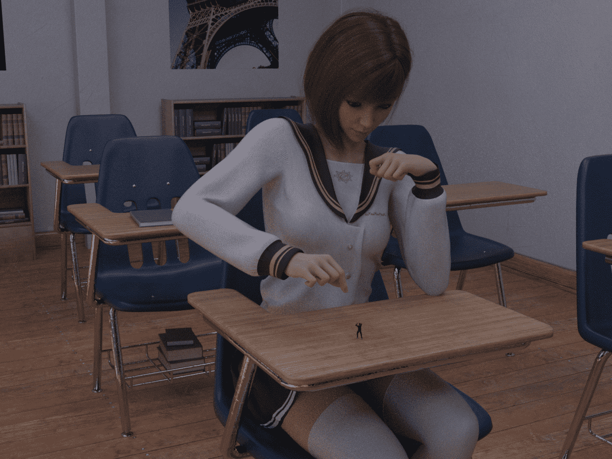
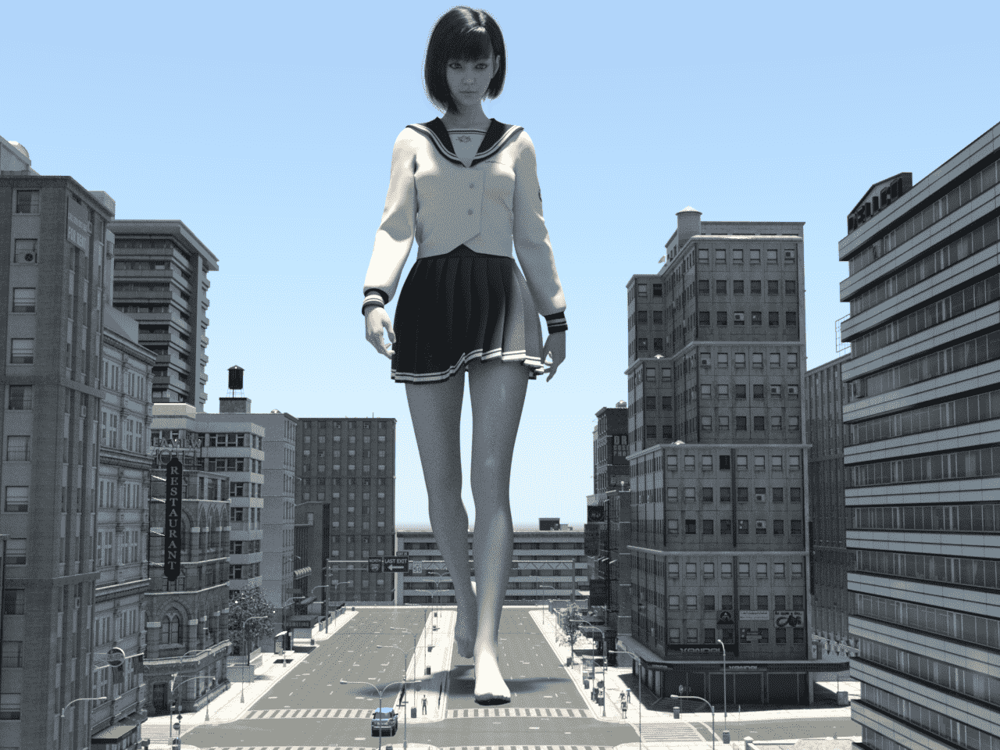
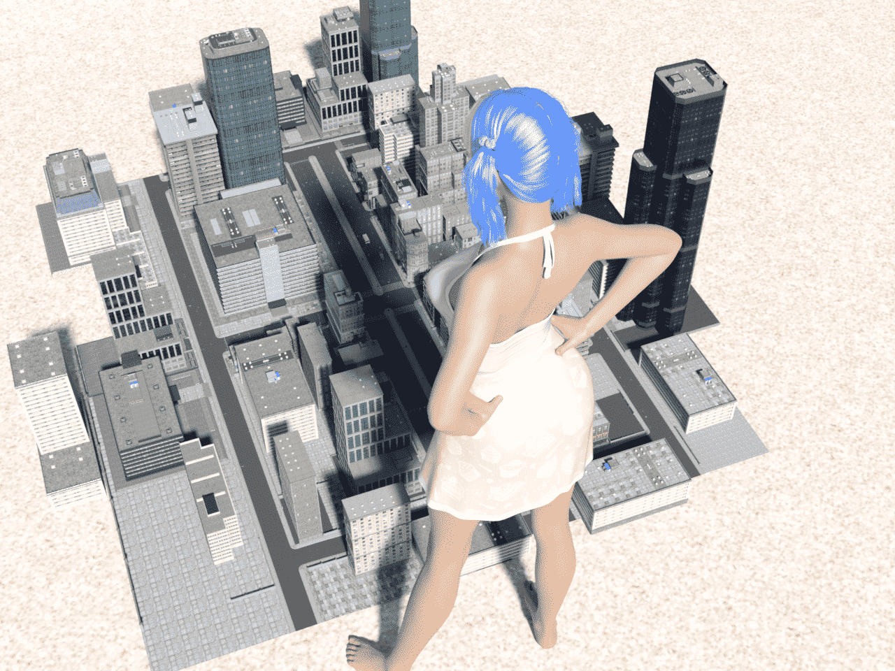

# 最近作品

作者：nhbnfn

TID：29125

 

# 1

一张一张图发不太好，还是攒一点一起发了，这样大家看的也比较舒服。。目前做图速度差不多一天才做一张，原因很多，不熟练加上电脑渲染时间太长(最长的一次渲染竟然让我等了2小时，应该是我电脑不行了。。)

我的Deviantart账号:deviantart.com/questilysolo 球球能来看的朋友们支持一下秋梨膏！

 

# 2

<ignore_js_op>[catch a bug.png](forum.php?mod=attachment&aid=ODQxMjR8NGRhMGEyZDZ8MTYwMzgyODE3OXwxODIzMHwyOTEyNQ%3D%3D&nothumb=yes) *(2.12 MB, 下載次數: 7)*

[下載附件](forum.php?mod=attachment&aid=ODQxMjR8NGRhMGEyZDZ8MTYwMzgyODE3OXwxODIzMHwyOTEyNQ%3D%3D&nothumb=yes)

2020-7-24 23:27 上傳  

</ignore_js_op> <ignore_js_op>[giantess5.png](forum.php?mod=attachment&aid=ODQxMjN8YjcxYzBmMzB8MTYwMzgyODE3OXwxODIzMHwyOTEyNQ%3D%3D&nothumb=yes) *(1.51 MB, 下載次數: 7)*

[下載附件](forum.php?mod=attachment&aid=ODQxMjN8YjcxYzBmMzB8MTYwMzgyODE3OXwxODIzMHwyOTEyNQ%3D%3D&nothumb=yes)

2020-7-24 23:27 上傳  

</ignore_js_op> <ignore_js_op>[giantess4.png](forum.php?mod=attachment&aid=ODQxMjJ8MGI4M2E2MDl8MTYwMzgyODE3OXwxODIzMHwyOTEyNQ%3D%3D&nothumb=yes) *(2.09 MB, 下載次數: 5)*

[下載附件](forum.php?mod=attachment&aid=ODQxMjJ8MGI4M2E2MDl8MTYwMzgyODE3OXwxODIzMHwyOTEyNQ%3D%3D&nothumb=yes)

2020-7-24 23:26 上傳  

</ignore_js_op>  

# 3

> [kevinsky05 發表於 2020-7-24 23:44](https://giantessnight.com/gnforum2012/forum.php?mod=redirect&goto=findpost&pid=442724&ptid=29125)

> 渲染除了看本來的電腦設備還有看你使用的模型精細度~

> TruForm 的模型城市和場境都佔資源比較少 可以試看看~ ...

这样吗 我去试试看 感谢k大回复！

 

# 4

> [scale君 發表於 2020-7-24 23:43](https://giantessnight.com/gnforum2012/forum.php?mod=redirect&goto=findpost&pid=442723&ptid=29125)

> 好棒，质感蛮不错，光影再调一下就更好了

是的。。光线还是我目前最头疼的问题 第一张图本来想做一个日光灯照在上面的，但奈何渲染出来没效果，后来就索性就这样了。。感谢您的回复！

 

# 5

> [kevinsky05 發表於 2020-7-25 00:30](https://giantessnight.com/gnforum2012/forum.php?mod=redirect&goto=findpost&pid=442743&ptid=29125)

> 一般來說你可點燈具 或在SURFACE裡點選燈具然後再調Luminance(亮度)

隐藏掉天花板之后确实可以 只不过都是太阳光照下来感觉不真实。。就是桌子椅子全亮了 本来想做出日光灯的效果的。。感谢k大教学!

 

# 6

> [kevinsky05 發表於 2020-7-25 00:30](https://giantessnight.com/gnforum2012/forum.php?mod=redirect&goto=findpost&pid=442743&ptid=29125)

> 一般來說你可點燈具 或在SURFACE裡點選燈具然後再調Luminance(亮度)

非常感谢!按照您的说法之后调整出来的这个亮度就是我想要的结果！和日光灯效果一样！对了，k大，我没有找到TruForm的城市模型啊 只有一些森林 卧室之类的。。是我找的方法不对么。。