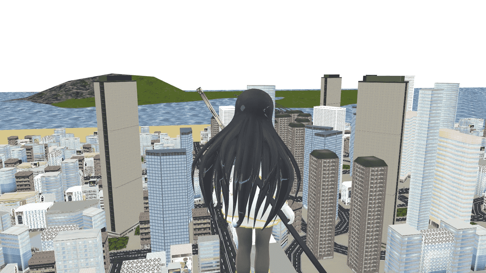
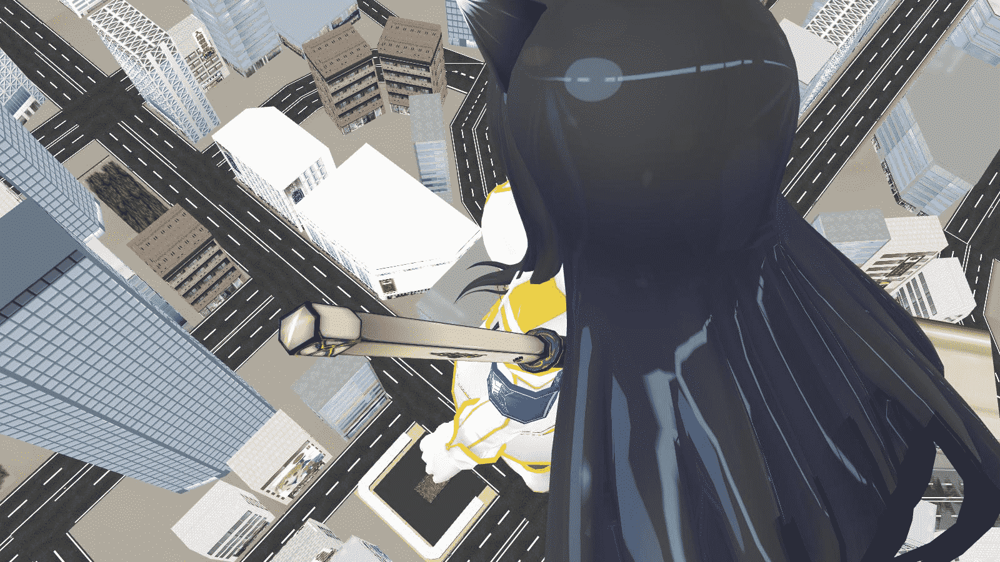

# 最近砸MMD

作者：ckw

TID：11677

 

# 1

最近玩MMD,以下略

摸石頭走路後勉強學會用日文版MMD(因為懶)

100倍大斑鳩(<白鞋),使用模型跟dan用的是不同版本(<黑鞋),因為隨便打包下來

為什麼只有一個動作模型?因為懶啊啊啊啊啊啊啊啊啊

為什麼天空是白色?因為忙記了導入

為毛畫質差?因為我的電腦就是這樣子

為什麼偷懶?我是寫字作文多過玩軟件

[ *本帖最後由 ckw 於 2012-1-15 01:12 編輯* ] 

# 2

<ignore_js_op>[8.jpg](forum.php?mod=attachment&aid=MjczODJ8YWI4ZDM2NTJ8MTYwMzg3NTcyMXwxODIzMHwxMTY3Nw%3D%3D&nothumb=yes) *(134.63 KB, 下載次數: 1)*

[下載附件](forum.php?mod=attachment&aid=MjczODJ8YWI4ZDM2NTJ8MTYwMzg3NTcyMXwxODIzMHwxMTY3Nw%3D%3D&nothumb=yes)

2012-1-15 01:05 上傳  

</ignore_js_op> <ignore_js_op>[9.jpg](forum.php?mod=attachment&aid=MjczODN8ZjUwYzFhODZ8MTYwMzg3NTcyMXwxODIzMHwxMTY3Nw%3D%3D&nothumb=yes) *(234.35 KB, 下載次數: 1)*

[下載附件](forum.php?mod=attachment&aid=MjczODN8ZjUwYzFhODZ8MTYwMzg3NTcyMXwxODIzMHwxMTY3Nw%3D%3D&nothumb=yes)

2012-1-15 01:05 上傳  

</ignore_js_op> <ignore_js_op>[6.jpg](forum.php?mod=attachment&aid=MjczODR8OGVhZWFmMzJ8MTYwMzg3NTcyMXwxODIzMHwxMTY3Nw%3D%3D&nothumb=yes) *(148.17 KB, 下載次數: 1)*

[下載附件](forum.php?mod=attachment&aid=MjczODR8OGVhZWFmMzJ8MTYwMzg3NTcyMXwxODIzMHwxMTY3Nw%3D%3D&nothumb=yes)

2012-1-15 01:05 上傳  

</ignore_js_op> <ignore_js_op>[5.jpg](forum.php?mod=attachment&aid=MjczODV8MmQ5ODVmZmR8MTYwMzg3NTcyMXwxODIzMHwxMTY3Nw%3D%3D&nothumb=yes) *(229.19 KB, 下載次數: 1)*

[下載附件](forum.php?mod=attachment&aid=MjczODV8MmQ5ODVmZmR8MTYwMzg3NTcyMXwxODIzMHwxMTY3Nw%3D%3D&nothumb=yes)

2012-1-15 01:05 上傳  

</ignore_js_op> <ignore_js_op>[16.jpg](forum.php?mod=attachment&aid=MjczODZ8OWRkNmZkYWR8MTYwMzg3NTcyMXwxODIzMHwxMTY3Nw%3D%3D&nothumb=yes) *(105.3 KB, 下載次數: 2)*

[下載附件](forum.php?mod=attachment&aid=MjczODZ8OWRkNmZkYWR8MTYwMzg3NTcyMXwxODIzMHwxMTY3Nw%3D%3D&nothumb=yes)

2012-1-15 01:05 上傳  

</ignore_js_op>  

# 3

> 原帖由 *1995613* 於 2012-1-17 09:44 發表 

> 说实话对日文只懂雅蠛蝶。

世界上除漢字,所謂的文字只是一堆發音符號,漢字則是有實在含意的獨立個體(成千上萬)

英文26個字母(基本發音字母)

日文則是50音,再分平假名(有漢字),或片假名,類似英語地一組字母=一個詞

看,簡單吧