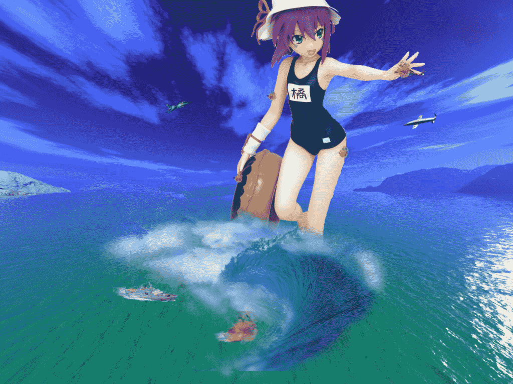

# 有P了一张图，欢迎大家多提意见。

作者：cat

TID：11816

 

# 1

终于又P完了一张，仍然和上次的图一样的风格。采纳大家的意见，使用三维与三维结合。虽然没有P真人，但是这个巨大娘是玛莉●梦魔的手办，应该也是有3D效果的。仍然想问一个问题：人物的阴影应该怎样添加，没有影子像只鬼一样，感觉很不自然啊。谢谢大家啊！ <ignore_js_op>

**?莉●?魔.jpg** *(497.78 KB, 下載次數: 0)*

[下載附件](forum.php?mod=attachment&aid=Mjc2ODN8NThjNWIyNzV8MTYwMzg3NTgwMXwxODIzMHwxMTgxNg%3D%3D&nothumb=yes)

2012-2-7 20:34 上傳

 

# 2

谢谢大家的支持哈，我会多努力的。话说按照4楼的方法在平面上可以添加，但是若在城市中，阴影好像就没有办法那样添加了吧。另外，阴影的角度，透视方向好像很难把握啊。希望各位大神赐教。</ignore_js_op>