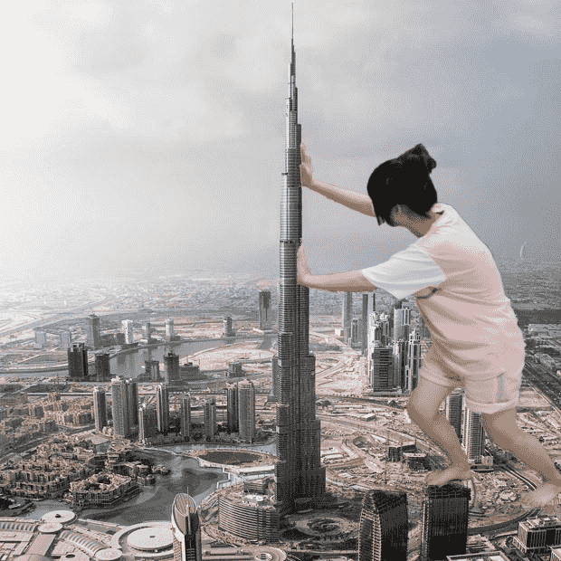

# 本人製作之拙圖兩張,請給些建議吧

作者：Solexight

TID：9275

 

# 1

其實我是不怎麼想拿出來的啦

不過想想讓大家娛樂一下就好...

製作大概也只花了20分鐘左右吧

不過有有求於人 就要有付出是吧..

能否請各位解決我的問題

不知道有沒有完整版的..小弟現高三

電腦時間畢竟不多..但無限飢渴的慾望實在讓我按耐不住啊

小弟我的發問:[http://www.giantessnight.com/gnforum/viewthread.php?tid=9271&extra=page%3D1](http://www.giantessnight.com/gnforum/viewthread.php?tid=9271&extra=page%3D1)

懇請拜託各位了,另謝謝xnr大大

本文重點是我娛樂用的兩張圖!

原圖也是論壇拿的

素材我盡量都是使用大圖..(如果是製作縮小的)

由於配合我個人喜愛的尺寸

所以壓縮之後,反而看不見小人啊..(一團黑)

其實也是懶啦..論壇有上傳容量限制所以之前也都沒發文

如果有好的素材分享地拜託各位也給我一些建議

我超喜歡糖果跟女帝啊......

<ignore_js_op>

**YAYA.jpg** *(91.68 KB, 下載次數: 2)*

[下載附件](forum.php?mod=attachment&aid=MjMwNTR8YjY4YTg2MjB8MTYwMzg3Nzk1NnwxODIzMHw5Mjc1&nothumb=yes)

2011-1-31 11:55 上傳

<ignore_js_op>

**白.jpg** *(86.56 KB, 下載次數: 0)*

[下載附件](forum.php?mod=attachment&aid=MjMwNTV8YjMzMmY4OTZ8MTYwMzg3Nzk1NnwxODIzMHw5Mjc1&nothumb=yes)

2011-1-31 11:55 上傳

下面是我高中朋友啦不過她懷孕休學去了..

題外話:最近台灣剛辦完了大學學測..雖然我是綜高生但沒選擇去考

四月底的統測才是我的征戰啊,大家給我一些鼓勵吧哈哈

小弟不才~能請問各位製圖高手們,都是使用什麼軟體呢

我用的只是初階的pohohimpact X3..哈哈 

# 2

呵呵謝謝各位的鼓勵搂

鑑於那是我很久之前做的 約莫一年前吧,那時舊電腦有photoimpact所以就拿來玩一下

由於我說過是娛樂用啦..加上我懶得去修了,所以去背應該是我懶得弄啦..大家加減看呵

也不算朋友..只是住在學校,有幾面之緣..後來發現不再有她的蹤跡

稍微聽聞才得知此事..

身上著的還是學校體育服呢

但還是請各位看倌們詳讀一下本文的內容拜託拜託,如果您有這部分的見聞能否解決小弟的困擾..

做圖上最棘手的是影像與背景融合,讓人物能在建築物後顯現這是問題

也就是所謂的融合

畢竟我不是具有這方人專業知識的人

所以這兩張圖真的只是一般人之作..恰巧有素材罷了~ 

# 3

還是接受指教摟..

我比較喜歡那種有互動的情節啦..

其實您比較用心吧..

共勉之!</ignore_js_op></ignore_js_op>