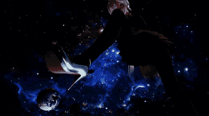

# 来个gif吧

作者：提高提高123哈

TID：19249

<title>1</title> <link href="../Styles/Style.css" type="text/css" rel="stylesheet">

# 1

昨晚就想发的，手机弄了半天放弃了，爬起来用电脑好啦
<title>2</title> <link href="../Styles/Style.css" type="text/css" rel="stylesheet">

# 2

 <ignore_js_op>[08.gif](forum.php?mod=attachment&aid=NTI1ODZ8MmZkNjdmOGF8MTYwMzg2NDA3OHwxODIzMHwxOTI0OQ%3D%3D&nothumb=yes) *(1.2 MB, 下載次數: 1100)*

[下載附件](forum.php?mod=attachment&aid=NTI1ODZ8MmZkNjdmOGF8MTYwMzg2NDA3OHwxODIzMHwxOTI0OQ%3D%3D&nothumb=yes)

2015-6-22 09:51 上傳  

</ignore_js_op> <title>3</title> <link href="../Styles/Style.css" type="text/css" rel="stylesheet">

# 3

*本帖最後由 提高提高123哈 於 2015-6-22 13:22 編輯*

> liuqihao1997 發表於 2015-6-22 10:55
> 这幅图让我想起了论坛里的一篇文章，，，，貌似也有着一段剧情，但名字我不记得了。。。
> 作为第一个购买的 ...

什么文啊，求个连接看看哈

哦，原来你也记不住啦，那算啦<title>4</title> <link href="../Styles/Style.css" type="text/css" rel="stylesheet">

# 4

> [archer 發表於 2015-6-22 18:25](https://giantessnight.com/gnforum2012/forum.php?mod=redirect&goto=findpost&pid=258856&ptid=19249)
> 哦哦 GIGA级很棒  这种GIF看起来和动画也没什么区别啦

那要不要动画呢，我做GIF主要是方便传播哈，视频片段毕竟太大了，不过如果有人想要我倒可以放出来<title>5</title> <link href="../Styles/Style.css" type="text/css" rel="stylesheet">

# 5

> [wtr2010 發表於 2015-6-23 00:56](https://giantessnight.com/gnforum2012/forum.php?mod=redirect&goto=findpost&pid=258912&ptid=19249)
> 这是楼主自己做的gif吗？实在是太赞了！相当有魄力的感觉。
> 顺带说下楼主想知道的那篇文，这篇http://giant ...

哦！我看过哈，原来都没注意过，仔细想想确实有很像的样子。做这动图的初衷是有次看到个GIF是有个手掌托着太阳系，让我很纠结因为吗虽然镜头很酷然而那手明显是男人手……所以想做个类似的，直接照搬内容又不太好，所以就改一改，把手换成haku的脚好啦。而太阳系呢改换成地球，可能更有冲击感。让haku的鞋跟贯穿地球啦<title>6</title> <link href="../Styles/Style.css" type="text/css" rel="stylesheet">

# 6

> [smsunhuawei 發表於 2015-7-22 14:31](https://giantessnight.com/gnforum2012/forum.php?mod=redirect&goto=findpost&pid=262761&ptid=19249)
> 真好真好，是怎么做出这么华丽效果的？是一帧帧做的还是做的视频转成GIF的？ ...

视频转的哈，逐帧太难了