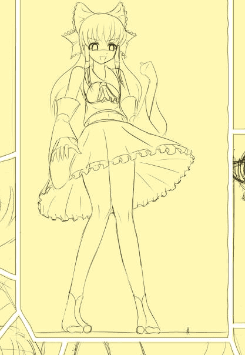

# 某人手绘线稿截图

作者：xnr

TID：8781

<title>1</title> <link href="../Styles/Style.css" type="text/css" rel="stylesheet">

# 1

以下这张截图就是这个帖子的现阶段部分成果：（这个帖子都沉了很久了）
[http://giantessnight.com/gnforum ... page%3D2&page=1](http://giantessnight.com/gnforum/viewthread.php?tid=8515&extra=page%3D2&page=1)

同好eventually提到了红白，红白也是巫女，对于NETA满载的《缩小学园》这部神作，为何不让她也来客串一把呢？于是我就画了以博丽灵梦为女主角的手绘作品，这也是我第一次尝试画漫画（貌似漫画更受欢迎？）

点击可看大图，这是原尺寸的。

<ignore_js_op>

**Snapz2.jpg** *(38.7 KB, 下載次數: 2)*

[下載附件](forum.php?mod=attachment&aid=MjIwNzh8OGIwYjVhNGF8MTYwMzg3NTQ3OHwxODIzMHw4Nzgx&nothumb=yes)

2010-12-4 22:53 上傳

背景黄为绘图中保护眼睛的颜色。

由于工作太忙，时间有限，加之目前本人比较缺乏灵感，原来打算画8-12张同人图的。
但现在只打算画六张：（其他多画也无意义）
1\. 园艺部女生踩踏
2\. 合成部被抓
3\. 被缩小成万分之一第三个选项替换图（原来画过一张，但当时手绘功力有限，感觉不好，所以这次重画。）
4\. 地仁田战红白（博丽灵梦），漫画形式。
5\. 保密，漫画形式。
6\. 保密。

发这个帖子的目的仍然是抛砖引玉，希望大家能分享好的想法，激发创作的灵感，谢谢！
可以在上面那个帖子或者本帖中提出来与大家交流，每一个帖子我都会认真去看的，请不要灌水哦！

[ *本帖最後由 xnr 於 2011-2-19 20:47 編輯* ]<title>2</title> <link href="../Styles/Style.css" type="text/css" rel="stylesheet">

# 2

> 原帖由 *1055348297* 於 2010-12-5 12:40 發表 
> 为什么裙子没有再短一些·····

红白的裙子就是这么长，没办法再短了。

我本来也想说能否短到可以看到内裤，但是觉得这样就不忠于官方设定了。

不过你放心，会有看到内裤的POV镜头的。<title>3</title> <link href="../Styles/Style.css" type="text/css" rel="stylesheet">

# 3

> 原帖由 *Feuillage* 於 2010-12-5 04:35 發表 
> 剛才以為是最中的草圖0.0

没理解这句话的意思。。。河南方言里的那个“中”吗？<title>4</title> <link href="../Styles/Style.css" type="text/css" rel="stylesheet">

# 4

我以为会有很多同好踊跃提出自己的建议和想法。。。最起码YY一下也好啊。。。<title>5</title> <link href="../Styles/Style.css" type="text/css" rel="stylesheet">

# 5

> 原帖由 *killer9999* 於 2010-12-5 18:00 發表 
> 要談的都在那邊談完了嘛

谈过什么我都没印象了。。。还是在这里详细的阐明吧。。。<title>6</title> <link href="../Styles/Style.css" type="text/css" rel="stylesheet">

# 6

> 原帖由 *wongvict* 於 2010-12-5 18:30 發表 
> 可我也已經說出我的妄想同人圖，我還不知道可以YY什麼

我已经回答你了啊。。。会有的。。。<title>7</title> <link href="../Styles/Style.css" type="text/css" rel="stylesheet">

# 7

> 原帖由 *wongvict* 於 2010-12-6 01:58 發表 
> 明白了，原來是希望帖子更有人氣。
> 
> 推動力太少了，創作動力也會跟著減少的。

我也是借助缩小学园这部游戏的人气的。

话说我这么做也是为了给大家一个交流、想象和创作的机会。

而不是一味的伸手求档什么的。</ignore_js_op>