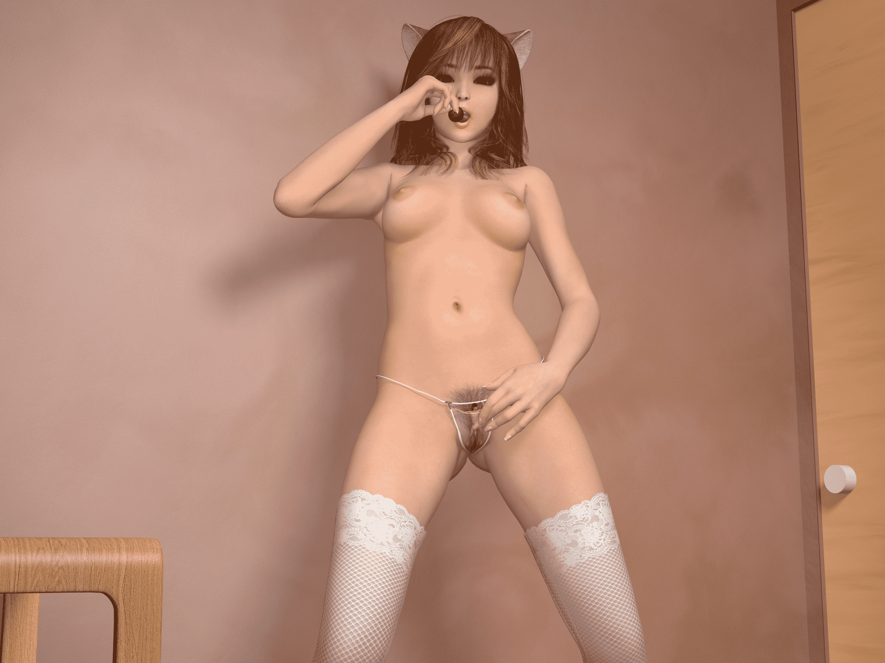

# 棒棒糖女孩（新手第一次发图）

作者：小狐狸桑

TID：11879

<title>1</title> <link href="../Styles/Style.css" type="text/css" rel="stylesheet">

# 1

折腾poser+c4d 有一段时间了，尝试了好久，在大A的帮助下终于会一些了

先发些图~ 随意做的，还在不断改进尝试中，希望大家喜欢，发现做图真的很耗时间。。辛苦的很

其实我有另外一个账号的，在论坛潜水好长时间了，一直是伸手党，都不好意思用那个ID发图，于是重新注册一个号，发发图片。。决定重新做人= = <title>2</title> <link href="../Styles/Style.css" type="text/css" rel="stylesheet">

# 2

 <ignore_js_op>[1.jpg](forum.php?mod=attachment&aid=Mjc4MDN8MWZkMGZmYzd8MTYwMzg0MDI5M3wxODIzMHwxMTg3OQ%3D%3D&nothumb=yes) *(2.07 MB, 下載次數: 325)*

[下載附件](forum.php?mod=attachment&aid=Mjc4MDN8MWZkMGZmYzd8MTYwMzg0MDI5M3wxODIzMHwxMTg3OQ%3D%3D&nothumb=yes)

2012-2-23 20:59 上傳  

</ignore_js_op> <ignore_js_op>[2.jpg](forum.php?mod=attachment&aid=Mjc4MDR8NmUxNTU0MGV8MTYwMzg0MDI5M3wxODIzMHwxMTg3OQ%3D%3D&nothumb=yes) *(945.65 KB, 下載次數: 212)*

[下載附件](forum.php?mod=attachment&aid=Mjc4MDR8NmUxNTU0MGV8MTYwMzg0MDI5M3wxODIzMHwxMTg3OQ%3D%3D&nothumb=yes)

2012-2-23 20:59 上傳  

</ignore_js_op> <ignore_js_op>[3.jpg](forum.php?mod=attachment&aid=Mjc4MDV8MGY0MzNiMjN8MTYwMzg0MDI5M3wxODIzMHwxMTg3OQ%3D%3D&nothumb=yes) *(1.63 MB, 下載次數: 260)*

[下載附件](forum.php?mod=attachment&aid=Mjc4MDV8MGY0MzNiMjN8MTYwMzg0MDI5M3wxODIzMHwxMTg3OQ%3D%3D&nothumb=yes)

2012-2-23 20:59 上傳  

</ignore_js_op> <ignore_js_op>[4.jpg](forum.php?mod=attachment&aid=Mjc4MDZ8NDAwY2RlNjZ8MTYwMzg0MDI5M3wxODIzMHwxMTg3OQ%3D%3D&nothumb=yes) *(663.99 KB, 下載次數: 127)*

[下載附件](forum.php?mod=attachment&aid=Mjc4MDZ8NDAwY2RlNjZ8MTYwMzg0MDI5M3wxODIzMHwxMTg3OQ%3D%3D&nothumb=yes)

2012-2-23 20:59 上傳  

</ignore_js_op> <ignore_js_op>[5.jpg](forum.php?mod=attachment&aid=Mjc4MDd8MWFjZjUzMTd8MTYwMzg0MDI5M3wxODIzMHwxMTg3OQ%3D%3D&nothumb=yes) *(419.81 KB, 下載次數: 88)*

[下載附件](forum.php?mod=attachment&aid=Mjc4MDd8MWFjZjUzMTd8MTYwMzg0MDI5M3wxODIzMHwxMTg3OQ%3D%3D&nothumb=yes)

2012-2-23 20:59 上傳  

</ignore_js_op> <ignore_js_op>[6.jpg](forum.php?mod=attachment&aid=Mjc4MDh8ZDQ3ODJmOWJ8MTYwMzg0MDI5M3wxODIzMHwxMTg3OQ%3D%3D&nothumb=yes) *(389.32 KB, 下載次數: 51)*

[下載附件](forum.php?mod=attachment&aid=Mjc4MDh8ZDQ3ODJmOWJ8MTYwMzg0MDI5M3wxODIzMHwxMTg3OQ%3D%3D&nothumb=yes)

2012-2-23 20:59 上傳  

</ignore_js_op> <ignore_js_op>[7.png](forum.php?mod=attachment&aid=Mjc4MDl8YTZiOTBhMTl8MTYwMzg0MDI5M3wxODIzMHwxMTg3OQ%3D%3D&nothumb=yes) *(3.46 MB, 下載次數: 64)*

[下載附件](forum.php?mod=attachment&aid=Mjc4MDl8YTZiOTBhMTl8MTYwMzg0MDI5M3wxODIzMHwxMTg3OQ%3D%3D&nothumb=yes)

2012-2-23 20:59 上傳  

</ignore_js_op> <ignore_js_op>[8.jpg](forum.php?mod=attachment&aid=Mjc4MTB8N2MyYzAwNDB8MTYwMzg0MDI5M3wxODIzMHwxMTg3OQ%3D%3D&nothumb=yes) *(407.35 KB, 下載次數: 54)*

[下載附件](forum.php?mod=attachment&aid=Mjc4MTB8N2MyYzAwNDB8MTYwMzg0MDI5M3wxODIzMHwxMTg3OQ%3D%3D&nothumb=yes)

2012-2-23 20:59 上傳  

</ignore_js_op> <ignore_js_op>[9.png](forum.php?mod=attachment&aid=Mjc4MTF8NWIzZTQ3Mjd8MTYwMzg0MDI5M3wxODIzMHwxMTg3OQ%3D%3D&nothumb=yes) *(2.98 MB, 下載次數: 60)*

[下載附件](forum.php?mod=attachment&aid=Mjc4MTF8NWIzZTQ3Mjd8MTYwMzg0MDI5M3wxODIzMHwxMTg3OQ%3D%3D&nothumb=yes)

2012-2-23 20:59 上傳  

</ignore_js_op> <ignore_js_op>[10.png](forum.php?mod=attachment&aid=Mjc4MTJ8MDMzOWJmMDV8MTYwMzg0MDI5M3wxODIzMHwxMTg3OQ%3D%3D&nothumb=yes) *(742.98 KB, 下載次數: 58)*

[下載附件](forum.php?mod=attachment&aid=Mjc4MTJ8MDMzOWJmMDV8MTYwMzg0MDI5M3wxODIzMHwxMTg3OQ%3D%3D&nothumb=yes)

2012-2-23 20:59 上傳  

</ignore_js_op> <ignore_js_op>[11.png](forum.php?mod=attachment&aid=Mjc4MTN8Y2ViOWNjMzJ8MTYwMzg0MDI5M3wxODIzMHwxMTg3OQ%3D%3D&nothumb=yes) *(3.51 MB, 下載次數: 78)*

[下載附件](forum.php?mod=attachment&aid=Mjc4MTN8Y2ViOWNjMzJ8MTYwMzg0MDI5M3wxODIzMHwxMTg3OQ%3D%3D&nothumb=yes)

2012-2-23 20:59 上傳  

</ignore_js_op> <title>3</title> <link href="../Styles/Style.css" type="text/css" rel="stylesheet">

# 3

额，传上来才发现图片尺寸略大了，点开看貌似要些时间，渲染的时候太贪心。。<title>4</title> <link href="../Styles/Style.css" type="text/css" rel="stylesheet">

# 4

我尝试了好久的，做的不好的都扔到回收站去了=  = 目前poser的模型都很精致的~ 但是狂吃内存，电脑要吃不消了。。<title>5</title> <link href="../Styles/Style.css" type="text/css" rel="stylesheet">

# 5

哈~谢谢老大支持~！ <title>6</title> <link href="../Styles/Style.css" type="text/css" rel="stylesheet">

# 6

是啊，调动作非常花时间，poser没有坐标系，两个人物的配合什么的很麻烦 -  -  而且poser不好弄场景，我是导入c4d渲染的~<title>7</title> <link href="../Styles/Style.css" type="text/css" rel="stylesheet">

# 7

哈，比较喜欢海贼，其实在另一面墙上还贴了犬夜叉的海报= =<title>8</title> <link href="../Styles/Style.css" type="text/css" rel="stylesheet">

# 8

正在筹备呢，准备做个故事吧~<title>9</title> <link href="../Styles/Style.css" type="text/css" rel="stylesheet">

# 9

恩~ 灯光我要琢磨琢磨，目前只会用用泛光灯和聚光灯。。还有就是感觉c4d渲染出的人物皮肤不如poser的有质感，可能是材质设置不对吧。。研究中。。