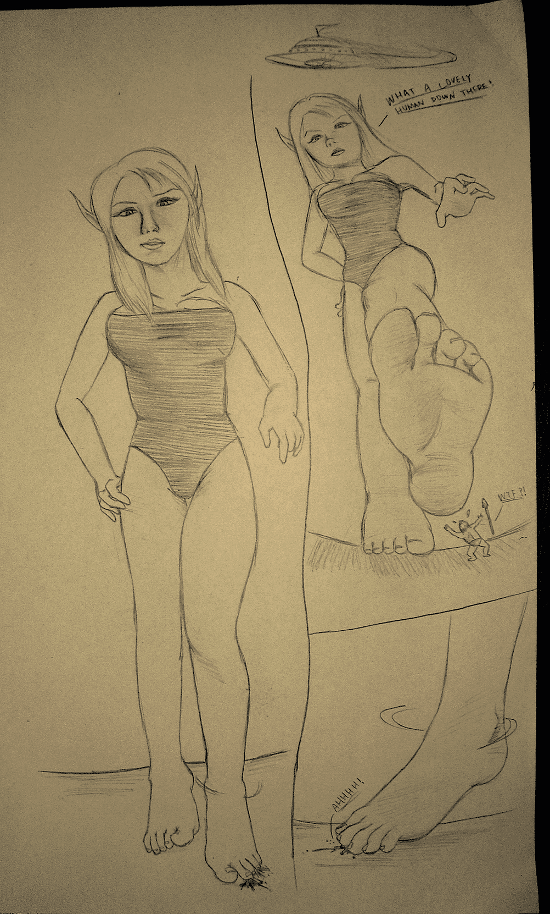
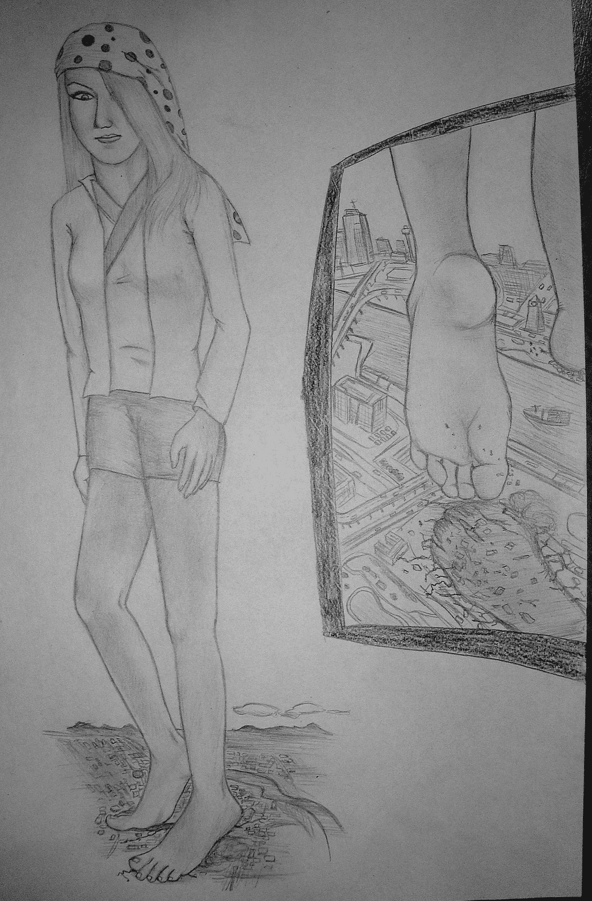

# 浮出來發圖

作者：pliod

TID：6424

 

# 1

好久不見! 最近考試實在很忙!

矛盾的是,我都是利用準備考試的時間來畫圖

下星期都還有一些,希望可以能好成績(正在玩電腦)

咳~介紹一下圖吧:

**第一張**

<ignore_js_op>

**外星妖精入侵.JPG** *(1.03 MB, 下載次數: 0)*

[下載附件](forum.php?mod=attachment&aid=MTY2OTJ8MmE3ZDMxNjl8MTYwMzg3ODkyNXwxODIzMHw2NDI0&nothumb=yes)

2010-1-24 05:56 上傳

比較粗糙一點的圖

一位落單的古代人,正在守獵,遇到從天而降的外星妖精.

手上的矛當然就沒用啦..從此那地區的文明消失殆盡

**第二張**

<ignore_js_op>

**城市破壞.JPG** *(861.26 KB, 下載次數: 0)*

[下載附件](forum.php?mod=attachment&aid=MTY2OTN8N2FhZWQzNDV8MTYwMzg3ODkyNXwxODIzMHw2NDI0&nothumb=yes)

2010-1-24 05:56 上傳

稍花點時間畫的

時間去到現代

一位金髮美麗的女神,身形未知數的大,是一般人的萬倍以上

不用運內力就可以在地板上踩出約一座湖的深度(武俠看太多)

最先進破壞性武器於她都無效

人過於渺小對她

完全不禁被她柔軟的腳底腳趾輕輕一壓

她"走"了後,世界又會重新回到古代,人類重新拿著木棍,矛作戰

也會出現許多差不多大小的"腳型湖"

-------------

請大家欣賞吧;)也請多指教! 

# 2

哈! 但丁喜歡Giga以上的GTS齁

好久沒畫了~ 到時學期假再帶來一些圖--</ignore_js_op></ignore_js_op>