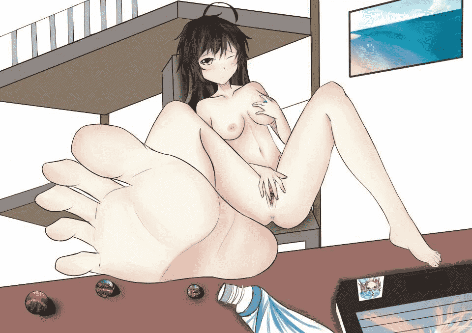

# 牙膏里的世界插图？

作者：GhostButterfly

TID：17616

<title>1</title> <link href="../Styles/Style.css" type="text/css" rel="stylesheet">

# 1

*本帖最後由 GhostButterfly 於 2014-8-22 07:23 編輯*

@准吧基佬 碱基  画的不是很好尤其是背景没有做处理。。。图层太多了动一下就提示内存不足，简直丧心病狂。还有几天就去买小钢炮嗯妥妥的。。。希望大家能给点建议。。。怎么说呢感觉有点别扭又不知道是哪里。。。话说希望各位潜水党也可以给出评价，本人没学过美术，只能靠建议去琢磨，嗯嗯回帖奖励也不少了希望大家能回复下，我很喜欢看回复的。。。钱真的不能再多了。。。我快不够了〒_〒 希望大家不要灌水。。。

<ignore_js_op>

**QQ图片20140821215915.jpg** *(93.44 KB, 下載次數: 20)*

[下載附件](forum.php?mod=attachment&aid=NDU4NzZ8MTExMDdiNmN8MTYwMzg2NDMwNnwxODIzMHwxNzYxNg%3D%3D&nothumb=yes)

2014-8-21 22:02 上傳

<title>2</title> <link href="../Styles/Style.css" type="text/css" rel="stylesheet">

# 2

> [無邊落木 發表於 2014-8-23 13:52](https://giantessnight.com/gnforum2012/forum.php?mod=redirect&goto=findpost&pid=232673&ptid=17616)
> 關於背景透視的修正，建議拍張室內照片，作為背景圖層描邊，這是最懶也最不會出問題的方法。
> 
> 注目重點既然 ...

谢谢您的评价  我是用数位板画的  我没有美术基础所以透视什么的也肯定不行了。。。还有我优先练习的人体 速写什么的 这图的人体透视完全脑补〒_〒梦里貌似就是这样。。。背景什么的会练习的，以后会更加努力的绘画的 最后 再次谢谢您给的建议</ignore_js_op>