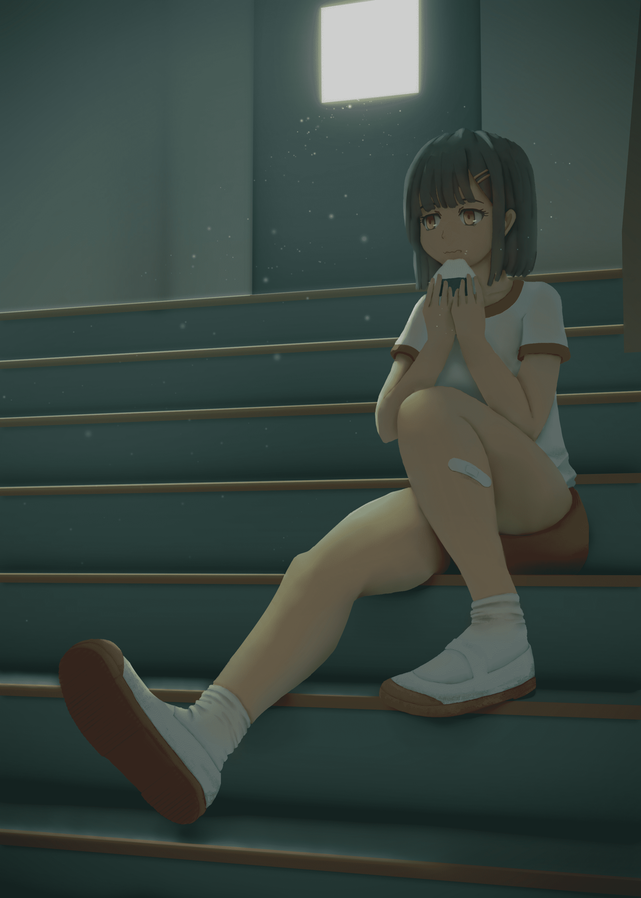

# 画了张幸运星

作者：marycat

TID：28939

 

# 1

<ignore_js_op>

**lucky_star.jpg** *(1.5 MB, 下載次數: 4)*

[下載附件](forum.php?mod=attachment&aid=ODM1MTR8NzIyMGZlMDl8MTYwMzgyODc1MHwxODIzMHwyODkzOQ%3D%3D&nothumb=yes)

2020-6-20 11:26 上傳

此方的作死行为(￣_,￣ )

 

# 2

<ignore_js_op>

**穿着体操服坐在楼梯间吃午饭的少女.jpg** *(1.25 MB, 下載次數: 0)*

[下載附件](forum.php?mod=attachment&aid=ODM1MTV8OGNlYTc3ZDl8MTYwMzgyODc1MHwxODIzMHwyODkzOQ%3D%3D&nothumb=yes)

2020-6-20 11:28 上傳

顺便发张上个月画的，没什么gts元素

 

# 3

> [kevinsky05 發表於 2020-6-20 13:44](https://giantessnight.com/gnforum2012/forum.php?mod=redirect&goto=findpost&pid=439856&ptid=28939)

> 一直都有follow 大神

> 希望看到更多gts作品~~~~

感谢支持~ˋ( ° ▽、° )

 

# 4

> [迷途小喵 發表於 2020-6-20 19:01](https://giantessnight.com/gnforum2012/forum.php?mod=redirect&goto=findpost&pid=439874&ptid=28939)

> 大腿的肉部分很棒呢

> 可以問一下適用甚麼方式畫出這種類似 紙雕的質感

> 非常喜歡

[https://www.bilibili.com/video/BV1nt411a7iz](https://www.bilibili.com/video/BV1nt411a7iz)

推荐你看下乔纳森·汉密尔顿大神的AO画法教程~

我那张画其实一开始是看了一些讲AO画法的视频，想练习一下AO画法，不过后来感觉掌握不好那种用于塑造立体感的微妙明暗渐变，于是就只画了物体交叠处的AO，也就是像这种纸片重叠的感觉了〒▽〒

真正的AO画法画出来就跟3D渲染一样立体的，我还达不到那种层次 orz</ignore_js_op></ignore_js_op>