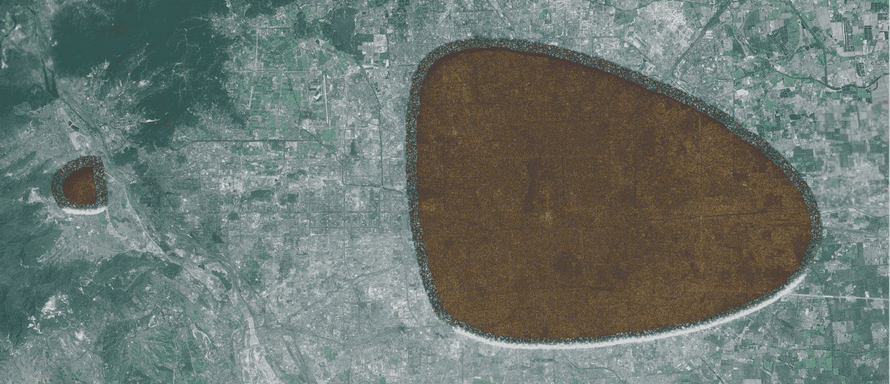

# 碾过城市的高跟靴靴印

作者：budebuai

TID：14830

<title>1</title> <link href="../Styles/Style.css" type="text/css" rel="stylesheet">

# 1

别的不说哈，能猜出是哪一座城市么？<title>2</title> <link href="../Styles/Style.css" type="text/css" rel="stylesheet">

# 2

 <ignore_js_op>[碾过北京的高跟靴靴印.jpg](forum.php?mod=attachment&aid=MzUzNTd8OTRkMDM1MDF8MTYwMzg3MzUzOHwxODIzMHwxNDgzMA%3D%3D&nothumb=yes) *(1.66 MB, 下載次數: 52)*

[下載附件](forum.php?mod=attachment&aid=MzUzNTd8OTRkMDM1MDF8MTYwMzg3MzUzOHwxODIzMHwxNDgzMA%3D%3D&nothumb=yes)

2013-7-27 18:39 上傳  

踩过城市的高跟靴

</ignore_js_op> <title>3</title> <link href="../Styles/Style.css" type="text/css" rel="stylesheet">

# 3

> 毒蛋白 發表於 2013-7-27 19:45 
> 个蛋白建议：
> 鞋跟处的地面平滑和一个斜坡的处理非常棒
> 鞋尖部分有鞋底的纹路就更赞了，

我最想做出这样的效果了，但。。。我再继续学习吧。。。<title>4</title> <link href="../Styles/Style.css" type="text/css" rel="stylesheet">

# 4

> xnr 發表於 2013-7-27 19:27 
> 鞋印控，好吧，新发现了一种GTS属性

哈哈哈。。。应该是，有关于巨大高跟靴女神的一切。想象女神的高跟靴一脚踩扁了城市。。。嗯嗯。。。