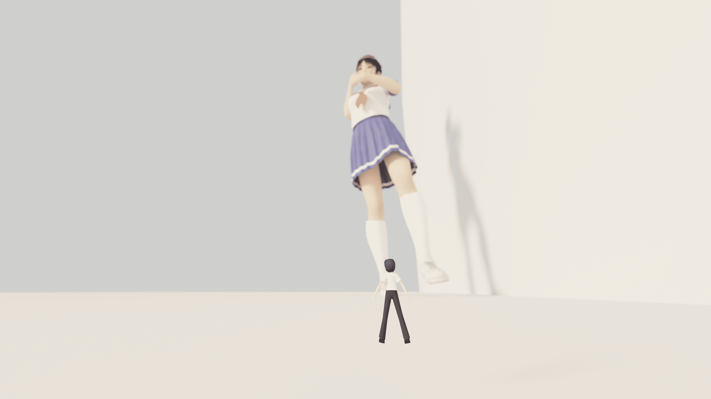

# 第一次Blender實作....

作者：Cocytus

TID：27997

<title>1</title> <link href="../Styles/Style.css" type="text/css" rel="stylesheet">

# 1

<ignore_js_op>

**Mari Test3.png** *(7.35 MB, 下載次數: 1)*

[下載附件](forum.php?mod=attachment&aid=ODEyODJ8M2M4ODQ1YzN8MTYwMzgzNTczMHwxODIzMHwyNzk5Nw%3D%3D&nothumb=yes)

2020-2-8 12:11 上傳

總結就是：Blender 比 MMD 細緻很多
（雖然一開始是因為我是Mac系統，所以沒有辦法用MMD，最後轉陣Blender）

皮膚、衣料的部分還得在多加學習</ignore_js_op>