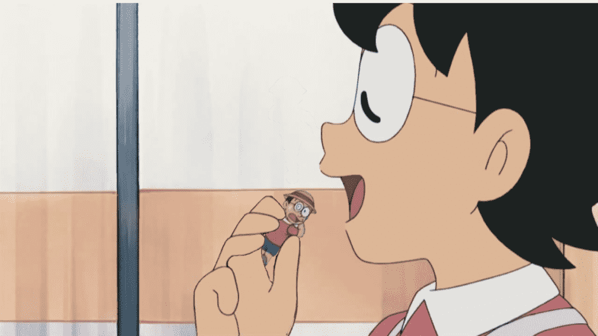

# 第一次弄合成圖 (我不會想標題啦...

作者：wlp156858

TID：16464

<title>1</title> <link href="../Styles/Style.css" type="text/css" rel="stylesheet">

# 1

*本帖最後由 wlp156858 於 2014-3-16 00:58 編輯*

...為了獎勵點決定強迫自己學一點基本的啦...(這原因才出來....各位不要扁我

小弟程式是用GIMPPortable，圖片後面還有點問題想請教一下各位前輩的

小弟因為只是自學了不到6小時 強行弄出來的作品 所以不要有太大的期望

其中一張圖片是用[http://www.giantessnight.com/gnforum2012/forum.php?mod=viewthread&tid=16463&extra=page%3D1](http://www.giantessnight.com/gnforum2012/forum.php?mod=viewthread&tid=16463&extra=page%3D1)的其中一圖片的 還有一個是 競時通 公會的團友 傳過來 被我無意看到覺得不錯拿來用的...最後卡通那張 相信不用多說了...? (卡通那張是我自學的時候 跟著網上的教學弄出來的-3-

<ignore_js_op>

**成品1.png** *(318.81 KB, 下載次數: 1)*

[下載附件](forum.php?mod=attachment&aid=NDE1ODl8YWE3NDc3MDh8MTYwMzg3MTcxMHwxODIzMHwxNjQ2NA%3D%3D&nothumb=yes)

2014-3-15 05:14 上傳

<ignore_js_op>

**成品.png** *(419.31 KB, 下載次數: 1)*

[下載附件](forum.php?mod=attachment&aid=NDE1OTB8ZDE3M2M4NWZ8MTYwMzg3MTcxMHwxODIzMHwxNjQ2NA%3D%3D&nothumb=yes)

2014-3-15 06:07 上傳

<ignore_js_op>

**3ddc8596bd8827291b12efaf3f439a7a.png** *(322.78 KB, 下載次數: 0)*

[下載附件](forum.php?mod=attachment&aid=NDE1ODd8YjZkNDZhZmV8MTYwMzg3MTcxMHwxODIzMHwxNjQ2NA%3D%3D&nothumb=yes)

2014-3-15 05:13 上傳

最後我剛說想問的問題是....GIMPPortable 有沒有方法弄出影子的效果 和 我不太懂GIMPPortable 的玻璃效果怎才可以用得好像物品在玻璃裡面的感覺...

喲~人家的第一次給了你們啦...(臉紅
<title>2</title> <link href="../Styles/Style.css" type="text/css" rel="stylesheet">

# 2

*本帖最後由 wlp156858 於 2014-3-16 00:55 編輯*

> [shendanxiaogui 發表於 2014-3-15 12:21](https://giantessnight.com/gnforum2012/forum.php?mod=redirect&goto=findpost&pid=218143&ptid=16464)
> (｡･∀･)ﾉﾞ少年，你终于踏出第一步了。在此我有一个非常重要的事情要告诉你：
> (´・ω・｀)你发错区了 ...

因為不夠前輩們做得那裡好 不太敢拿出來

話說原來這樣算是 原創 
本來以為原圖不是本人 就不是原創 ( </ignore_js_op></ignore_js_op></ignore_js_op>