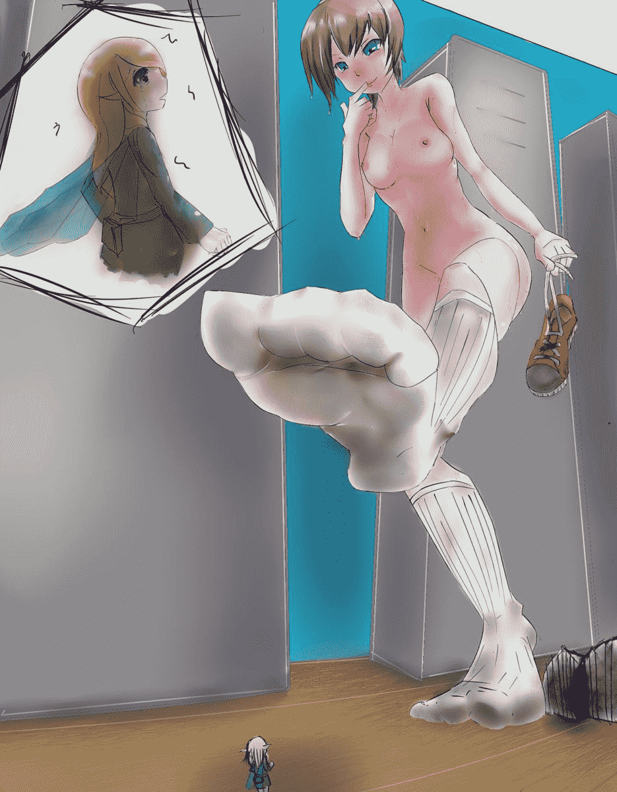

# 練習畫

作者：peter084

TID：24635

 

# 1

背景的部分還在摸索 總之先發上來傷大家眼

<ignore_js_op>

**zd3sc5ocxeq-extra_large.jpg** *(112.36 KB, 下載次數: 6)*

[下載附件](forum.php?mod=attachment&aid=NzExNjl8YzI5OWMzZmR8MTYwMzg1MDU0MnwxODIzMHwyNDYzNQ%3D%3D&nothumb=yes)

2018-3-2 16:06 上傳

 

# 2

> [3213213210 發表於 2018-3-2 18:47](https://giantessnight.com/gnforum2012/forum.php?mod=redirect&goto=findpost&pid=362243&ptid=24635)

> 背景的櫃子看起來透視沒算好，找一下三點透視的消失點再畫比較好

> 人物呢，整隻左腳(右邊)完全是拚起來的， ...

謝謝你的分析

很開心有人幫我評論

我會再努力!</ignore_js_op>