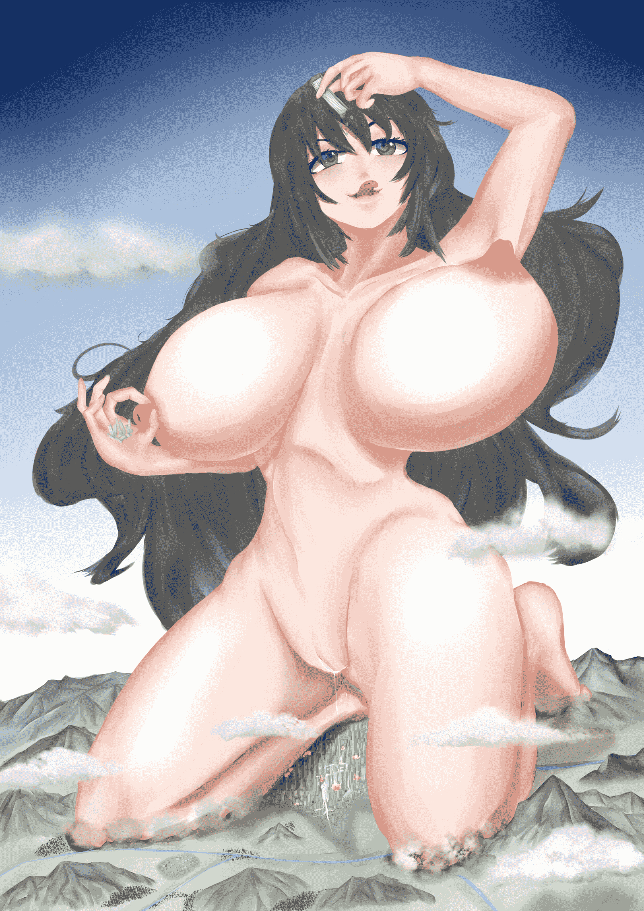

# 练习作品3

作者：噶比

TID：24024

<title>1</title> <link href="../Styles/Style.css" type="text/css" rel="stylesheet">

# 1

*本帖最後由 gabbit 於 2017-11-15 06:54 編輯*

大家好
这张是小的搓微波炉搓了一星期的产物，
不足处依旧很多很多，依旧希望各位大佬指点。
在上次的各位大大和前辈的指导和私信聊天下，得到了极大的帮助
谢谢回复的大家。
另希望自己的低劣作品能够让更多的潜水与神隐大触复出

<title>2</title> <link href="../Styles/Style.css" type="text/css" rel="stylesheet">

# 2

 <ignore_js_op>[2017年11月6日32.jpg](forum.php?mod=attachment&aid=Njk4MTV8MTVmMTA5NGR8MTYwMzg1NDEwMXwxODIzMHwyNDAyNA%3D%3D&nothumb=yes) *(2.18 MB, 下載次數: 112)*

[下載附件](forum.php?mod=attachment&aid=Njk4MTV8MTVmMTA5NGR8MTYwMzg1NDEwMXwxODIzMHwyNDAyNA%3D%3D&nothumb=yes)

2017-11-15 06:54 上傳  

</ignore_js_op> <title>3</title> <link href="../Styles/Style.css" type="text/css" rel="stylesheet">

# 3

> [Eighteen 發表於 2017-11-14 22:54](https://giantessnight.com/gnforum2012/forum.php?mod=redirect&goto=findpost&pid=350154&ptid=24024)
> 这样直接传网盘，小心连百度帐号一起被BANG掉啊……

18爷！欢迎  。号棒掉还能活，只要不是人被catch

<title>4</title> <link href="../Styles/Style.css" type="text/css" rel="stylesheet">

# 4

*本帖最後由 gabbit 於 2017-11-15 11:02 編輯*

> [Yagami_ray 發表於 2017-11-15 10:12](https://giantessnight.com/gnforum2012/forum.php?mod=redirect&goto=findpost&pid=350161&ptid=24024)
> 新的大佬已经出现

大佬可做不得做不得*100
卧虎藏龙的GN，分分钟有大佬把我这辣鸡碾成血渍

<title>5</title> <link href="../Styles/Style.css" type="text/css" rel="stylesheet">

# 5

*本帖最後由 gabbit 於 2017-11-15 22:47 編輯*

> [葬儀社 發表於 2017-11-15 20:36](https://giantessnight.com/gnforum2012/forum.php?mod=redirect&goto=findpost&pid=350179&ptid=24024)
> 恩...個人淺見
> 大佬女體本身沒太大問題.差不多就是在多畫抓上色的增加經驗值程度(這個可以找P網一些有教學 ...

谢谢葬大佬，能得到这么有价值的回复很滿足以后努力糊出大佬能看上眼的ㄋㄟㄋㄟ

<title>6</title> <link href="../Styles/Style.css" type="text/css" rel="stylesheet">

# 6

> [awkeygen 發表於 2017-11-15 22:40](https://giantessnight.com/gnforum2012/forum.php?mod=redirect&goto=findpost&pid=350190&ptid=24024)
> 帮楼主顶一个，其实还有一个绘图套路，楼主可以考虑利用poser或者DAZ进行制作，之后用绘画的模式渲染在辅以 ...

谢谢A大大。我会尝试您所说的这种方法的。poser的话，更新了机子我去试试。
再次谢谢大大的建议！！！
<title>7</title> <link href="../Styles/Style.css" type="text/css" rel="stylesheet">

# 7

> [kahei0726 發表於 2017-11-16 17:28](https://giantessnight.com/gnforum2012/forum.php?mod=redirect&goto=findpost&pid=350242&ptid=24024)
> 好棒的作品啊！再看看我的画，看来还需要练习啊

谢谢谢谢，太过奖了，其实好多好多地方我都是画崩掉的，见识的很少，看的也少，偷懒也偷的很多 我为潜水的大佬加油。

<title>8</title> <link href="../Styles/Style.css" type="text/css" rel="stylesheet">

# 8

> [無邊落木 發表於 2017-11-20 01:15](https://giantessnight.com/gnforum2012/forum.php?mod=redirect&goto=findpost&pid=350441&ptid=24024)
> 看的出來很多細節都有琢磨過的，不像無某不會畫的就跳過攬過呼攏過了(自慚

漫畫大佬耶!!謝謝大佬的指點，透視的部分實在是不太敢畫，小透視大透視沒好好學，那時候沒打好這個基礎。