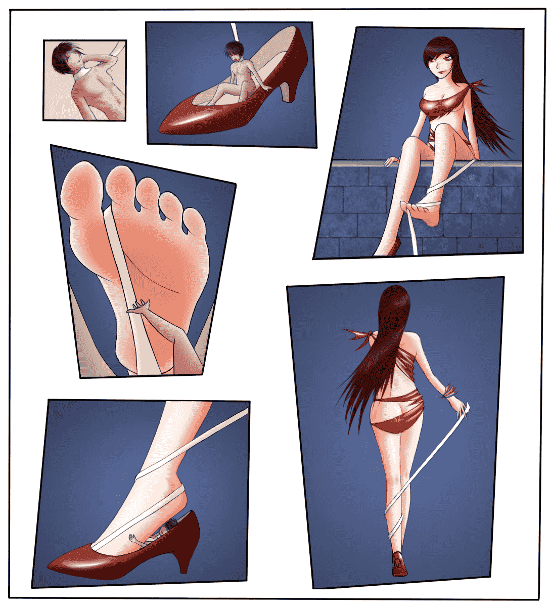
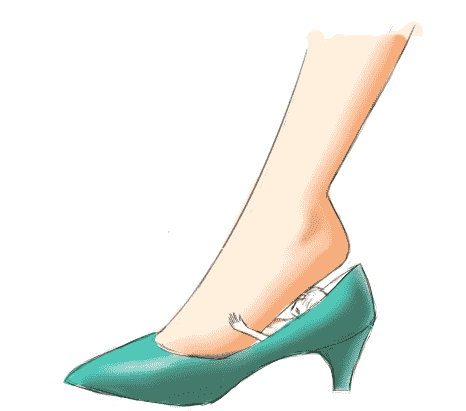

# 终于把上色完成了，对话不会就不加了。

作者：喵喵

TID：19007

 

# 1

*本帖最後由 喵喵 於 2015-6-18 22:57 編輯*

<ignore_js_op>

**新建图像慢慢搞NEW.png** *(704.07 KB, 下載次數: 1)*

[下載附件](forum.php?mod=attachment&aid=NTI1NDN8ZDQ2NGMyZWF8MTYwMzg2NTMzOXwxODIzMHwxOTAwNw%3D%3D&nothumb=yes)

2015-6-18 22:57 上傳

喜欢就回复一个吧。

 

# 2

*本帖最後由 喵喵 於 2015-5-20 20:51 編輯*

> [3213213210 發表於 2015-5-20 20:33](https://giantessnight.com/gnforum2012/forum.php?mod=redirect&goto=findpost&pid=255249&ptid=19007)

> 呃……陰影是個問題，但分鏡處理下好不

> 先後順序看不明白啊

从左到右，从上到下啦。阴影嘛，上色的时候直接上了。 <ignore_js_op>

**QQ图片20150511001405.png** *(18.84 KB, 下載次數: 0)*

[下載附件](forum.php?mod=attachment&aid=NTIwMDV8MGI0MjU5MzF8MTYwMzg2NTMzOXwxODIzMHwxOTAwNw%3D%3D&nothumb=yes)

2015-5-20 20:45 上傳

试验性涂了一下大概是这样的。

不过我没画过漫画，分镜什么的完全不懂。

 

# 3

> [dijkstra 發表於 2015-5-21 02:00](https://giantessnight.com/gnforum2012/forum.php?mod=redirect&goto=findpost&pid=255269&ptid=19007)

> 可以先画四格，这样就可以不用太考虑分镜啦~多多交流哈~

> P.S.我只想问一下~楼主画得男孩子为何如此美丽~ ...

哈哈。。。那啥，我没有学过美术，都是自己练的，全用来画妹子了。男人嘛，自然会像妹子一点，哈哈哈。。。

 

# 4

恩，自己先顶一个好了。</ignore_js_op></ignore_js_op>