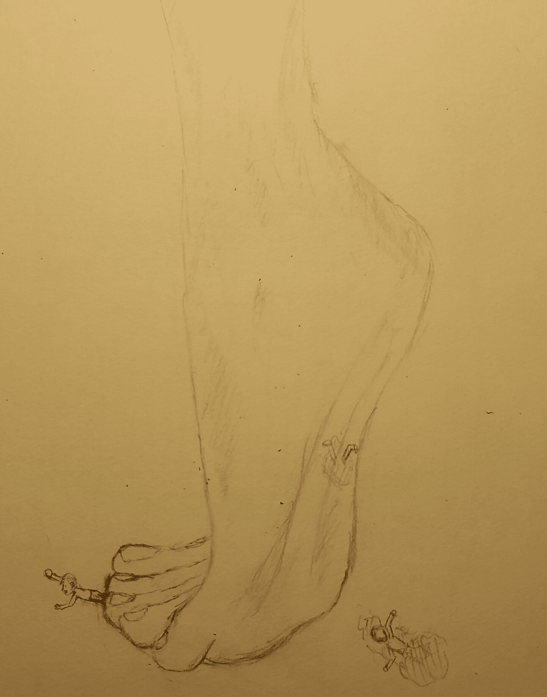
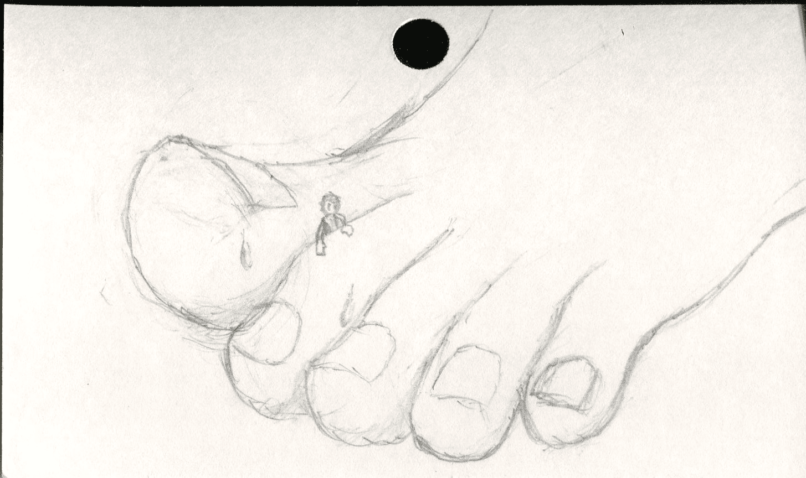

# 脚部结构练习

作者：dijkstra

TID：18994

<title>1</title> <link href="../Styles/Style.css" type="text/css" rel="stylesheet">

# 1

*本帖最後由 dijkstra 於 2015-6-9 15:27 編輯*

最近在忙写论文，除了一些练习之外就没画什么完整作品。
今天随便练习了一下脚部的结构，画完又随便加了两只小虫子点缀~
求拍砖~( ´▽` )ﾉ
<ignore_js_op>

**tmp_10107-20150517_045030-1-510466115.jpg** *(1.13 MB, 下載次數: 1)*

[下載附件](forum.php?mod=attachment&aid=NTE5NDF8YWY3NmNiNDV8MTYwMzg2MTAwNXwxODIzMHwxODk5NA%3D%3D&nothumb=yes)

2015-5-17 19:51 上傳

6月9日练习
<ignore_js_op>

**tmp_8648-img001-1690507151.jpg** *(178.88 KB, 下載次數: 0)*

[下載附件](forum.php?mod=attachment&aid=NTIzMjF8YmU4ZjFlODh8MTYwMzg2MTAwNXwxODIzMHwxODk5NA%3D%3D&nothumb=yes)

2015-6-9 15:26 上傳

<title>2</title> <link href="../Styles/Style.css" type="text/css" rel="stylesheet">

# 2

<ignore_js_op>

**tmp_8648-img0011969605324.jpg** *(178.88 KB, 下載次數: 0)*

[下載附件](forum.php?mod=attachment&aid=NTIzMjB8MjE4YmU0ZTh8MTYwMzg2MTAwNXwxODIzMHwxODk5NA%3D%3D&nothumb=yes)

2015-6-9 15:22 上傳

再练一张，对面的妹子穿凉拖，就参(yi)考(yin)了一下╮(╯▽╰)╭
啊管理员阿姨我不是故意画在图书卡背面的(￣Д￣)ﾉ</ignore_js_op></ignore_js_op></ignore_js_op>