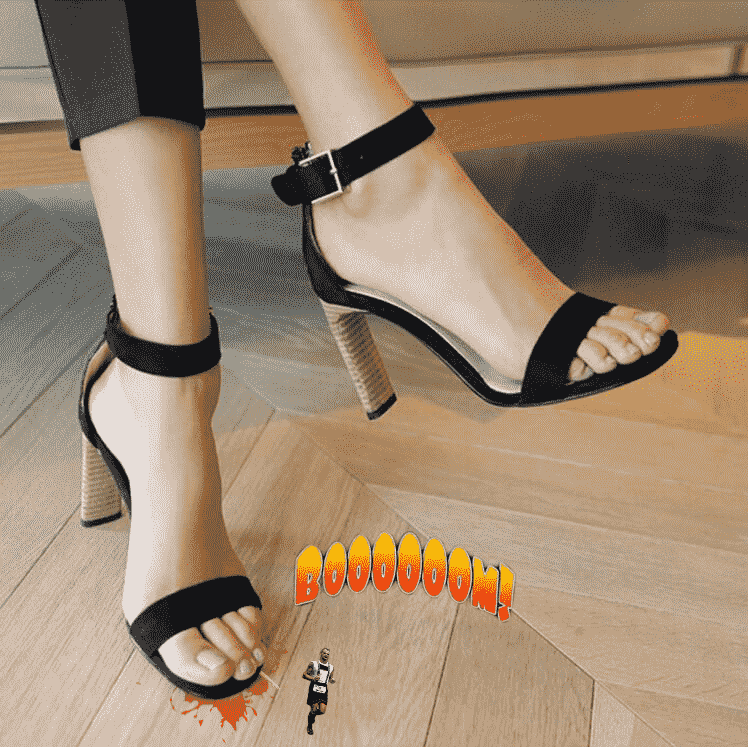

# 自己做了玩玩的图

作者：conan2000

TID：21785

 

# 1

用Photoshop做了玩玩的，对于将扣下来的人物放到大图里面还是有一种违和感，有没有大神指点一下，怎么做才能尽量降低和背景的不和谐感？

 

# 2

<ignore_js_op>[Giantess 1.jpg](forum.php?mod=attachment&aid=NjM5MzB8ZmFiNmQ4YWV8MTYwMzg2MDY4M3wxODIzMHwyMTc4NQ%3D%3D&nothumb=yes) *(256.02 KB, 下載次數: 31)*

[下載附件](forum.php?mod=attachment&aid=NjM5MzB8ZmFiNmQ4YWV8MTYwMzg2MDY4M3wxODIzMHwyMTc4NQ%3D%3D&nothumb=yes)

2016-9-8 20:36 上傳  

</ignore_js_op>  

# 3

> [3213213210 發表於 2016-9-8 20:57](https://giantessnight.com/gnforum2012/forum.php?mod=redirect&goto=findpost&pid=307857&ptid=21785)

> 先不扯色調和光影講最基本的

> 你的背景是大概60俯度拍攝的 人物卻是平視還有點偏低角度 當然違和啊 ...

你说得有道理，色调和光影怎么设置比较好？

 

# 4

> [qreeper 發表於 2016-9-9 18:00](https://giantessnight.com/gnforum2012/forum.php?mod=redirect&goto=findpost&pid=307948&ptid=21785)

> 感觉人物和地面的角度有些问题。。。

那跟素材也有关系了，当时角度没找好